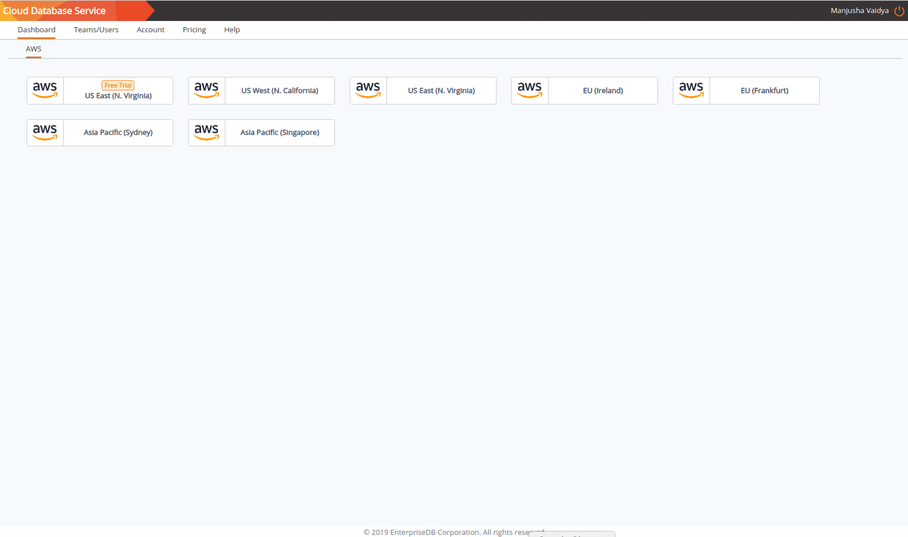

Cloud Database Service (CDS) is designed to help you easily create and manage high-availability database clusters. To get started with CDS, open a browser and navigate to:

> <https://www.enterprisedb.com/edb-postgres-cds>

Select a link on the page to login or start a free trial. When logging in, provide your EnterpriseDB account credentials; if you do not have a user account, follow the onscreen links to register as a user.

Click each respective link to review details; if you agree, check the box to the left of `I agree to the Terms & Conditions and the Privacy Policy` and click `SUBMIT` to continue.

After registering, you will be sent an account activation email. Follow the link in the email to provide a password for your account and complete the registration process.

After logging in, you will be taken to the CDS `Dashboard` tab, where you can select a deployment type. Select the `AWS Free Trial` button to deploy a [free trial console](02_cds_using_the_cds_mgmt_console#free_console). Please note that some restrictions apply.

> 

Using a Free Trial Console

## Using a Free Trial Console

You may elect to deploy a trial console while experimenting with CDS. You are not required to provide a credit card when registering for a free console, but some restrictions do apply:

  - Free consoles are deployed in US-East-1 (N. Virginia).
  - Available free instance types are `t3.micro` and `t3.small`.
  - Each instance has a lifetime of 7 days.
  - A template must be used to define an instance on a free console; two templates are available:
      - Developer Postgres Advanced Server
      - Developer PostgreSQL
  - An organization (including all of the teams) is limited to 5 free nodes.
  - Trial console usage is not included on the `Account` tab.

We offer a paid subscription option which does not have the above-listed restrictions, refer to the [Signing Up for a Paid Console](02_cds_using_the_cds_mgmt_console#signing_up_for_a_paid_console) for paid console details.

billing information Signing Up for CDS

## Signing Up for a Paid Console

Use options on the [Account tab](05_cds_mgmt_account#cds_mgmt_account) to manage your billing preferences.

You have the option to pay for your subscription with a credit card or via manual invoicing. To apply for manual invoicing, complete the [More Options](02_cds_using_the_cds_mgmt_console#manual_invoicing) tab located in the `Payment Methods` panel on the `Details` tab of the `Account` tab.

To use a credit card to pay for your consoles, use fields in the `Credit Card` section to provide details about the credit card that will be used for the account billing. EnterpriseDB accepts Visa, MasterCard, American Express, Discover, Diners Club, and JCB. All billing will be in US dollars.

Provide card information in the `Card` field:

  - the card number in the `Card number` field.
  - the expiration date in the `MM/YY` field.
  - the card verification value in the `CVV` field.

Then, specify cardholder information below the card information:

  - the first name of the cardholder in the `First Name` field.
  - the last name of the cardholder in the `Last Name` field.
  - the first line of the card's billing address in the `Address 1` field.
  - the second line of the card's billing address in the `Address 2` field.
  - the name of the city to which the credit card's bills are sent in the `City` field.
  - the name of the state, province, or county to which the credit card's bills are sent in the `State/Province/County` field.
  - the name of the country to which bills are sent in the `Country` field.
  - the billing postal code in the `Postal/Zip Code` field.
  - If applicable, provide a VAT number in the `VAT Number` field.

The `Organization Details` section displays the contact information entered when you registered; click the `Edit` button to update the information shown. You can modify the:

  - Organization Name
  - Primary Email Address
  - CC Email Addresses

supported regions

Press the `Subscribe` button to complete the registration process and continue to the CDS Dashboard. Use links on the `Dashboard` tab to select the region in which your console will be deployed; CDS currently supports the following regions:

  - US East (N. Virginia)
  - US West (N. California)
  - EU (Ireland)
  - EU (Frankfurt)
  - Asia Pacific (Sydney)
  - Asia Pacific (Singapore)

If you would like to request support for a specific region, please reach out to:

> [mailto:cds-help@enterprisedb.com](mailto:cds-help@enterprisedb.com)

Your current user account will be able to deploy a console on the regions offered.

When you select a region, the `Ark user console <cds_user_cluster_tab>` will open in a new browser tab. The CDS management console will remain available in your current tab, allowing you to perform management tasks related to the account.

Tabs on the CDS web interface allow you to manage your CDS account. Tab access is controlled by administrator-assigned membership in a `Team <cds_mgmt_teams_users>`.

manual invoicing Signing Up for Manual Invoicing

### Signing Up for Manual Invoicing

Requests for manual invoicing will be reviewed by the CDS team. Use the `More Options` tab located in the `Payment Methods` panel to submit a request.

Use fields on the `More Options` tab to provide billing information for your organization. Provide:

  - the first line of the address to which invoices will be sent in the `Address 1` field.
  - the second line of the billing address (if applicable) in the `Address 2` field.
  - the name of the city to which bills will be sent in the `City` field.
  - the name of the state to which bills will be sent in the `State` field.
  - the name of the country to which bills will be sent in the `Country` field.
  - the postal code for the billing address in the `Zip` field.
  - a VAT number in the `VAT Number` field (if applicable).

When you've completed the dialog, click the `Contact Sales` button to submit your application.

After submitting billing details, the `More Options` tab will display the status of your request for manual invoicing. When your request is approved, the status will be updated from `Pending` to `Approved` and you will be sent a notification email. While your application is being reviewed, you will have access to free consoles via the CDS `Dashboard` tab; once approved, you will be able to select from all of the consoles shown on the `Dashboard` tab.

If the request is `Rejected`, you will be required to provide credit card information to use paid consoles.

If you have initially created an account with credit card billing, and wish to move to manual invoicing, you can submit a request for manual invoicing, and continue to use the credit card billing until the manual invoicing is approved. Once approved, credit card details will be removed from the `Credit Card` tab, and any charges will be invoiced manually.
