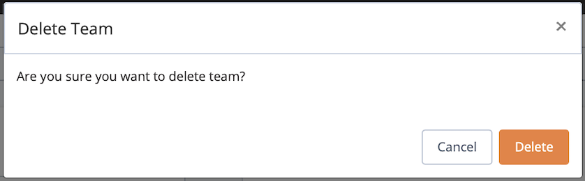

A *team* is group of users with collective permissions to access the different tabs of the administrative console based on the role(s) associated with the team. When you create (or modify) a team, you can assign membership in a role to that team. Each user in a team inherits all of the roles (privileges) of that team.

An organization can have multiple teams; similarly, a user may be a member of multiple teams.

Roles are predefined:

  - The `Billing` role provides access to view your account's invoices.
  - The `Provisioning` role provides access to create, update/upgrade, and delete database clusters or backups.
  - The `Support` role provides access to documentation, white papers, support forums, and CDS support (you can send an e-mail to <cds-help@enterprisedb.com> to log tickets).
  - The `User Management` role provides access to create, edit or delete teams and other team members.
  - The `Organization Admin` role provides access to update payment or organization details, buy reserved CDS instances, opt for enterprise support, or view account's current usage, etc.

You can use the `Teams/Users` tab to define teams and assign membership in a team to one or more users.

admin team

The `Admin` team is predefined, and has access to all of the functionality of each role.

team management

## Managing Teams

Click the `Add Team` button to open the `Add Team` dialog and define additional user teams for your organization.

Use fields on the `Add Team` dialog to define a new team:

  - Enter the name of a team in the `Name` field.
  - Enter a description of the team in the `Description` field.
  - Use the `Roles` field to select one or more Roles in which the team has membership.

When you're finished, click the `OK` button to save the team definition and continue.

You can use options in the `Actions` column to manage a team definition:

  - Click the `Edit` icon to modify a team definition. When the `Update Team` dialog opens, modify the team definition and select `OK` to preserve your changes, or select `Cancel` to exit without saving.
  - Select the `Delete` icon to delete a team. If you elect to delete a team, a popup will confirm your selection before deleting the definition.

deleting a team

**Deleting a Team**

To delete a team, highlight the team name and select the delete icon to the right of the name; when the popup opens, select `Delete` to delete the team, or `Cancel` to exit the popup without removing the team.

user management

## Managing Users

To add a user to a team, select the `Users` tab; the tab displays a list of the currently defined users.

Click the `Add User` button to open the `Add User` dialog and add users to teams within your organization.

Use fields on the `Add User` dialog to define a new user:

  - Enter the email address of the user in the `Email` field.
  - Use the `Teams` field to specify one or more teams in which the user is a member. The user will have access to all of the administrative console tabs that are associated with the selected team(s).

When you're finished, click the `OK` button to save the team definition and continue.

You can use options in the `Actions` column to manage a user definition:

  - Click the `Edit` icon to modify a user definition. When the `Update User` dialog opens, modify the definition and select `OK` to preserve your changes, or select `Cancel` to exit without saving.
  - Select the `Delete` icon to delete a team. If you elect to delete a team, a popup will confirm your selection before deleting the definition.

deleting a user

**Deleting a User**

To delete a user, highlight the user name and select the delete icon to the right of the name; when the popup opens, select `Delete` to delete the user, or `Cancel` to exit the popup without removing the user.

