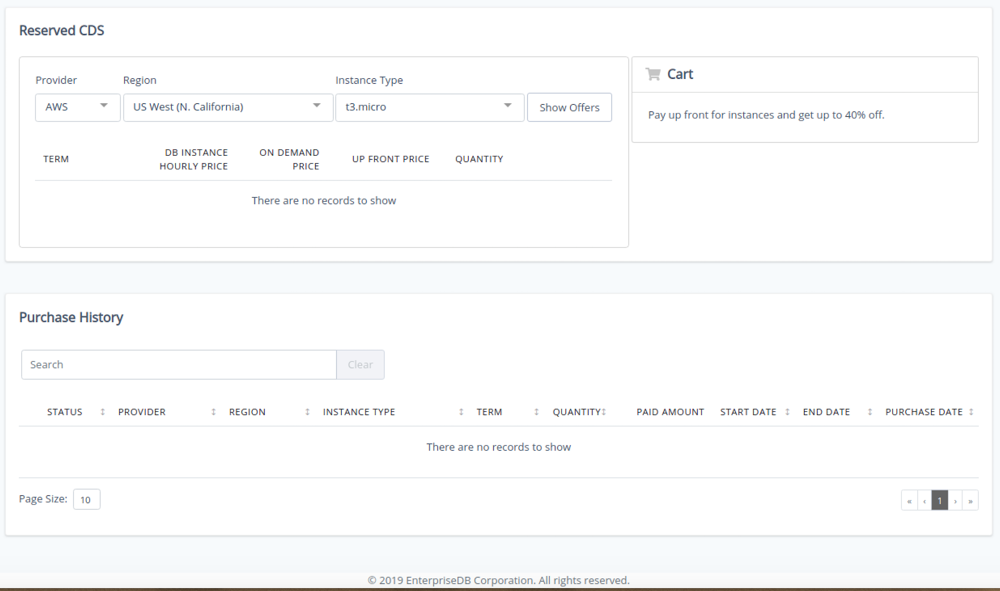

You can use options accessed through the `Account` tab to:

>   - manage billing and invoicing details for your account.
>   - save money by purchasing deeply-discounted reserved instances.
>   - review account usage.
>   - review and download invoices for your account.

Payment details

Use options on the `Details` tab to manage the information for your CDS account:

  - Use the `Payment Methods` section to provide credit card or [More Options](02_cds_using_the_cds_mgmt_console#manual_invoicing) payment information for your account.
  - Use the `Organization Details` section to manage your organization name or contact emails.

Use the `Purchase` tab to enable Enterprise Support and access discounted prices for *reserved instances*.

CDS support is offered in two levels; [Basic Support and Enterprise Support](06_cds_mgmt_pricing#support_comparison). Use the `Enterprise Support` slider to enable Enterprise Support. Enterprise support includes 24 x 7 access to Postgres Rocks, an initial response to support issues in 30 minutes, and performance tuning guidance.

If you enable `Enterprise Support`, you will be prompted to confirm that you are authorizing additional charges related to the option.

**Reserved Instances**

When you reserve instances, you agree to use a pre-determined instance type for a specified length of time; EnterpriseDB offers a deep discount on the instance price for reserved instances. The discount price automatically applies to existing running instances (of the same instance type) starting from the date of purchase.

Purchasing reserved instance

Use fields on the `Reserved CDS` tab to review and select from your reserved instances offers:

  - Use the `Provider` drop-down to select the service provider.
  - Use the `Region` drop-down to select the region in which your instances will be deployed.
  - Use the `Instance Type` drop-down to select the server type of the instances.

Then, click `Show Offers` to see the available reserved instances that match your specifications.

To purchase reserved instances, select `Add to Cart` and use shopping cart options to complete the purchase. Details about your savings are noted in the shopping cart.

The `Purchase History` tab displays a detailed list of completed purchase transactions.

usage

The `Usage` tab provides rapid access to the un-billed usage for your account. Please note that the usage displayed does not include trial consoles.

invoices

The `Invoices` tab contains a list of the invoices for your account. Click a column heading to sort the displayed invoices, or the `Download` icon (in the `Actions` column) to download a specific invoice.

Please note that trial console information is not included on the `Invoices` tab.

reserved instances

## Using Reserved Instances

You can reserve Advanced Server or PostgreSQL database instances for Cloud Database Service for a one year term. Using reserved instances provides substantial savings for:

>   - Steady state use cases
>   - Database instances for your production applications
>   - Mission critical applications that run on Multi-AZ database deployments for higher availability and data durability

The discount price automatically applies to existing running instances (of the same instance type) starting from the date of purchase. For more information about reserved instances, visit the [EnterpriseDB website](https://www.enterprisedb.com/edb-postgres-cds/) .
