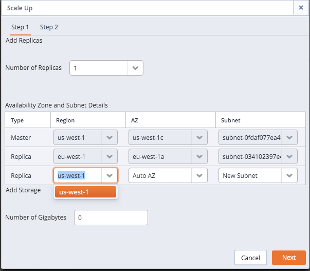

Console controls make it simple to add replicas and storage to an existing cluster, or to upgrade to a larger server class (i.e. vertical scaling).

  - Adding additional replicas to your database cluster increases the CPU power available to handle additional client requests or applications, increasing the number of client connections that can be serviced. When the scale up is complete, each additional replica automatically assumes a share of the read-only workload from incoming queries.
  - Adding additional storage to the cluster increases the amount of data that can be stored by the database servers. When you add additional storage to the cluster, each member of the cluster gets the additional storage amount.
  - Vertically scaling to a larger server class increases the processing capabilities of your cluster, allowing the server to process customer requests with greater speed.

You can also downsize a cluster by selectively removing a replica. You can machine scale to a smaller machine type to reduce resource usage (cpu/memory) and/or cost.

adding replicas adding storage manually adding replica

## Manually Adding Replicas and Storage

The `Scale Up` dialog makes it simple to manually add additional replicas to a cluster if you find that server resources are strained. The dialog also allows you to increase the amount of storage available to a cluster.

If you specify that CDS should add both storage and replicas, CDS will process the request for additional storage *before* adding replicas to the cluster. All of the nodes on the cluster will be of the newly specified storage size. To add a replica or storage space to a cluster, navigate to the `Clusters` tab, highlight a cluster name, and select the `Scale Up` icon. The `Scale Up` dialog opens as shown below.

Use the fields on the `Step 1` tab to specify:

  - The number of replicas to add to the cluster.

<!-- end list -->

  - \- The region in which the node will reside. You can create  
    cluster with nodes in multiple regions.

<!-- end list -->

  - The availability zone in which the cluster will be provisioned.
  - The subnet that will be used by the cluster.
  - The amount of storage memory (in Gigabytes) that will be added to each server in the cluster.

When you've completed the dialog, click `Next` to continue to the `Step 2` tab.

Use the `Previous` button to return to the `Step 1` tab to modify specified values. Use the `Scale Up` button to confirm that you wish to add the specified number of replication servers or the specified amount of memory to the cluster. Use the `Cancel` button, or simply close the dialog to exit without modifying the cluster.

CDS will confirm that replicas or memory are being added to the cluster.

remove replica

## Manually Removing a Replica

CDS's `Scale Down` dialog makes it simple to manually remove one or more unneeded replicas from a cluster. To delete a replica, navigate to the `Clusters` tab, and click the `Scale Down` icon. The Scale Down dialog opens as shown below.

Check the box to the left of the name of a replica, and click Next to proceed to the `Step 2` tab of the dialog.

Click `Scale Down` to confirm that you wish to remove the replica, or `Previous` to return to the `Step 1` tab. Use the `Cancel` button, or simply close the dialog to exit without modifying the cluster.

server class, change change server class

## Manually Changing the Server Class

When your RAM processing needs, CPU power, or other circumstances warrant a larger virtual machine for your application, you can vertically scale to a larger server class. Use the `Scale Machine Type` dialog to copy the cluster into a larger server class.

When you use the `Scale Machine Type` dialog to move your cluster into a larger server class, you must provide a new name for the upgraded cluster. You can also use the dialog to specify that CDS should re-assign the IP address of the cluster, so the upgrade will be transparent to connecting clients.

You can also downsize a cluster by selectively removing a replica. You can machine scale to a smaller machine type to reduce resource usage (cpu/memory) and/or cost.

When you vertically scale your cluster with the `Scale Machine Type` dialog, CDS will copy the existing cluster into a new cluster of a different server class, and optionally re-assign the IP address of the existing cluster to the new cluster. You can scale your cluster from any region.

To open the `Scale Machine Type` dialog, navigate to the `Clusters` tab, and select the `Scale Machine Type` icon.

Use the `Server Class` drop-down listbox to specify the size of the new cluster.

When you click the `Scale` button to start scaling the cluster, CDS will confirm that the scaling is in progress.

Before creating the new cluster and (optionally) re-assigning the IP address, CDS will perform a backup of the original cluster. During the process, status indicators in the `PENDING` column of the `Clusters` tab will keep you informed as CDS backs up the original cluster, and initializes the new cluster.
