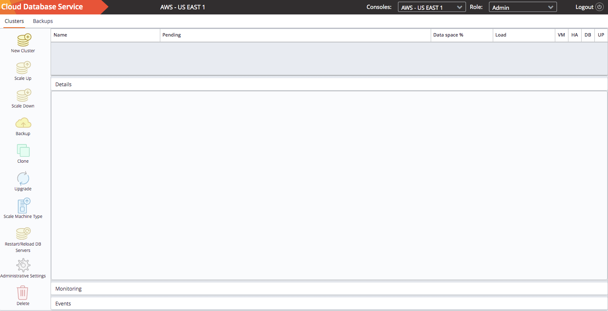

Select an AWS region from the options displayed on the `Dashboard` tab
to spin up a new console.

CDS will open a new browser tab in the selected region.

To provision a database cluster, select the `New Cluster` icon in the
left panel of the `Clusters` tab.
