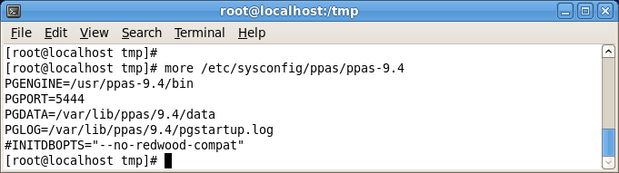

You can use the Yum (Yellowdog Updater, Modified) package manager to install Advanced Server or Advanced Server supporting components. Yum will attempt to satisfy package dependencies as it installs a package, but requires access to the Advanced Server repositories. If your system does not have access to a repository via the Internet, you can use RPM to install a package or create a local repository, but you may be required to manually satisfy package dependencies.

The edb-repo RPM installs Advanced Server, and its core supporting components. You can use the Advanced Server meta RPM for installation convenience, or pick and choose any sub-component that you need on a particular machine. Note that some sub-components require the installation of other Advanced Server component packages, while other packages may be installed individually.

For a complete list of the RPM installers available for Advanced Server and its supporting components, see [Section 3.3](#advanced-server-rpm-installers---reference).

By default, the RPM installers place Postgres Plus Advanced Server components in the directories listed in the table below:

| PPAS Component | Path to Installation Directory           |
| -------------- | ---------------------------------------- |
| Executables    | /usr/ppas-9.4/bin                        |
| Libraries      | /usr/ppas-9.4/lib or /usr/ppas-9.4/lib64 |
| Documentation  | /usr/ppas-9.4/share/doc                  |
| Contrib        | /usr/ppas-9.4/share/contrib              |
| Data           | /var/lib/ppas/9.4/data                   |
| Backup area    | /var/lib/ppas/9.4/backups                |

## Installing an RPM Package

Before installing the Advanced Server or a supporting component via an RPM package, you must request access to the EnterpriseDB repository. For information, visit:

<https://info.enterprisedb.com/rs/069-ALB-339/images/Repository%20Access%2004-09-2019.pdf>

After receiving your repository credentials you can:

> 1\. Create the repository configuration file.
>
> 2\. Modify the file, providing your user name and password.
>
> 3\. Install Advanced Server and its supporting components.

**Creating a Repository Configuration File and Installing Advanced Server**

To create the repository configuration file, assume superuser privileges and invoke the following command:

> yum -y install https://yum.enterprisedb.com/edb-repo-rpms/edb-repo-latest.noarch.rpm

The repository configuration file is named edb.repo. The file resides in /etc/yum.repos.d.

After creating the edb.repo file, use your choice of editor to ensure that the value of the enabled parameter is 1, and replace the username and password placeholders in the baseurl specification with the name and password of a registered EnterpriseDB user.

\[edb\]

name=EnterpriseDB RPMs $releasever - $basearch

baseurl=https://\<*username\>*:\<*password\>*@yum.enterprisedb.com/edb/redhat/rhel-$releasever-$basearch

enabled=1

gpgcheck=1

gpgkey=file:///etc/pki/rpm-gpg/ENTERPRISEDB-GPG-KEY

After saving your changes to the configuration file, you can use yum install command to install Advanced Server. For example, to install the server and its core components, use the command:

> yum install ppas94-server

When you install an RPM package that is signed by a source that is not recognized by your system, yum may ask for your permission to import the key to your local server. If prompted, and you are satisfied that the packages come from a trustworthy source, enter a y, and press Return to continue.

After installing Advanced Server, you must configure the installation; see [Section 3.2](#advanced-server-rpm-installers---reference), *Configuring an Advanced Server Installation* for details.

During the installation, yum may encounter a dependency that it cannot resolve. If it does, it will provide a list of the required dependencies that you must manually resolve.

### Updating an RPM Installation

If you have an existing Advanced Server RPM installation, you can use yum to upgrade your repository configuration file and update to a more recent product version. To update the edb.repo file, assume superuser privileges and enter:

> yum upgrade edb-repo

yum will update the edb.repo file to enable access to the current EDB repository, configured to connect with the credentials specified in your edb.repo file. Then, you can use yum to upgrade all packages whose names include the expression ppas:

> yum upgrade ppas*\**

Please note that the yum upgrade command will only perform an update between minor releases; to update between major releases, you must use pg\_upgrade. For more information about using pg\_upgrade, see Section 8.

For more information about using yum commands and options, enter yum --help on your command line, or visit:

<https://access.redhat.com/documentation/en-US/Red_Hat_Enterprise_Linux/6/html/Deployment_Guide/ch-yum.html>

### Installing Advanced Server on an Isolated Network

You can create a local yum repository to act as a host for the Advanced Server RPM packages if the server on which you wish to install Advanced Server (or supporting components) cannot directly access the EnterpriseDB repository. The process of creating a local repository is fairly straightforward, but contains operating-system specific steps.

To create and use a local repository, you must:

1.  Assume operating system superuser privileges.

2.  Move the repository configuration package onto the system within the isolated network that will host the repository. The repository configuration package creates a file that includes the configuration information for each repository from which you plan to install a package. The package name is edb-repo.

> The edb-repo rpm creates the edb-repo file; install this package if you are installing any or all of the following:
 - Advanced Server
 - EDB\*Plus
 - EnterpriseDB Backup and Restore
 - EnterpriseDB Failover Manager
 - Infinite Cache
 - The JDBC Connector
 - Migration Toolkit
 - PgAgent
 - PgBouncer
 - PgPool
 - PL/Java
 - PL/pgSQL Debugger
 - PostGIS
 - Slony Replication
 - SQL Profiler
 - The OCI Connector
 - The ODBC Connector
 - The PEM Client
 - xDB Replication Server

<!-- end list -->

3.  Use yum to invoke the repository configuration package:

> yum install -C edb-repo
>
> The -C option instructs yum not to attempt to update any repositories that exist on the host system.

4.  The repository configuration file is named edb.repo and resides in the following directory:

> /etc/yum.repos.d
>
> To enable a repository, change the value of the enabled parameter to 1 and replace the username and password placeholders in the baseurl specification with your user name and the repository password.
>
> ***The \[ppas94\] repository***
>
> Modify both the \[ppas94\] entries in the edb.repo file to install any of the Advanced Server 9.4 packages:
>
> \[edb\]
>
> name=EnterpriseDB RPMs $releasever - $basearch
>
> baseurl=https://\<username\>:\<password\>@yum.enterprisedb.com/edb/redhat/rhel-$releasever-$basearch
>
> enabled=1
>
> gpgcheck=1
>
> gpgkey=file:///etc/pki/rpm-gpg/ENTERPRISEDB-GPG-KEY

5.  After you modify any applicable entries, save the configuration file and exit the editor.

6.  Use the following commands to install the yum-utils and createrepo packages:

> yum install yum-utils
> yum install createrepo

7.  Use the following command to create a directory in which to store the repository:

> mkdir /srv/repos

8.  Sync the RPM packages and create the repository.

> reposync -r ppas94 -p /srv/repos
> createrepo /srv/repos

9.  Install your preferred webserver on the host that will act as your local repository, and ensure that the repos directory is accessible to the other servers on your network. For example, you might install lighttpd:

> yum install lighttpd
>
> If you are using lighttpd, you must provide a configuration file that identifies the location of the repository. For example, the configuration file might contain:
>
> $HTTP\["host"\] == "yum.*domain*.com"{
> server.document-root = "/srv/repos"
> server.errorlog="/var/log/lighttpd/yum\_error.log"
> accesslog.filename = "/var/log/lighttpd/yum\_access.log"}
>
> For detailed information about installing, configuring and using lighttpd, visit the official project site at:

<http://redmine.lighttpd.net/projects/1/wiki/Docs>

10. Configure yum on the isolated database servers:

> On each isolated database servers, configure yum to pull updates from the mirrored repository on your local network. For example, you might create a file called /etc/yum.repos.d/ppas with connection information that specifies:
>
> \[ppas94\]
> name=PPAS
> baseurl=http://yum.*domain*.com/ppas94
> enabled=1
> gpgcheck=0

11. After specifying the location and connection information for your local repository, you can use yum commands to install Advanced Server and its supporting components on the isolated servers. For example:

> yum install ppas94

For more information about creating a local repository, visit:

<http://yum.baseurl.org/>

If the server with Internet access is not directly accessible by the isolated database servers, the server can be setup on a machine that is accessible, and the mirrored repository transferred to the server via a USB memory stick or portable drive.

## Configuring a Package Installation

The packages that install the database server component also creates a service configuration file and service startup scripts.

The Advanced Server RPM package creates the ppas-9.4 service configuration file (see Figure 3.5) in /etc/sysconfig/ppas. The file contains environment variables that specify default values that are used by the service startup script when initializing a database and configuring the service for use.

*Figure 3.5 — The Advanced Server service configuration file.*

The file contains the following environment variables:
 - PGENGINE specifies the location of the engine and utility executable files.
 - PGPORT specifies the listener port for the database server.
 - PGDATA specifies the path to the data directory.
 - PGLOG specifies the location of the log file to which the server writes startup information.
 - Use the INITDBOPTS variable to specify any initdb option or options that you wish to apply to the new cluster.

> By default, the INITDBOPTS variable is commented out; when you run the service startup script, the new cluster will be created in Oracle Compatible mode. Clusters created in Oracle Compatible mode will contain a database named edb, and have a database superuser named enterprisedb.
>
> To create a new cluster in PostgreSQL mode, remove the pound sign (\#) in front of the INITDBOPTS variable, enabling the "--no-redwood-compat" option. Clusters created in PostgreSQL mode will contain a database named postgres, and have a database superuser named enterprisedb.
>
> You may specify multiple initdb options. For example, the following statement:
>
> INITDBOPTS="--no-redwood-compat -U alice --locale=en\_US.UTF-8"
>
> Creates a database cluster (without compatibility features for Oracle) that contains a database named postgres that is owned by a user named alice; the cluster uses UTF-8 encoding.
>
> To view a list of valid initdb options, open a command line, assume superuser privileges, and enter the command:
>
> /usr/ppas-9.4/bin/initdb --help
>
> For more information about using initdb, see the PostgreSQL Core Documentation, available at:

<http://www.enterprisedb.com/docs/en/9.4/pg/app-initdb.html>

You can modify the ppas-9.4 file before invoking the startup script to change the listener port, data directory location, startup log location or installation mode. Note that if you plan to create more than one instance on the same system, you may wish to copy the ppas-9.4 file (and the associated startup script that resides in /etc/init.d), and modify the file contents for each additional instance that resides on the same host.

Please note that the options in the service configuration file are only enforced if initdb is invoked via the service command; if you manually invoke initdb (at the command line), you must specify the other options (such as the data directory and installation mode) on the command line.

### Creating a Database Cluster and Starting the Service

To create a database cluster in the PGDATA directory, that listens on the port specified by PGPORT, invoke the service script:

> service ppas-9.4 initdb

After creating a database cluster, start the database server with the command:

> service ppas-9.4 start

Use the chkconfig command to arrange for the operating system to autostart the Advanced Server service when the system is operating in runlevel 2, 3, 4 or 5.

> chkconfig ppas-9.4 on

For more information about using chkconfig command options, consult the chkconfig man page:

> \# man chkconfig

## Advanced Server RPM Installers - Reference

The tables that follow list the packages that are available from EnterpriseDB. Please note that you can also use the yum search command to access a list of the packages that are currently available from your configured repository. To use the yum search command, open a command line, assume root privileges, and enter:

> yum search *package*

Where *package* is the search term that specifies the name (or partial name) of a package. The repository search will return a list of available packages that include the specified search term.

The following table lists the packages that are stored in the ppas94 repository:

<table>
<thead>
<tr class="header">
<th>Package Name</th>
<th>Package Installs</th>
</tr>
</thead>
<tbody>
<tr class="odd">
<td>ppas94</td>
<td>
The ppas94 meta RPM installs Advanced Server, and its core supporting components. This package installs:

Database server

Client programs (edb-psql, pg_dump, pg_restore, and other client utilities)

Community contributed modules

Community documentation

ecpg/ecpgPlus

EDB*Plus

Index Advisor

Infinite Cache

pgAgent

pgsnmpd

PL Debugger

PL/Java

PL/Perl

PL/Python

PL/Tcl

pgpool-extensions

Slony Replication

SQL Profiler

SQL Protect

sslutils

Supporting library files
</td>
</tr>
<tr class="even">
<td>ppas94-server</td>
<td>This package contains an Advanced Server meta installer that installs the database server.</td>
</tr>
<tr class="odd">
<td>ppas94-server-client</td>
<td>The ppas94-server-client package contains client programs and utilities that you can use to access and manage Advanced Server.</td>
</tr>
<tr class="even">
<td>ppas94-server-contrib</td>
<td>The ppas94-contrib package installs contributed tools and utilities that are distributed with Advanced Server.</td>
</tr>
<tr class="odd">
<td>ppas94-server-core</td>
<td>The ppas94-server-core package includes the programs needed to create the core functionality behind the Advanced Server database.</td>
</tr>
<tr class="even">
<td>ppas94-server-devel</td>
<td>The ppas94-server-devel package contains the header files and libraries needed to compile C or C++ applications that directly interact with an Advanced Server server and the ecpg or ecpgPlus C preprocessor.</td>
</tr>
<tr class="odd">
<td>ppas94-server-docs</td>
<td>The ppas94-server-docs package installs the SGML source for the PostgreSQL documentation, as well as the documentation in HTML and PDF format.</td>
</tr>
<tr class="even">
<td>ppas94-server-indexadvisor</td>
<td>This package installs Advanced Server's Index Advisor feature. The Index Advisor utility helps determine which columns you should index to improve performance in a given workload.</td>
</tr>
<tr class="odd">
<td>ppas94-server-libs</td>
<td>The ppas94-server-libs package provides the essential shared libraries for any ppas client program or interface.</td>
</tr>
<tr class="even">
<td>ppas94-server-pldebugger</td>
<td>This package implements an API for debugging PL/pgSQL functions on Advanced Server.</td>
</tr>
<tr class="odd">
<td>ppas94-server-plperl</td>
<td>The ppas94-server-plperl package installs the PL/Perl procedural language for Advanced Server. Please note that the ppas94-server-plperl package is dependent on the platform-supplied version of Perl.</td>
</tr>
<tr class="even">
<td>ppas94-server-plpython</td>
<td>The ppas94-server-plpython package installs the PL/Python procedural language for Advanced Server. Please note that the ppas94-server-plpython package is dependent on the platform-supplied version of Python.</td>
</tr>
<tr class="odd">
<td>ppas94-server-pltcl</td>
<td>The ppas94-pltcl package installs the PL/Tcl procedural language for Advanced Server. Please note that the ppas94-server-pltcl package is dependent on the platform-supplied version of TCL.</td>
</tr>
<tr class="even">
<td>ppas94-server-sqlprofiler</td>
<td>This package installs Advanced Server's SQL Profiler feature. SQL Profiler helps identify and optimize SQL code.</td>
</tr>
<tr class="odd">
<td>ppas94-server-sqlprotect</td>
<td>This package installs Advanced Server's SQL Protect feature. SQL Protect provides protection against SQL injection attacks.</td>
</tr>
<tr class="even">
<td>ppas94-server-sslutils</td>
<td>This package installs functionality that provides SSL support for the PEM Client.</td>
</tr>
<tr class="odd">
<td>ppas94-edbplus</td>
<td>The ppas94-edbplus package contains the files required to install the EDB*Plus command line client. EDB*Plus commands are compatible with Oracle's SQL*Plus.</td>
</tr>
<tr class="even">
<td>ppas94-icache</td>
<td>This package contains the files required to install the Infinite Cache service on a cache server node. Infinite Cache is a high-performance, distributed memory object caching system that distributes database load across multiple cache servers.</td>
</tr>
<tr class="odd">
<td>ppas94-pgagent</td>
<td>This package installs pgAgent; pgAgent is a job scheduler for Postgres Plus Advanced Server.</td>
</tr>
<tr class="even">
<td>ppas94-pgsnmpd</td>
<td>SNMP (Simple Network Management Protocol) is a protocol that allows you to supervise an apparatus connected to the network.</td>
</tr>
<tr class="odd">
<td>ppas94-pljava</td>
<td>This package installs PL/Java, providing access to Java stored procedures, triggers and functions via the JDBC interface.</td>
</tr>
<tr class="even">
<td>ppas94-pgpool-extensions</td>
<td>This package creates server extensions required by the server.</td>
</tr>
<tr class="odd">
<td>ppas94-postgis</td>
<td>This package installs PostGIS (geographic information systems) extensions for Postgres Plus Advanced Server. Please note: before installing the ppas94-postgis package, you must install the EPEL repository. Use the command: 
yum install epel-release</td>
</tr>
<tr class="even">
<td>ppas94-postgis-core</td>
<td>This package installs packages that support PostGIS functionality.</td>
</tr>
<tr class="odd">
<td>ppas94-postgis-docs</td>
<td>This package installs PostGIS community documentation</td>
</tr>
<tr class="even">
<td>ppas94-postgis-utils</td>
<td>This package installs PostGIS utilities.</td>
</tr>
<tr class="odd">
<td>ppas94-replication</td>
<td>This package contains the meta installer for Slony-I replication and documentation. Slony-I facilitates master-standby replication, and is suited for large databases with a limited number of standbys.</td>
</tr>
<tr class="even">
<td>ppas94-replication-core</td>
<td>This package contains the files required to install Slony-I replication. Slony-I facilitates master-standby replication, and is suited for large databases with a limited number of standby systems.</td>
</tr>
<tr class="odd">
<td>ppas94-replication-docs</td>
<td>This package contains the Slony-I project documentation (in pdf form).</td>
</tr>
<tr class="even">
<td>ppas94-replication-tools</td>
<td>This package contains the Slony altperl tools and utilities that are useful when deploying Slony-I replication environments.</td>
</tr>
</tbody>
</table>

The following table lists the packages for Advanced Server supporting components:

| Package Name          | Package Installs                                                                                                                                                                                                                                                                   |
| --------------------- | ---------------------------------------------------------------------------------------------------------------------------------------------------------------------------------------------------------------------------------------------------------------------------------- |
| edb-bart              | The edb-bart package installs the EnterpriseDB Backup and Recovery Tool. For more information, visit <http://www.enterprisedb.com/edb-backup-and-recovery-tool>.                                                                                                                   |
| efm20                 | The efm20 package installs EnterpriseDB Failover Manager. Failover Manager is a high-availability module that enables automatic failover. For more information, visit <http://www.enterprisedb.com/products/edb-failover-manager>.                                                 |
| pem-agent             | The pem-agent package installs the Postgres Enterprise Manager (PEM) agent. PEM allows you to manage, monitor and tune single or multiple servers from a single console. For more information about PEM, visit <http://www.enterprisedb.com/products/postgres-enterprise-manager>. |
| ppas-jdbc             | The ppas-jdbc package includes the .jar files needed for Java programs to access a Postgres Plus Advanced Server database.                                                                                                                                                         |
| ppas-migrationtoolkit | The ppas-migrationtoolkit package installs Migration Toolkit; the Migration Toolkit utility facilitates migration to an Advanced Server database from Oracle, PostgreSQL, MySQL, Sybase and SQL Server.                                                                            |
| ppas-oci              | The ppas-oci package installs the EnterpriseDB Open Client library, allowing applications that use the Oracle Call Interface API to connect to an Advanced Server database.                                                                                                        |
| ppas-oci-devel        | This package installs the OCI include files; install this package if you are developing C/C++ applications that require these files.                                                                                                                                               |
| ppas-odbc             | This package installs the driver needed for applications to access a Postgres Plus Advanced Server system via ODBC (Open Database Connectivity).                                                                                                                                   |
| ppas-odbc-devel       | This package installs the ODBC include files; install this package if you are developing C/C++ applications that require these files.                                                                                                                                              |
| ppas-pgbouncer16      | This package contains pgBouncer (a lightweight connection pooler). This package requires the libevent package.                                                                                                                                                                     |
| ppas-pgpool34         | This package contains the PgPool meta installer. PgPool provides connection pooling and load balancing for Advanced Server installations.                                                                                                                                          |
| ppas-xdb              | This package contains the xDB meta installer; xDB provides asynchronous cross-database replication. For more information, visit <http://www.enterprisedb.com/download-xdb-replication-server-mmr>.                                                                                 |

Please Note: The available packages are subject to change.

