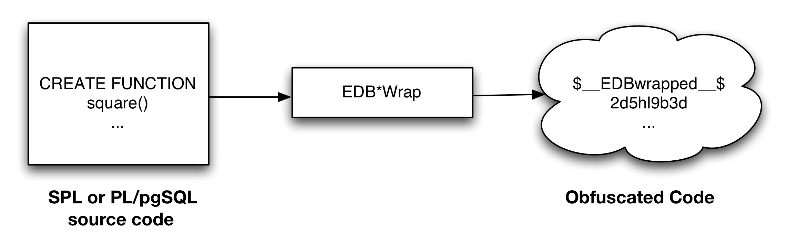

The sections in this chapter describe various utility programs. These include:
 - EDB\*Plus
 - EDB\*Loader
 - EDB\*Wrap
 - Dynamic Runtime Instrumentation

## EDB\*Plus

EDB\*Plus is a utility program that provides a command line user interface to the Postgres Plus Advanced Server. EDB\*Plus accepts SQL commands, SPL anonymous blocks, and EDB\*Plus commands. EDB\*Plus commands are compatible with Oracle SQL\*Plus commands and provide various capabilities including:
 - Querying certain database objects
 - Executing stored procedures
 - Formatting output from SQL commands
 - Executing batch scripts
 - Executing OS commands
 - Recording output

The following section describes how to connect to an Postgres Plus Advanced Server database using EDB\*Plus. The final section provides a summary of the EDB\*Plus commands.

### Starting EDB\*Plus

To open an EDB\*Plus command line, navigate through the Applications (or Start) menu to the Postgres Plus Advanced Server menu, to the Run SQL Command Line menu, and select the EDB\*Plus option. You can also invoke EDB\*Plus from the operating system command line with the following command:

edbplus \[ -S\[ILENT \] \] \[ *login* | /NOLOG \] \[ @*scriptfile*\[.*ext* \] \]

\-SILENT

If specified, the EDB\*Plus sign-on banner is suppressed along with all prompts.

*login*

Login information for connecting to the database server and database. *login* takes the following format. (There must be no white space within the login information.)

*username*\[/*password*\]\[@{*connectstring* | *variable* } \]

> Where:

*username* is a database username with which to connect to the database.

*password* is the password associated with the specified *username*. If a *password* is not provided, but a password is required for authentication, EDB\*Plus will prompt for the password.

*connectstring* is the database connection string.

*variable* is a variable defined in the login.sql file that contains a database connection string. The login.sql file can be found in the edbplus subdirectory of the Postgres Plus Advanced Server home directory.

*host*\[:*port*\]\[/*dbname* \] \]

*host* is the hostname on which the database server resides. If neither @*connectstring* nor @*variable* nor /NOLOG is specified, the default host is assumed to be the localhost. *port* is the port number receiving connections on the database server. If not specified, the default is 5444. *dbname* is the name of the database to connect to. If not specified the default is edb.

/NOLOG

Specify /NOLOG to start EDB\*Plus without establishing a database connection. SQL commands and EDB\*Plus commands that require a database connection cannot be used in this mode. The CONNECT command can be subsequently given to connect to a database after starting EDB\*Plus with the /NOLOG option.

*scriptfile*\[.*ext* \]

*scriptfile* is the name of a file residing in the current working directory, containing SQL and/or EDB\*Plus commands that will be automatically executed after startup of EDB\*Plus. *ext* is the filename extension. If the filename extension is sql, then the .sql extension may be omitted when specifying *scriptfile*. When creating a script file, always name the file with an extension, otherwise it will not be accessible by EDB\*Plus. (EDB\*Plus will always assume a .sql extension on filenames that are specified with no extension.)

The following example shows user enterprisedb with password, password, connecting to database edb running on a database server on the localhost at port 5444.

C:\\Program Files (x86)\\PostgresPlus\\9.4AS\\edbplus\>edbplus enterprisedb/password

Connected to EnterpriseDB 9.4.0.0 (localhost:5444/edb) AS enterprisedb

EDB\*Plus: Release 9.4

Copyright (c) 2008-2014, EnterpriseDB Corporation. All rights reserved.

SQL\>

The following example shows user enterprisedb with password, password, connecting to database edb running on a database server on the localhost at port 5445.

C:\\Program Files (x86)\\PostgresPlus\\9.4AS\\edbplus\>edbplus enterprisedb/password@localhost:5445/edb

Connected to EnterpriseDB 9.4.0.0 (localhost:5445/edb) AS enterprisedb

EDB\*Plus: Release 9.4

Copyright (c) 2008-2014, EnterpriseDB Corporation. All rights reserved.

SQL\>

Using variable hr\_5445 in the login.sql file, the following illustrates how it is used to connect to database hr on localhost at port 5445.

C:\\Program Files (x86)\\PostgresPlus\\9.4AS\\edbplus\>edbplus enterprisedb/password@hr\_5445

Connected to EnterpriseDB 9.4.0.0 (localhost:5445/hr) AS enterprisedb

EDB\*Plus: Release 9.4 (Build 28)

Copyright (c) 2008-2014, EnterpriseDB Corporation. All rights reserved.

SQL\>

The following is the content of the login.sql file used in the previous example.

define edb="localhost:5445/edb"

define hr\_5445="localhost:5445/hr"

The following example executes a script file, dept\_query.sql after connecting to database edb on server localhost at port 5444.

C:\\Program Files (x86)\\PostgresPlus\\9.4AS\\edbplus\>edbplus enterprisedb/password @dept\_query

Connected to EnterpriseDB 9.4.0.0 (localhost:5444/edb) AS enterprisedb

SQL\> SELECT \* FROM dept;

DEPTNO DNAME LOC

\------ -------------- -------------

10 ACCOUNTING NEW YORK

20 RESEARCH DALLAS

30 SALES CHICAGO

40 OPERATIONS BOSTON

SQL\> EXIT

Disconnected from EnterpriseDB Database.

The following is the content of file dept\_query.sql used in the previous example.

SET PAGESIZE 9999

SET ECHO ON

SELECT \* FROM dept;

EXIT

### Command Summary

This section contains a summary of EDB\*Plus commands.

#### ACCEPT

The ACCEPT command displays a prompt and waits for the user’s keyboard input. The value input by the user is placed in the specified variable.

ACC\[EPT \] *variable*

The following example creates a new variable named my\_name, accepts a value of John Smith, then displays the value using the DEFINE command.

SQL\> ACCEPT my\_name

Enter value for my\_name: John Smith

SQL\> DEFINE my\_name

DEFINE MY\_NAME = "John Smith"

#### APPEND

APPEND is a line editor command that appends the given text to the end of the current line in the SQL buffer.

A\[PPEND \] *text*

In the following example, a SELECT command is built-in the SQL buffer using the APPEND command. Note that two spaces are placed between the APPEND command and the WHERE clause in order to separate dept and WHERE by one space in the SQL buffer.

SQL\> APPEND SELECT \* FROM dept

SQL\> LIST

1\* SELECT \* FROM dept

SQL\> APPEND WHERE deptno = 10

SQL\> LIST

1\* SELECT \* FROM dept WHERE deptno = 10

#### CHANGE

CHANGE is a line editor command performs a search-and-replace on the current line in the SQL buffer.

C\[HANGE \] /*from*/\[*to*/ \]

If *to*/ is specified, the first occurrence of text *from* in the current line is changed to text *to*. If *to*/ is omitted, the first occurrence of text *from* in the current line is deleted.

The following sequence of commands makes line 3 the current line, then changes the department number in the WHERE clause from 20 to 30.

SQL\> LIST

1 SELECT empno, ename, job, sal, comm

2 FROM emp

3 WHERE deptno = 20

4\* ORDER BY empno

SQL\> 3

3\* WHERE deptno = 20

SQL\> CHANGE /20/30/

3\* WHERE deptno = 30

SQL\> LIST

1 SELECT empno, ename, job, sal, comm

2 FROM emp

3 WHERE deptno = 30

4\* ORDER BY empno

#### CLEAR

The CLEAR command removes the contents of the SQL buffer, deletes all column definitions set with the COLUMN command, or clears the screen.

CL\[EAR \] \[ BUFF\[ER \] | SQL | COL\[UMNS \] | SCR\[EEN \] \]

BUFFER | SQL

Clears the SQL buffer.

COLUMNS

Removes column definitions.

SCREEN

Clears the screen. This is the default if no options are specified.

#### COLUMN

The COLUMN command controls output formatting. The formatting attributes set by using the COLUMN command remain in effect only for the duration of the current session.

COL\[UMN \]

\[ column

{ CLE\[AR \] |

{ FOR\[MAT \] spec |

HEA\[DING \] text |

{ OFF | ON }

} \[...\]

}

\]

If the COLUMN command is specified with no subsequent options, formatting options for current columns in effect for the session are displayed.

If the COLUMN command is followed by a column name, then the column name may be followed by one of the following:

1.  No other options

2.  CLEAR

3.  Any combination of FORMAT, HEADING, and one of OFF or ON

*column*

Name of a column in a table to which subsequent column formatting options are to apply. If no other options follow *column*, then the current column formatting options if any, of *column* are displayed.

CLEAR

The CLEAR option reverts all formatting options back to their defaults for *column*. If the CLEAR option is specified, it must be the only option specified.

*spec*

Format specification to be applied to *column*. For character columns, *spec* takes the following format:

*n*

*n* is a positive integer that specifies the column width in characters within which to display the data. Data in excess of *n* will wrap around with the specified column width.

For numeric columns, *spec* is comprised of the following elements.

> Table 10‑11‑1 Numeric Column Format Elements

|         |                                            |
| ------- | ------------------------------------------ |
| Element | Description                                |
| $       | Display a leading dollar sign.             |
| ,       | Display a comma in the indicated position. |
| .       | Marks the location of the decimal point.   |
| 0       | Display leading zeros.                     |
| 9       | Number of significant digits to display.   |

If loss of significant digits occurs due to overflow of the format, then all \#’s are displayed.

*text*

Text to be used for the column heading of *column*.

OFF | ON

If OFF is specified, formatting options are reverted back to their defaults, but are still available within the session. If ON is specified, the formatting options specified by previous COLUMN commands for *column* within the session are re-activated.

The following example shows the effect of changing the display width of the job column.

SQL\> SET PAGESIZE 9999

SQL\> COLUMN job FORMAT A5

SQL\> COLUMN job

COLUMN JOB ON

FORMAT A5

wrapped

SQL\> SELECT empno, ename, job FROM emp;

EMPNO ENAME JOB

\----- ---------- -----

7369 SMITH CLERK

7499 ALLEN SALES

MAN

7521 WARD SALES

MAN

7566 JONES MANAG

ER

7654 MARTIN SALES

MAN

7698 BLAKE MANAG

ER

7782 CLARK MANAG

ER

7788 SCOTT ANALY

ST

7839 KING PRESI

DENT

7844 TURNER SALES

MAN

7876 ADAMS CLERK

7900 JAMES CLERK

7902 FORD ANALY

ST

7934 MILLER CLERK

14 rows retrieved.

The following example applies a format to the sal column.

SQL\> COLUMN sal FORMAT $99,999.00

SQL\> COLUMN

COLUMN JOB ON

FORMAT A5

wrapped

COLUMN SAL ON

FORMAT $99,999.00

wrapped

SQL\> SELECT empno, ename, job, sal FROM emp;

EMPNO ENAME JOB SAL

\----- ---------- ----- -----------

7369 SMITH CLERK $800.00

7499 ALLEN SALES $1,600.00

MAN

7521 WARD SALES $1,250.00

MAN

7566 JONES MANAG $2,975.00

ER

7654 MARTIN SALES $1,250.00

MAN

7698 BLAKE MANAG $2,850.00

ER

7782 CLARK MANAG $2,450.00

ER

7788 SCOTT ANALY $3,000.00

ST

7839 KING PRESI $5,000.00

DENT

7844 TURNER SALES $1,500.00

MAN

7876 ADAMS CLERK $1,100.00

7900 JAMES CLERK $950.00

7902 FORD ANALY $3,000.00

ST

7934 MILLER CLERK $1,300.00

14 rows retrieved.

#### CONNECT

Change the database connection to a different user and/or connect to a different database. There must be no white space between any of the parameters following the CONNECT command.

CON\[NECT\] *username*\[/*password*\]\[@{*connectstring* | *variable* } \]

Where:

*username* is a database username with which to connect to the database.

*password* is the password associated with the specified *username*. If a *password* is not provided, but a password is required for authentication, EDB\*Plus will prompt for the password.

*connectstring* is the database connection string.

*variable* is a variable defined in the login.sql file that contains a database connection string. The login.sql file can be found in the edbplus subdirectory of the Postgres Plus Advanced Server home directory.

In the following example, the database connection is changed to database edb on the localhost at port 5445 with username, smith.

SQL\> CONNECT smith/mypassword@localhost:5445/edb

Disconnected from EnterpriseDB Database.

Connected to EnterpriseDB 9.4.0.0 (localhost:5445/edb) AS smith

From within the session shown above, the connection is changed to username enterprisedb. Also note that the host defaults to the localhost, the port defaults to 5444 (which is not the same as the port previously used), and the database defaults to edb.

SQL\> CONNECT enterprisedb/password

Disconnected from EnterpriseDB Database.

Connected to EnterpriseDB 9.4.0.0 (localhost:5444/edb) AS enterprisedb

#### DEFINE

The DEFINE command creates or replaces the value of a *user variable* (also called a *substitution variable*).

DEF\[INE \] \[ *variable* \[ = *text* \] \]

If the DEFINE command is given without any parameters, all current variables and their values are displayed.

If DEFINE *variable* is given, only *variable* is displayed with its value.

*DEFINE variable = text* assigns *text* to *variable*. *text* may be optionally enclosed within single or double quotation marks. Quotation marks must be used if *text* contains space characters.

The following example defines two variables, dept and name.

SQL\> DEFINE dept = 20

SQL\> DEFINE name = 'John Smith'

SQL\> DEFINE

DEFINE EDB = "localhost:5445/edb"

DEFINE DEPT = "20"

DEFINE NAME = "John Smith"

**Note:** The variable EDB is read from the login.sql file located in the edbplus subdirectory of the Postgres Plus Advanced Server home directory.

#### DEL

DEL is a line editor command that deletes one or more lines from the SQL buffer.

DEL \[ *n* | *n* *m* | *n* \* | *n* L\[AST \] | \* | \* *n* | \* L\[AST \] |

L\[AST \] \]

The parameters specify which lines are to be deleted from the SQL buffer. Two parameters specify the start and end of a range of lines to be deleted. If the DEL command is given with no parameters, the current line is deleted.

*n*

*n* is an integer representing the *n*th line

*n* *m*

*n* and *m* are integers where *m* is greater than *n* representing the *n*th through the *m*th lines

\*

Current line

*LAST*

Last line

In the following example, the fifth and sixth lines containing columns sal and comm, respectively, are deleted from the SELECT command in the SQL buffer.

SQL\> LIST

1 SELECT

2 empno

3 ,ename

4 ,job

5 ,sal

6 ,comm

7 ,deptno

8\* FROM emp

SQL\> DEL 5 6

SQL\> LIST

1 SELECT

2 empno

3 ,ename

4 ,job

5 ,deptno

6\* FROM emp

#### DESCRIBE

The DESCRIBE command displays:
 - A list of columns, column data types, and column lengths for a table or view
 - A list of parameters for a procedure or function
 - A list of procedures and functions and their respective parameters for a package.

The DESCRIBE command will also display the structure of the database object referred to by a synonym. The syntax is:

DESC\[RIBE\] \[ *schema*.\]*object*

*schema*

Name of the schema containing the object to be described.

*object*

Name of the table, view, procedure, function, or package to be displayed, or the synonym of an object.

#### DISCONNECT

The DISCONNECT command closes the current database connection, but does not terminate EDB\*Plus.

DISC\[ONNECT \]

#### EDIT

The EDIT command invokes an external editor to edit the contents of an operating system file or the SQL buffer.

ED\[IT \] \[ *filename*\[.*ext* \] \]

*filename*\[.*ext* \]

*filename* is the name of the file to open with an external editor. *ext* is the filename extension. If the filename extension is sql, then the .sql extension may be omitted when specifying *filename*. EDIT always assumes a .sql extension on filenames that are specified with no extension. If the filename parameter is omitted from the EDIT command, the contents of the SQL buffer are brought into the editor.

#### EXECUTE

The EXECUTE command executes an SPL procedure from EDB\*Plus.

EXEC\[UTE \] *spl\_procedure* \[ (\[ *parameters* \]) \]

*spl\_procedure*

The name of the SPL procedure to be executed.

*parameters*

Comma-delimited list of parameters. If there are no parameters, then a pair of empty parentheses may optionally be specified.

#### EXIT

The EXIT command terminates the EDB\*Plus session and returns control to the operating system. QUIT is a synonym for EXIT. Specifying no parameters is equivalent to EXIT SUCCESS COMMIT.

{ EXIT | QUIT }

\[ SUCCESS | FAILURE | WARNING | *value* |*variable* \]

\[ COMMIT | ROLLBACK \]SUCCESS | FAILURE |WARNING

Returns an operating system dependent return code indicating successful operation, failure, or warning for SUCCESS, FAILURE, and WARNING, respectively. The default is SUCCESS.

*value*

An integer value that is returned as the return code.

*variable*

A variable created with the DEFINE command whose value is returned as the return code.

COMMIT | ROLLBACK

If COMMIT is specified, uncommitted updates are committed upon exit. If ROLLBACK is specified, uncommitted updates are rolled back upon exit. The default is COMMIT.

#### GET

The GET command loads the contents of the given file to the SQL buffer.

GET *filename*\[.*ext* \] \[ LIS\[T \] | NOL\[IST \] \]

*filename*\[.*ext* \]

*filename* is the name of the file to load into the SQL buffer. *ext* is the filename extension. If the filename extension is sql, then the .sql extension may be omitted when specifying *filename*. GET always assumes a .sql extension on filenames that are specified with no extension.

*LIST | NOLIST*

If LIST is specified, the content of the SQL buffer is displayed after the file is loaded. If NOLIST is specified, no listing is displayed. The default is LIST.

#### HELP

The HELP command obtains an index of topics or help on a specific topic. The question mark (?) is synonymous with specifying HELP.

> { HELP | ? } { INDEX | *topic* }

*INDEX*

Displays an index of available topics.

*topic*

The name of a specific topic – e.g., an EDB\*Plus command, for which help is desired.

#### HOST

The HOST command executes an operating system command from EDB\*Plus.

> HO\[ST \] \[os\_command\]

*os\_command*

The operating system command to be executed. If you do not provide an operating system command, EDB\*Plus pauses execution and opens a new shell prompt. When the shell exits, EDB\*Plus resumes execution.

#### INPUT

The INPUT line editor command adds a line of text to the SQL buffer after the current line.

> I\[NPUT \] *text*

The following sequence of INPUT commands constructs a SELECT command.

SQL\> INPUT SELECT empno, ename, job, sal, comm

SQL\> INPUT FROM emp

SQL\> INPUT WHERE deptno = 20

SQL\> INPUT ORDER BY empno

SQL\> LIST

1 SELECT empno, ename, job, sal, comm

2 FROM emp

3 WHERE deptno = 20

4\* ORDER BY empno

#### LIST

LIST is a line editor command that displays the contents of the SQL buffer.

> L\[IST\] \[ n | n m | n \* | n L\[AST\] | \* | \* n | \* L\[AST\] | L\[AST\] \]

The buffer does not include a history of the EDB\*Plus commands.

*n*

> n represents the buffer line number.

*n m*

> n m displays a list of lines between n and m.

*n \**

> n \* displays a list of lines that range between line n and the current line.

*n L\[AST\]*

> n L\[AST\] displays a list of lines that range from line n through the last line in the buffer.

*\**

> \* displays the current line.

*\* n*

> \* n displays a list of lines that range from the current line through line n.

*\* L\[AST\]*

> \* L\[AST\] displays a list of lines that range from the current line through the last line.

*L\[AST\]*

> L\[AST\] displays the last line.

#### PASSWORD

Use the PASSWORD command to change your database password.

> PASSW\[ORD\] \[*user\_name*\]

You must have sufficient privileges to use the PASSWORD command to change another user's password. The following example demonstrates using the PASSWORD command to change the password for a user named acctg:

SQL\> PASSWORD acctg

Changing password for acctg

New password:

New password again:

Password successfully changed.

#### PAUSE

The PAUSE command displays a message, and waits for the user to press ENTER.

> PAU\[SE\] \[*optional*\_*text*\]

*optional*\_*text* specifies the text that will be displayed to the user. If the *optional*\_*text* is omitted, Advanced Server will display two blank lines. If you double quote the *optional*\_*text* string, the quotes will be included in the output.

#### PRINT

The PRINT command displays the value of a bind variable.

> PRI\[NT\] \[*bind*\_*variable*\_*name*\]

*bind*\_*variable*\_*name* specifies the name of a bind variable. Omit *bind*\_*variable*\_*name* to generate a list that includes the values of all bind variables.

#### PROMPT

The PROMPT command displays a message to the user before continuing.

> PRO\[MPT\] \[*message*\_*text*\]

*message*\_*text* specifies the text displayed to the user. Double quote the string to include quotes in the output.

#### QUIT

The QUIT command terminates the session and returns control to the operating system. QUIT is a synonym for EXIT.

> QUIT
>
> \[SUCCESS | FAILURE | WARNING | *value* | *sub*\_*variable*\]
>
> \[COMMIT | ROLLBACK\]

The default value is QUIT SUCCESS COMMIT.

#### REMARK

Use REMARK to include comments in a script.

> REM\[ARK\] \[*optional*\_*text*\]

You may also use the following convention to include a comment:

/\*

\* This is an example of a three line comment.

\*/

#### SAVE

Use the SAVE command to write the SQL Buffer to an operating system file.

> SAV\[E\] *file\_name*
> \[CRE\[ATE\] | REP\[LACE\] | APP\[END\]\]

*file\_name*

> *file\_name* specifies the name of the file (including the path) where the buffer contents are written. If you do not provide a file extension, .sql is appended to the end of the file name.

CREATE

> Include the CREATE keyword to create a new file. A new file is created *only* if a file with the specified name does not already exist. This is the default.

REPLACE

> Include the REPLACE keyword to specify that Advanced Server should overwrite an existing file.

APPEND

> Include the APPEND keyword to specify that Advanced Server should append the contents of the SQL buffer to the end of the specified file.

The following example saves the contents of the SQL buffer to a file named example.sql, located in the temp directory:

SQL\> SAVE C:\\example.sql CREATE

File "example.sql" written.

#### SET

Use the SET command to specify a value for a session level variable that controls EDB\*Plus behavior. The following forms of the SET command are valid:

**SET AUTOCOMMIT**

Use the SET AUTOCOMMIT command to specify commit behavior for Advanced Server transactions.

> SET AUTO\[COMMIT\]
>
> {ON | OFF | IMMEDIATE | *statement*\_*count*}

Please note that EDB\*Plus always automatically commits DDL statements.

*ON*

> Specify ON to turn autocommit behavior on.

*OFF*

> Specify OFF to turn autocommit behavior off.

*IMMEDIATE*

> IMMEDIATE has the same effect as ON.

*statement\_count*

> Include a value for *statement\_count* to instruct EDB\*Plus to issue a commit after the specified count of successful SQL statements.

**SET COLUMN SEPARATOR**

Use the SET COLUMN SEPARATOR command to specify the text that Advanced Server displays between columns.

> SET COLSEP *column*\_*separator*

The default value of *column*\_*separator* is a single space.

**SET ECHO**

Use the SET ECHO command to specify if SQL and EDB\*Plus script statements should be displayed onscreen as they are executed.

> SET ECHO {ON | OFF}

The default value is OFF.

**SET FEEDBACK**

The SET FEEDBACK command controls the display of interactive information after a SQL statement executes.

> SET FEED\[BACK\] {ON | OFF | row\_threshold}

*row\_threshold*

> Specify an integer value for *row\_threshold*. Setting *row\_threshold* to 0 is same as setting FEEDBACK to OFF. Setting *row\_threshold* equal 1 effectively sets FEEDBACK to ON.

**SET FLUSH**

Use the SET FLUSH command to control display buffering.

> SET FLU\[SH\] {ON | OFF}

Set FLUSH to OFF to enable display buffering. If you enable buffering, messages bound for the screen may not appear until the script completes. Please note that setting FLUSH to OFF will offer better performance.

Set FLUSH to ON to disable display buffering. If you disable buffering, messages bound for the screen appear immediately.

**SET HEADING**

Use the SET HEADING variable to specify if Advanced Server should display column headings for SELECT statements.

> SET HEA\[DING\] {ON | OFF}

**SET HEAD SEPARATOR**

The SET HEADSEP command sets the new heading separator character used by the COLUMN HEADING command. The default is '|'.

> SET HEADS\[EP\]

**SET LINESIZE**

Use the SET LINESIZE command to specify the width of a line in characters.

> SET LIN\[ESIZE\] *width*\_*of*\_*line*

*width\_of\_line*

> The default value of *width\_of\_line* is 132.

**SET NEWPAGE**

Use the SET NEWPAGE command to specify how many blank lines are printed after a page break.

> SET NEWP\[AGE\] *lines*\_*per*\_*page*

*lines\_per\_page*

> The default value of *lines\_per\_page* is 1.

**SET NULL**

Use the SET NULL command to specify a string that is displayed to the user when a NULL column value is displayed in the output buffer.

> SET NULL *null*\_*string*

**SET PAGESIZE**

Use the SET PAGESIZE command to specify the number of printed lines that fit on a page.

> SET PAGES\[IZE\] *line\_count*

Use the line\_count parameter to specify the number of lines per page.

**SET SQLCASE**

The SET SQLCASE command specifies if SQL statements transmitted to the server should be converted to upper or lower case.

> SET SQLC\[ASE\] {MIX\[ED\] | UP\[PER\] | LO\[WER\]}

*UPPER*

> Specify UPPER to convert the command text to uppercase.

LOWER

> Specify LOWER to convert the command text to lowercase.

MIXED

> Specify MIXED to leave the case of SQL commands unchanged. The default is MIXED.

**SET PAUSE**

The SET PAUSE command is most useful when included in a script; the command displays a prompt and waits for the user to press Return.

> SET PAU\[SE\] {ON | OFF}

If SET PAUSE is ON, the message Hit ENTER to continue… will be displayed before each command is executed.

**SET SPACE**

Use the SET SPACE command to specify the number of spaces to display between columns:

> SET SPACE *number*\_*of*\_*spaces*

**SET SQLPROMPT**

Use SET SQLPROMPT to set a value for a user-interactive prompt:

> SET SQLP\[ROMPT\] "*prompt*"

By default, SQLPROMPT is set to "SQL\> "

**SQL TERMOUT**

Use the SQL TERMOUT command to specify if command output should be displayed onscreen.

> SET TERM\[OUT\] {ON | OFF}

**SQL TIMING**

The SQL TIMING command specifies if Advanced Server should display the execution time for each SQL statement after it is executed.

> SET TIMI\[NG\] {ON | OFF}

**SET VERIFY**

Specifies if both the old and new values of a SQL statement are displayed when a substitution variable is encountered.

> SET VER\[IFY\] { ON | OFF }

#### SHOW

Use the SHOW command to display current parameter values.

> SHO\[W\] {ALL | *parameter*\_*name*}

Display the current parameter settings by including the ALL keyword:

SQL\> SHOW ALL

autocommit OFF

colsep " "

define "&"

echo OFF

FEEDBACK ON for 6 row(s).

flush ON

heading ON

headsep "|"

linesize 78

newpage 1

null " "

pagesize 14

pause OFF

serveroutput OFF

spool OFF

sqlcase MIXED

sqlprompt "SQL\> "

sqlterminator ";"

suffix ".sql"

termout ON

timing OFF

verify ON

USER is "enterprisedb"

HOST is "localhost"

PORT is "5444"

DATABASE is "edb"

VERSION is "9.4.0.0"

Or display a specific parameter setting by including the parameter\_name in the SHOW command:

SQL\> SHOW VERSION

VERSION is "9.4.0.0"

#### SPOOL

The SPOOL command sends output from the display to a file.

> SP\[OOL\] *output*\_*file* | OFF

Use the *output*\_*file* parameter to specify a path name for the output file.

#### START

Use the START command to run an EDB\*Plus script file; START is an alias for @ command.

> STA\[RT\] *script*\_*file*

Specify the name of a script file in the *script*\_*file* parameter.

#### UNDEFINE

The UNDEFINE command erases a user variable created by the DEFINE command.

> UNDEF\[INE\] *variable*\_*name* \[ *variable*\_*name*...\]

Use the *variable*\_*name* parameter to specify the name of a variable or variables.

#### WHENEVER SQLERROR

The WHENEVER SQLERROR command provides error handling for SQL errors or PL/SQL block errors. The syntax is:

> WHENEVER SQLERROR
> {CONTINUE \[COMMIT|ROLLBACK|NONE\]
> |EXIT \[SUCCESS|FAILURE|WARNING|*n*|*sub\_variable*\]
> \[COMMIT|ROLLBACK\]}

If Advanced Server encounters an error during the execution of a SQL command or PL/SQL block, EDB\*Plus performs the action specified in the WHENEVER SQLERROR command:

> Include the CONTINUE clause to instruct EDB\*Plus to perform the specified action before continuing.
>
> Include the COMMIT clause to instruct EDB\*Plus to COMMIT the current transaction before exiting or continuing.
>
> Include the ROLLBACK clause to instruct EDB\*Plus to ROLLBACK the current transaction before exiting or continuing.
>
> Include the NONE clause to instruct EDB\*Plus to continue without committing or rolling back the transaction.
>
> Include the EXIT clause to instruct EDB\*Plus to perform the specified action and exit if it encounters an error.
>
> Use the following options to specify a status code that EDB\*Plus will return before exiting:
>
> \[SUCCESS|FAILURE|WARNING|*n*|*sub\_variable*\]
>
> Please note that EDB\*Plus supports substitution variables, but does not support bind variables.

## EDB\*Loader

EDB\*Loader is a high-performance bulk data loader that provides an Oracle compatible interface for Postgres Plus Advanced Server. The EDB\*Loader command line utility loads data from an input source, typically a file, into one or more tables using a subset of the parameters offered by Oracle SQL\*Loader.

EDB\*Loader features include:
 - Support for the Oracle SQL\*Loader data loading methods - conventional path load, direct path load, and parallel direct path load
 - Oracle SQL\*Loader compatible syntax for control file directives
 - Input data with delimiter-separated or fixed-width fields
 - Bad file for collecting rejected records
 - Loading of multiple target tables
 - Discard file for collecting records that do not meet the selection criteria of any target table
 - Log file for recording the EDB\*Loader session and any error messages
 - Data loading from standard input and remote loading, particularly useful for large data sources on remote hosts

These features are explained in detail in the following sections.

**Note:** The following are important version compatibility restrictions between the EDB\*Loader client and the database server.
 - Invoking EDB\*Loader is done using a client program called edbldr, which is used to pass parameters and directive information to the database server. **It is strongly recommended that the 9.4 EDB\*Loader client (that is, the edbldr program supplied with Postgres Plus Advanced Server 9.4) be used to load data only into version 9.4 of the database server. In general, the EDB\*Loader client and database server should be the same version.**
 - It is possible to use a 9.4 EDB\*Loader client to load data into a 9.3 database server, but the new 9.4 EDB\*Loader features may not be available under those circumstances.
 - Use of a 9.4 or 9.3 EDB\*Loader client is not supported for database servers version 9.2 or earlier.

### Data Loading Methods

As with Oracle SQL\*Loader, EDB\*Loader supports three data loading methods:
 - Conventional path load
 - Direct path load
 - Parallel direct path load

Conventional path load is the default method used by EDB\*Loader. Basic insert processing is used to add rows to the table.

The advantage of a conventional path load over the other methods is that table constraints and database objects defined on the table such as primary keys, not null constraints, check constraints, unique indexes, foreign key constraints, and triggers are enforced during a conventional path load.

One exception is that Postgres Plus Advanced Server *rules* defined on the table are not enforced. EDB\*Loader can load tables on which rules are defined, but the rules are not executed. As a consequence, partitioned tables implemented using rules cannot be loaded using EDB\*Loader.

**Note:** Postgres Plus Advanced Server rules are created by the CREATE RULE command. Postgres Plus Advanced Server rules are not the same database objects as rules and rule sets used in Oracle.

EDB\*Loader also supports direct path loads. A direct path load is faster than a conventional path load, but requires the removal of most types of constraints and triggers from the table. See Section 11.2.5 for information on direct path loads.

Finally, EDB\*Loader supports parallel direct path loads. A parallel direct path load provides even greater performance improvement by permitting multiple EDB\*Loader sessions to run simultaneously to load a single table. See Section 11.2.6 for information on parallel direct path loads.

### General Usage

EDB\*Loader can load data files with either delimiter-separated or fixed-width fields, in single-byte or multi-byte character sets. The delimiter can be a string consisting of one or more single-byte or multi-byte characters. Data file encoding and the database encoding may be different. Character set conversion of the data file to the database encoding is supported.

Each EDB\*Loader session runs as a single, independent transaction. If an error should occur during the EDB\*Loader session that aborts the transaction, all changes made during the session are rolled back.

Generally, formatting errors in the data file do not result in an aborted transaction. Instead, the badly formatted records are written to a text file called the *bad file*. The reason for the error is recorded in the *log file*.

Records causing database integrity errors do result in an aborted transaction and rollback. As with formatting errors, the record causing the error is written to the bad file and the reason is recorded in the log file.

**Note:** EDB\*Loader differs from Oracle SQL\*Loader in that a database integrity error results in a rollback in EDB\*Loader. In Oracle SQL\*Loader, only the record causing the error is rejected. Records that were previously inserted into the table are retained and loading continues after the rejected record.

The following are examples of types of formatting errors that do not abort the transaction:
 - Attempt to load non-numeric value into a numeric column
 - Numeric value is too large for a numeric column
 - Character value is too long for the maximum length of a character column
 - Attempt to load improperly formatted date value into a date column

The following are examples of types of database errors that abort the transaction and result in the rollback of all changes made in the EDB\*Loader session:
 - Violation of a unique constraint such as a primary key or unique index
 - Violation of a referential integrity constraint
 - Violation of a check constraint
 - Error thrown by a trigger fired as a result of inserting rows

> 

### Building the EDB\*Loader Control File

When you invoke EDB\*Loader, the list of arguments must include the name of a control file. The control file includes the instructions that EDB\*Loader uses to load the table (or tables) from the input data file. The control file includes information such as:
 - The name of the input data file containing the data to be loaded.
 - The name of the table or tables to be loaded from the data file.
 - Names of the columns within the table or tables and their corresponding field placement in the data file.
 - Specification of whether the data file uses a delimiter string to separate the fields, or if the fields occupy fixed column positions.
 - Optional selection criteria to choose which records from the data file to load into a given table.
 - The name of the file that will collect illegally formatted records.
 - The name of the discard file that will collect records that do not meet the selection criteria of any table.

The syntax for the EDB\*Loader control file is as follows:

\[ OPTIONS (*param*=*value* \[, *param*=*value* \] ...) \]

LOAD DATA

\[ CHARACTERSET *charset* \]

\[ INFILE '{ *data\_file* | stdin }' \]

\[ BADFILE '*bad\_file*' \]

\[ DISCARDFILE '*discard\_file*' \]

\[ { DISCARDMAX | DISCARDS } *max\_discard\_recs* \]

\[ INSERT | APPEND | REPLACE | TRUNCATE \]

\[ PRESERVE BLANKS \]

{ INTO TABLE *target\_table*

\[ WHEN *field\_condition* \[ AND *field\_condition* \] ...\]

\[ FIELDS TERMINATED BY '*termstring*'

\[ OPTIONALLY ENCLOSED BY '*enclstring*' \] \]

\[ TRAILING NULLCOLS \]

(*field\_def* \[, *field\_def* \] ...)

} ...

where *field\_def* defines a *data field*, or simply, a *field*, in *data\_file* that describes the location, data format, or value of the data to be inserted into *column\_name* of *target\_table*. The syntax of *field\_def* is the following:

*column\_name* {

CONSTANT *val* |

FILLER \[ POSITION (*start*:*end*) \] \[ *fieldtype* \] |

\[ POSITION (*start*:*end*) \] \[ *fieldtype* \]

\[ PRESERVE BLANKS \] \[ "*expr*" \]

}

where *fieldtype* is one of:

CHAR | INTEGER EXTERNAL | FLOAT EXTERNAL | DECIMAL EXTERNAL |

ZONED EXTERNAL | DATE \[ "*datemask*" \]

Description

The specification of *data\_file*, *bad\_file*, and *discard\_file* may include the full directory path or a relative directory path to the file name. If the file name is specified alone or with a relative directory path, the file is then assumed to exist (in the case of *data\_file*), or is created (in the case of *bad\_file* or *discard\_file*), relative to the current working directory from which edbldr is invoked.

The directory path and/or file name may be specified by using environment variables. For Linux, the format is $*ENV\_VARIABLE* or ${*ENV\_VARIABLE*} where *ENV\_VARIABLE* is the environment variable set to the directory path and/or file name. For Windows, use %*ENV\_VARIABLE*%.

The operating system account enterprisedb must have read permission on the directory and file specified by *data\_file*.

The operating system account enterprisedb must have write permission on the directories where *bad\_file* and *discard\_file* are to be written.

**Note:** It is suggested that the file names for *data\_file*, *bad\_file*, and *discard\_file* include extensions of .dat, .bad, and .dsc, respectively. If the provided file name does not contain an extension, EDB\*Loader assumes the actual file name includes the appropriate aforementioned extension.

If an EDB\*Loader session results in data format errors and the BADFILE clause is not specified, nor is the BAD parameter given on the command line when edbldr is invoked, a bad file is created with the name *control\_file\_base*.bad in the current working directory from which edbldr is invoked. *control\_file\_base* is the base name of the control file (that is, the file name without any extension) used in the edbldr session.

If all of the following conditions are true, the discard file is not created even if the EDB\*Loader session results in discarded records:
 - The DISCARDFILE clause for specifying the discard file is not included in the control file.
 - The DISCARD parameter for specifying the discard file is not included on the command line.
 - The DISCARDMAX clause for specifying the maximum number of discarded records is not included in the control file.
 - The DISCARDS clause for specifying the maximum number of discarded records is not included in the control file.
 - The DISCARDMAX parameter for specifying the maximum number of discarded records is not included on the command line.

If neither the DISCARDFILE clause nor the DISCARD parameter for explicitly specifying the discard file name are specified, but DISCARDMAX or DISCARDS is specified, then the EDB\*Loader session creates a discard file using the data file name with an extension of .dsc.

**Note:** There is a distinction between keywords DISCARD and DISCARDS. DISCARD is an EDB\*Loader command line parameter used to specify the discard file name (see Section 11.2.4). DISCARDS is a clause of the LOAD DATA directive that may only appear in the control file. Keywords DISCARDS and DISCARDMAX provide the same functionality of specifying the maximum number of discarded records allowed before terminating the EDB\*Loader session. Records loaded into the database before termination of the EDB\*Loader session due to exceeding the DISCARDS or DISCARDMAX settings are kept in the database and are not rolled back.

If one of INSERT, APPEND, REPLACE, or TRUNCATE is specified, it establishes the default action of how rows are to be added to target tables. If omitted, the default action is as if INSERT had been specified.

If the FIELDS TERMINATED BY clause is specified, then the POSITION (*start*:*end*) clause may not be specified for any *field\_def*. Alternatively if the FIELDS TERMINATED BY clause is not specified, then every *field\_def* must contain the POSITION (*start*:*end*) clause, excluding those with the CONSTANT clause.

Parameters

OPTIONS *param*=*value*

Use the OPTIONS clause to specify *param*=*value* pairs that represent an EDB\*Loader directive. If a parameter is specified in both the OPTIONS clause and on the command line when edbldr is invoked, the command line setting is used.

Specify one or more of the following command line parameter/value pairs:

> DIRECT= { FALSE | TRUE }
>
> If DIRECT is set to TRUE EDB\*Loader performs a direct path load instead of a conventional path load. The default value of DIRECT is FALSE.
>
> See Section 11.2.5 for information on direct path loads.

ERRORS=*error\_count*

> *error\_count* specifies the number of errors permitted before aborting the EDB\*Loader session. The default is 50.
>
> PARALLEL= { FALSE | TRUE }
>
> Set PARALLEL to TRUE to indicate that this EDB\*Loader session is one of a number of concurrent EDB\*Loader sessions participating in a parallel direct path load. The default value of PARALLEL is FALSE.
>
> When PARALLEL is TRUE, the DIRECT parameter must also be set to TRUE . See Section 11.2.6 for more information about parallel direct path loads.

ROWS=*n*

> *n* specifies the number of rows that EDB\*Loader will commit before loading the next set of *n* rows.
>
> If EDB\*Loader encounters an invalid row during a load (in which the ROWS parameter is specified), those rows committed prior to encountering the error will remain in the destination table.

SKIP=*skip*\_*count*

> *skip\_count* specifies the number of records at the beginning of the input data file that should be skipped before loading begins. The default is 0.

SKIP\_INDEX\_MAINTENANCE={ FALSE | TRUE }

> If SKIP\_INDEX\_MAINTENANCE is TRUE, index maintenance is not performed as part of a direct path load, and indexes on the loaded table are marked as invalid. The default value of SKIP\_INDEX\_MAINTENANCE is FALSE.
>
> Please note: During a parallel direct path load, target table indexes are not updated, and are marked as invalid after the load is complete.
>
> You can use the REINDEX command to rebuild an index. For more information about the REINDEX command, see the PostgreSQL core documentation, available at:
>
> <http://www.enterprisedb.com/docs/en/9.4/pg/sql-reindex.html>

*charset*

Use the CHARACTERSET clause to identify the character set encoding of *data\_file* where *charset* is the character set name. This clause is required if the data file encoding differs from the control file encoding. (The control file encoding must always be in the encoding of the client where edbldr is invoked.)

Examples of *charset* settings are UTF8, SQL\_ASCII, and SJIS.

For more information about client to database character set conversion, see the PostgreSQL core documentation available at:

> <http://www.enterprisedb.com/docs/en/9.4/pg/multibyte.html>

*data\_file*

File containing the data to be loaded into *target\_table*. Each record in the data file corresponds to a row to be inserted into *target\_table*.

If an extension is not provided in the file name, EDB\*Loader assumes the file has an extension of .dat, for example, mydatafile.dat.

**Note:** If the DATA parameter is specified on the command line when edbldr is invoked, the file given by the command line DATA parameter is used instead.

If the INFILE clause is omitted as well as the command line DATA parameter, then the data file name is assumed to be identical to the control file name, but with an extension of .dat.

stdin

Specify stdin (all lowercase letters) if you want to use standard input to pipe the data to be loaded directly to EDB\*Loader. This is useful for data sources generating a large number of records to be loaded.

*bad\_file*

File that receives *data\_file* records that cannot be loaded due to errors.

If an extension is not provided in the file name, EDB\*Loader assumes the file has an extension of .bad, for example, mybadfile.bad.

**Note:** If the BAD parameter is specified on the command line when edbldr is invoked, the file given by the command line BAD parameter is used instead.

*discard\_file*

File that receives input data records that are not loaded into any table because none of the selection criteria are met for tables with the WHEN clause, and there are no tables without a WHEN clause. (All records meet the selection criteria of a table without a WHEN clause.)

If an extension is not provided in the file name, EDB\*Loader assumes the file has an extension of .dsc, for example, mydiscardfile.dsc.

**Note:** If the DISCARD parameter is specified on the command line when edbldr is invoked, the file given by the command line DISCARD parameter is used instead.

{ DISCARDMAX | DISCARDS } *max\_discard\_recs*

Maximum number of discarded records that may be encountered from the input data records before terminating the EDB\*Loader session. (A discarded record is described in the preceding description of the *discard\_file* parameter.) Either keyword DISCARDMAX or DISCARDS may be used preceding the integer value specified by *max\_discard\_recs*.

For example, if *max\_discard\_recs* is 0, then the EDB\*Loader session is terminated if and when a first discarded record is encountered. If *max\_discard\_recs* is 1, then the EDB\*Loader session is terminated if and when a second discarded record is encountered.

When the EDB\*Loader session is terminated due to exceeding *max\_discard\_recs*, prior input data records that have been loaded into the database are retained. They are not rolled back.

INSERT | APPEND | REPLACE | TRUNCATE

Specifies how data is to be loaded into the target tables. If one of INSERT, APPEND, REPLACE, or TRUNCATE is specified, it establishes the default action for all tables, overriding the default of INSERT.

INSERT

> Data is to be loaded into an empty table. EDB\*Loader throws an exception and does not load any data if the table is not initially empty.
>
> **Note:** If the table contains rows, the TRUNCATE command must be used to empty the table prior to invoking EDB\*Loader. EDB\*Loader throws an exception if the DELETE command is used to empty the table instead of the TRUNCATE command. Oracle SQL\*Loader allows the table to be emptied by using either the DELETE or TRUNCATE command.

APPEND

> Data is to be added to any existing rows in the table. The table may be initially empty as well.

REPLACE

> The REPLACE keyword and TRUNCATE keywords are functionally identical. The table is truncated by EDB\*Loader prior to loading the new data.
>
> **Note:** Delete triggers on the table are not fired as a result of the REPLACE operation.

TRUNCATE

> The table is truncated by EDB\*Loader prior to loading the new data. Delete triggers on the table are not fired as a result of the truncate operation.

PRESERVE BLANKS

For all target tables, retains leading white space when the optional enclosure delimiters are not present and leaves trailing white space intact when fields are specified with a predetermined size. When omitted, the default behavior is to trim leading and trailing white space.

*target\_table*

Name of the table into which data is to be loaded. The table name may be schema-qualified (for example, enterprisedb.emp). The specified target must not be a view.

*field\_condition*

Conditional clause taking the following form:

\[ ( \] (*start*:*end*) { = | \!= | \<\> } '*val*' \[ ) \]

*start* and *end* are positive integers specifying the column positions in *data\_file* that mark the beginning and end of a field that is to be compared with the constant *val*. The first character in each record begins with a *start* value of 1.

In the WHEN *field\_condition* \[ AND *field\_condition* \] clause, if all such conditions evaluate to true for a given record, then EDB\*Loader attempts to insert that record into *target\_table*. If the insert operation fails, the record is written to *bad\_file*.

All characters used in the *field\_condition* text (particularly in the *val* string) must be valid in the database encoding. (For performing data conversion, EDB\*Loader first converts the characters in *val* string to the database encoding and then to the data file encoding.)

If for a given record, none of the WHEN clauses evaluate to true for all INTO TABLE clauses, the record is written to *discard\_file*, if a discard file was specified for the EDB\*Loader session.

*termstring*

String of one or more characters that separates each field in *data\_file*. The characters may be single-byte or multi-byte as long as they are valid in the database encoding. Two consecutive appearances of *termstring* with no intervening character results in the corresponding column set to null.

*enclstring*

String of one or more characters used to enclose a field value in *data\_file*. The characters may be single-byte or multi-byte as long as they are valid in the database encoding. Use *enclstring* on fields where *termstring* appears as part of the data.

TRAILING NULLCOLS

If TRAILING NULLCOLS is specified, then the columns in the column list for which there is no data in *data\_file* for a given record, are set to null when the row is inserted. This applies only to one or more consecutive columns at the end of the column list.

If fields are omitted at the end of a record and TRAILING NULLCOLS is not specified, EDB\*Loader assumes the record contains formatting errors and writes it to the bad file.

*column\_name*

Name of a column in *target\_table* into which a field value defined by *field\_def* is to be inserted.

CONSTANT *val*

Specifies a constant that is type-compatible with the column data type to which it is assigned in a field definition. Single or double quotes may enclose *val*. If *val* contains white space, then enclosing quotation marks must be used.

The use of the CONSTANT clause completely determines the value to be assigned to a column in each inserted row. No other clause may appear in the same field definition.

If the TERMINATED BY clause is used to delimit the fields in *data\_file*, there must be no delimited field in *data\_file* corresponding to any field definition with a CONSTANT clause. In other words, EDB\*Loader assumes there is no field in *data\_file* for any field definition with a CONSTANT clause.

FILLER

Specifies that the data in the field defined by the field definition is not to be loaded into the associated column. The column is set to null.

A column name defined with the FILLER clause must not be referenced in a SQL expression. See the discussion of the *expr* parameter.

POSITION (*start*:*end*)

Defines the location of the field in a record in a fixed-width field data file. *start* and *end* are positive integers. The first character in the record has a start value of 1.

CHAR | INTEGER EXTERNAL | FLOAT EXTERNAL | DECIMAL EXTERNAL | ZONED EXTERNAL | DATE \[ "*datemask*" \]

Field type that describes the format of the data field in *data\_file*.

**Note:** Specification of any of these field types is optional. All data in *data\_file* must be in human-readable, text form. Specification of a field type is for descriptive purposes only and has no effect on whether or not EDB\*Loader successfully inserts the data in the field into the table column. Successful loading depends upon the column data type and its compatibility with the field value.

For example, a column with data type NUMBER(7,2) successfully accepts a field containing 2600, but if the field contains a value such as 26XX, the insertion fails and the record is written to *bad\_file*.

*datemask*

Specifies the ordering and abbreviation of the day, month, and year components of a date field.

See Section 3.5.7 for date mask formatting information.

**Note:** If the DATE field type is specified along with a SQL expression for the column, then *datemask* must be specified after DATE and before the SQL expression. See the following discussion of the *expr* parameter.

PRESERVE BLANKS

For the column on which this option appears, retains leading white space when the optional enclosure delimiters are not present and leaves trailing white space intact when fields are specified with a predetermined size. When omitted, the default behavior is to trim leading and trailing white space.

*expr*

A SQL expression returning a scalar value that is type-compatible with the column data type to which it is assigned in a field definition. Double quotes must enclose *expr*. *expr* may contain a reference to any column in the field list (except for fields with the FILLER clause) by prefixing the column name by a colon character (:).

Examples

The following are some examples of control files and their corresponding data files.

The following control file uses a delimiter-separated data file that appends rows to the emp table:

LOAD DATA

INFILE 'emp.dat'

BADFILE 'emp.bad'

APPEND

INTO TABLE emp

FIELDS TERMINATED BY ',' OPTIONALLY ENCLOSED BY '"'

TRAILING NULLCOLS

(

empno,

ename,

job,

mgr,

hiredate,

sal,

deptno,

comm

)

In the preceding control file, the APPEND clause is used to allow the insertion of additional rows into the emp table.

The following is the corresponding delimiter-separated data file:

9101,ROGERS,CLERK,7902,17-DEC-10,1980.00,20

9102,PETERSON,SALESMAN,7698,20-DEC-10,2600.00,30,2300.00

9103,WARREN,SALESMAN,7698,22-DEC-10,5250.00,30,2500.00

9104,"JONES, JR.",MANAGER,7839,02-APR-09,7975.00,20

The use of the TRAILING NULLCOLS clause allows the last field supplying the comm column to be omitted from the first and last records. The comm column is set to null for the rows inserted from these records.

The double quotation mark enclosure character surrounds the value JONES, JR. in the last record since the comma delimiter character is part of the field value.

The following query displays the rows added to the table after the EDB\*Loader session:

SELECT \* FROM emp WHERE empno \> 9100;

empno | ename | job | mgr | hiredate | sal | comm | deptno

\-------+------------+----------+------+--------------------+---------+---------+--------

9101 | ROGERS | CLERK | 7902 | 17-DEC-10 00:00:00 | 1980.00 | | 20

9102 | PETERSON | SALESMAN | 7698 | 20-DEC-10 00:00:00 | 2600.00 | 2300.00 | 30

9103 | WARREN | SALESMAN | 7698 | 22-DEC-10 00:00:00 | 5250.00 | 2500.00 | 30

9104 | JONES, JR. | MANAGER | 7839 | 02-APR-09 00:00:00 | 7975.00 | | 20

(4 rows)

The following example is a control file that loads the same rows into the emp table, but uses a data file containing fixed-width fields:

LOAD DATA

INFILE 'emp\_fixed.dat'

BADFILE 'emp\_fixed.bad'

APPEND

INTO TABLE emp

TRAILING NULLCOLS

(

empno POSITION (1:4),

ename POSITION (5:14),

job POSITION (15:23),

mgr POSITION (24:27),

hiredate POSITION (28:38),

sal POSITION (39:46),

deptno POSITION (47:48),

comm POSITION (49:56)

)

In the preceding control file, the FIELDS TERMINATED BY and OPTIONALLY ENCLOSED BY clauses are absent. Instead, each field now includes the POSITION clause.

The following is the corresponding data file containing fixed-width fields:

9101ROGERS CLERK 790217-DEC-10 1980.0020

9102PETERSON SALESMAN 769820-DEC-10 2600.0030 2300.00

9103WARREN SALESMAN 769822-DEC-10 5250.0030 2500.00

9104JONES, JR.MANAGER 783902-APR-09 7975.0020

The following control file illustrates the use of the FILLER clause in the data fields for the sal and comm columns. EDB\*Loader ignores the values in these fields and sets the corresponding columns to null.

LOAD DATA

INFILE 'emp\_fixed.dat'

BADFILE 'emp\_fixed.bad'

APPEND

INTO TABLE emp

TRAILING NULLCOLS

(

empno POSITION (1:4),

ename POSITION (5:14),

job POSITION (15:23),

mgr POSITION (24:27),

hiredate POSITION (28:38),

sal FILLER POSITION (39:46),

deptno POSITION (47:48),

comm FILLER POSITION (49:56)

)

Using the same fixed-width data file as in the prior example, the resulting rows in the table appear as follows:

SELECT \* FROM emp WHERE empno \> 9100;

empno | ename | job | mgr | hiredate | sal | comm | deptno

\-------+------------------+----------+------+--------------------+-----+------+--------

9101 | ROGERS | CLERK | 7902 | 17-DEC-10 00:00:00 | | | 20

9102 | PETERSON | SALESMAN | 7698 | 20-DEC-10 00:00:00 | | | 30

9103 | WARREN | SALESMAN | 7698 | 22-DEC-10 00:00:00 | | | 30

9104 | JONES, JR. | MANAGER | 7839 | 02-APR-09 00:00:00 | | | 20

(4 rows)

The following example illustrates the use of multiple INTO TABLE clauses. For this example, two empty tables are created with the same data definition as the emp table. The following CREATE TABLE commands create these two empty tables, while inserting no rows from the original emp table:

CREATE TABLE emp\_research AS SELECT \* FROM emp WHERE deptno = 99;

CREATE TABLE emp\_sales AS SELECT \* FROM emp WHERE deptno = 99;

The following control file contains two INTO TABLE clauses. Also note that there is no APPEND clause so the default operation of INSERT is used, which requires that tables emp\_research and emp\_sales be empty.

LOAD DATA

INFILE 'emp\_multitbl.dat'

BADFILE 'emp\_multitbl.bad'

DISCARDFILE 'emp\_multitbl.dsc'

INTO TABLE emp\_research

WHEN (47:48) = '20'

TRAILING NULLCOLS

(

empno POSITION (1:4),

ename POSITION (5:14),

job POSITION (15:23),

mgr POSITION (24:27),

hiredate POSITION (28:38),

sal POSITION (39:46),

deptno CONSTANT '20',

comm POSITION (49:56)

)

INTO TABLE emp\_sales

WHEN (47:48) = '30'

TRAILING NULLCOLS

(

empno POSITION (1:4),

ename POSITION (5:14),

job POSITION (15:23),

mgr POSITION (24:27),

hiredate POSITION (28:38),

sal POSITION (39:46),

deptno CONSTANT '30',

comm POSITION (49:56) "ROUND(:comm + (:sal \* .25), 0)"

)

The WHEN clauses specify that when the field designated by columns 47 thru 48 contains 20, the record is inserted into the emp\_research table and when that same field contains 30, the record is inserted into the emp\_sales table. If neither condition is true, the record is written to the discard file named emp\_multitbl.dsc.

The CONSTANT clause is given for column deptno so the specified constant value is inserted into deptno for each record. When the CONSTANT clause is used, it must be the only clause in the field definition other than the column name to which the constant value is assigned.

Finally, column comm of the emp\_sales table is assigned a SQL expression. Column names may be referenced in the expression by prefixing the column name with a colon character (:).

The following is the corresponding data file:

9101ROGERS CLERK 790217-DEC-10 1980.0020

9102PETERSON SALESMAN 769820-DEC-10 2600.0030 2300.00

9103WARREN SALESMAN 769822-DEC-10 5250.0030 2500.00

9104JONES, JR.MANAGER 783902-APR-09 7975.0020

9105ARNOLDS CLERK 778213-SEP-10 3750.0010

9106JACKSON ANALYST 756603-JAN-11 4500.0040

Since the records for employees ARNOLDS and JACKSON contain 10 and 40 in columns 47 thru 48, which do not satisfy any of the WHEN clauses, EDB\*Loader writes these two records to the discard file, emp\_multitbl.dsc, whose content is shown by the following:

9105ARNOLDS CLERK 778213-SEP-10 3750.0010

9106JACKSON ANALYST 756603-JAN-11 4500.0040

The following are the rows loaded into the emp\_research and emp\_sales tables:

SELECT \* FROM emp\_research;

empno | ename | job | mgr | hiredate | sal | comm | deptno

\-------+------------+---------+------+--------------------+---------+------+--------

9101 | ROGERS | CLERK | 7902 | 17-DEC-10 00:00:00 | 1980.00 | | 20.00

9104 | JONES, JR. | MANAGER | 7839 | 02-APR-09 00:00:00 | 7975.00 | | 20.00

(2 rows)

SELECT \* FROM emp\_sales;

empno | ename | job | mgr | hiredate | sal | comm | deptno

\-------+----------+----------+------+--------------------+---------+---------+--------

9102 | PETERSON | SALESMAN | 7698 | 20-DEC-10 00:00:00 | 2600.00 | 2950.00 | 30.00

9103 | WARREN | SALESMAN | 7698 | 22-DEC-10 00:00:00 | 5250.00 | 3813.00 | 30.00

(2 rows)

### Invoking EDB\*Loader

You must have superuser privileges to run EDB\*Loader. Use the following command to invoke EDB\*Loader from the command line:

edbldr \[ -d *dbname* \] \[ -p *port* \] \[ -h *host* \]

\[ USERID={ *username*/*password* | *username*/ | *username* | / } \]

CONTROL=*control\_file*

\[ DATA=*data\_file* \]

\[ BAD=*bad\_file* \]

\[ DISCARD=*discard\_file* \]

\[ DISCARDMAX=*max\_discard\_recs* \]

\[ LOG=*log\_file* \]

\[ PARFILE=*param\_file* \]

\[ DIRECT={ FALSE | TRUE } \]

\[ ERRORS=*error\_count* \]

\[ PARALLEL={ FALSE | TRUE } \]

\[ ROWS=*n* \]

\[ SKIP=*skip\_count* \]

\[ SKIP\_INDEX\_MAINTENANCE={ FALSE | TRUE } \]

\[ edb\_resource\_group=*group\_name* \]

Description

If the -d option, the -p option, or the -h option are omitted, the defaults for the database, port, and host are determined according to the same rules as other Postgres Plus Advanced Server utility programs such as edb-psql, for example.

Any parameter listed in the preceding syntax diagram except for the -d option, -p option, -h option, and the PARFILE parameter may be specified in a *parameter file*. The parameter file is specified on the command line when edbldr is invoked using PARFILE=*param\_file*. Some parameters may be specified in the OPTIONS clause in the control file. See the description of the control file in Section   11.2.3.

The specification of *control\_file*, *data\_file*, *bad\_file*, *discard\_file*, *log\_file*, and *param\_file* may include the full directory path or a relative directory path to the file name. If the file name is specified alone or with a relative directory path, the file is assumed to exist (in the case of *control\_file*, *data\_file*, or *param\_file*), or to be created (in the case of *bad\_file*, *discard\_file*, or *log\_file*) relative to the current working directory from which edbldr is invoked.

**Note:** The control file must exist in the character set encoding of the client where edbldr is invoked. If the client is in a different encoding than the database encoding, then the PGCLIENTENCODING environment variable must be set on the client to the client’s encoding prior to invoking edbldr. This must be done to ensure character set conversion is properly done between the client and the database server.

The operating system account used to invoke edbldr must have read permission on the directories and files specified by *control\_file*, *data\_file*, and *param\_file*.

The operating system account enterprisedb must have write permission on the directories where *bad\_file*, *discard\_file*, and *log\_file* are to be written.

**Note:** It is suggested that the file names for *control\_file*, *data\_file*, *bad\_file*, *discard\_file*, and *log\_file* include extensions of .ctl, .dat, .bad, .dsc, and .log, respectively. If the provided file name does not contain an extension, EDB\*Loader assumes the actual file name includes the appropriate aforementioned extension.

Parameters

*dbname*

Name of the database containing the tables to be loaded.

*port*

Port number on which the database server is accepting connections.

*host*

IP address of the host on which the database server is running.

USERID={ *username*/*password* | *username*/ | *username* | / }

EDB\*Loader connects to the database with *username*. *username* must be a superuser. *password* is the password for *username*.

If the USERID parameter is omitted, EDB\*Loader prompts for *username* and *password*. If USERID=*username*/ is specified, then EDB\*Loader 1) uses the password file specified by environment variable PGPASSFILE if PGPASSFILE is set, or 2) uses the .pgpass password file (pgpass.conf on Windows systems) if PGPASSFILE is not set. If USERID=*username* is specified, then EDB\*Loader prompts for *password*. If USERID=/ is specified, the connection is attempted using the operating system account as the user name.

**Note:** The Postgres Plus Advanced Server connection environment variables PGUSER and PGPASSWORD are ignored by EDB\*Loader. See the PostgreSQL core documentation for information on the PGPASSFILE environment variable and the password file.

CONTROL=*control\_file*

*control\_file* specifies the name of the control file containing EDB\*Loader directives. If a file extension is not specified, an extension of .ctl is assumed. See Section 11.2.3 for a description of the control file.

DATA=*data\_file*

*data\_file* specifies the name of the file containing the data to be loaded into the target table. If a file extension is not specified, an extension of .dat is assumed. See Section 11.2.3 for a description of the *data\_file*.

**Note:** Specifying a *data\_file* on the command line overrides the INFILE clause specified in the control file.

BAD=*bad\_file*

*bad\_file* specifies the name of a file that receives input data records that cannot be loaded due to errors. See Section 11.2.3 for a description of the *bad\_file*.

**Note:** Specifying a *bad\_file* on the command line overrides any BADFILE clause specified in the control file.

DISCARD=*discard\_file*

*discard\_file* is the name of the file that receives input data records that do not meet any table’s selection criteria. See the description of *discard\_file* in Section   11.2.3.

**Note:** Specifying a *discard\_file* using the command line DISCARD parameter overrides the DISCARDFILE clause in the control file.

DISCARDMAX=*max\_discard\_recs*

*max\_discard\_recs* is the maximum number of discarded records that may be encountered from the input data records before terminating the EDB\*Loader session. See the description of *max\_discard\_recs* in Section11.2.3.

**Note:** Specifying *max\_discard\_recs* using the command line DISCARDMAX parameter overrides the DISCARDMAX or DISCARDS clause in the control file.

LOG=*log\_file*

*log\_file* specifies the name of the file in which EDB\*Loader records the results of the EDB\*Loader session.

If the LOG parameter is omitted, EDB\*Loader creates a log file with the name *control\_file\_base*.log in the directory from which edbldr is invoked. *control\_file\_base* is the base name of the control file used in the EDB\*Loader session. The operating system account enterprisedb must have write permission on the directory where the log file is to be written.

PARFILE=*param\_file*

*param\_file* specifies the name of the file that contains command line parameters for the EDB\*Loader session. Any command line parameter listed in this section except for the -d, -p, and -h options, and the PARFILE parameter itself, can be specified in *param\_file* instead of on the command line.

Any parameter given in *param\_file* overrides the same parameter supplied on the command line before the PARFILE option. Any parameter given on the command line that appears after the PARFILE option overrides the same parameter given in *param\_file*.

**Note:** Unlike other EDB\*Loader files, there is no default file name or extension assumed for *param\_file*, though by Oracle SQL\*Loader convention, .par is typically used, but not required, as an extension.

DIRECT= { FALSE | TRUE }

If DIRECT is set to TRUE EDB\*Loader performs a direct path load instead of a conventional path load. The default value of DIRECT is FALSE.

See Section 11.2.5 for information on direct path loads.

ERRORS=*error\_count*

*error\_count* specifies the number of errors permitted before aborting the EDB\*Loader session. The default is 50.

PARALLEL= { FALSE | TRUE }

Set PARALLEL to TRUE to indicate that this EDB\*Loader session is one of a number of concurrent EDB\*Loader sessions participating in a parallel direct path load. The default value of PARALLEL is FALSE.

When PARALLEL is TRUE, the DIRECT parameter must also be set to TRUE . See Section 11.2.6 for more information about parallel direct path loads.

ROWS=*n*

*n* specifies the number of rows that EDB\*Loader will commit before loading the next set of *n* rows.

SKIP=*skip\_count*

Number of records at the beginning of the input data file that should be skipped before loading begins. The default is 0.

SKIP\_INDEX\_MAINTENANCE= { FALSE | TRUE }

If set to TRUE, index maintenance is not performed as part of a direct path load, and indexes on the loaded table are marked as invalid. The default value of SKIP\_INDEX\_MAINTENANCE is FALSE.

Please note: During a parallel direct path load, target table indexes are not updated, and are marked as invalid after the load is complete.

You can use the REINDEX command to rebuild an index. For more information about the REINDEX command, see the PostgreSQL core documentation, available at:

<http://www.enterprisedb.com/docs/en/9.4/pg/sql-reindex.html>

edb\_resource\_group=*group\_name*

*group\_name* specifies the name of an EDB Resource Manager resource group to which the EDB\*Loader session is to be assigned.

Any default resource group that may have been assigned to the session (for example, a database user running the EDB\*Loader session who had been assigned a default resource group with the ALTER ROLE ... SET edb\_resource\_group command) is overridden by the resource group given by the edb\_resource\_group parameter specified on the edbldr command line.

For information about the EDB Resource Manager, see Chapter 5, “EDB Resource Manager” in the Postgres Plus Enterprise Edition Guide, available at:

http://www.enterprisedb.com/docs/en/9.4/eeguide/Table%2520of%2520Contents.htm

Examples

In the following example EDB\*Loader is invoked using a control file named emp.ctl located in the current working directory to load a table in database edb:

$ /opt/PostgresPlus/9.4AS/bin/edbldr -d edb USERID=enterprisedb/password CONTROL=emp.ctl

EDB\*Loader: Copyright (c) 2007-2014, EnterpriseDB Corporation.

Successfully loaded (4) records

In the following example, EDB\*Loader prompts for the user name and password since they are omitted from the command line. In addition, the files for the bad file and log file are specified with the BAD and LOG command line parameters.

$ /opt/PostgresPlus/9.4AS/bin/edbldr -d edb CONTROL=emp.ctl BAD=/tmp/emp.bad LOG=/tmp/emp.log

Enter the user name : enterprisedb

Enter the password :

EDB\*Loader: Copyright (c) 2007-2014, EnterpriseDB Corporation.

Successfully loaded (4) records

The following example runs EDB\*Loader with the same parameters as shown in the preceding example, but using a parameter file located in the current working directory. The SKIP and ERRORS parameters are altered from their defaults in the parameter file as well.

The parameter file, emp.par, contains the following:

CONTROL=emp.ctl

BAD=/tmp/emp.bad

LOG=/tmp/emp.log

SKIP=1

ERRORS=10

EDB\*Loader is invoked with the parameter file as shown by the following:

$ /opt/PostgresPlus/9.4AS/bin/edbldr -d edb PARFILE=emp.par

Enter the user name : enterprisedb

Enter the password :

EDB\*Loader: Copyright (c) 2007-2014, EnterpriseDB Corporation.

Successfully loaded (3) records

#### Exit Codes

When EDB\*Loader exits, it will return one of the following codes:

| Exit Code | Description                                                                                                                                                             |
| --------- | ----------------------------------------------------------------------------------------------------------------------------------------------------------------------- |
| 0         | Indicates that all rows loaded successfully.                                                                                                                            |
| 1         | Indicates that EDB\*Loader encountered command line or syntax errors, or aborted the load operation due to an unrecoverable error.                                      |
| 2         | Indicates that the load completed, but some (or all) rows were rejected or discarded.                                                                                   |
| 3         | Indicates that EDB\*Loader encountered fatal errors (such as OS errors). This class of errors is equivalent to the FATAL or PANIC severity levels of PostgreSQL errors. |

### Direct Path Load

During a direct path load, EDB\*Loader writes the data directly to the database pages, which is then synchronized to disk. The insert processing associated with a conventional path load is bypassed, thereby resulting in a performance improvement.

Bypassing insert processing reduces the types of constraints that may exist on the target table. The following types of constraints are permitted on the target table of a direct path load:
 - Primary key
 - Not null constraints
 - Indexes (unique or non-unique)

The restrictions on the target table of a direct path load are the following:
 - Triggers are not permitted
 - Check constraints are not permitted
 - Foreign key constraints on the target table referencing another table are not permitted
 - Foreign key constraints on other tables referencing the target table are not permitted
 - The table must not be partitioned
 - Rules may exist on the target table, but they are not executed

**Note:** Currently, a direct path load in EDB\*Loader is more restrictive than in Oracle SQL\*Loader. The preceding restrictions do not apply to Oracle SQL\*Loader in most cases.

In addition, the following restrictions apply to a control file used in a direct path load:
 - Multiple table loads are not supported. That is, only one INTO TABLE clause may be specified in the control file.
 - SQL expressions may not be used in the data field definitions of the INTO TABLE clause.

To run a direct path load, add the DIRECT=TRUE option as shown by the following example:

$ /opt/PostgresPlus/9.4AS/bin/edbldr -d edb USERID=enterprisedb/password CONTROL=emp.ctl DIRECT=TRUE

EDB\*Loader: Copyright (c) 2007-2014, EnterpriseDB Corporation.

Successfully loaded (4) records

### Parallel Direct Path Load

The performance of a direct path load can be further improved by distributing the loading process over two or more sessions running concurrently. Each session runs a direct path load into the same table.

Since the same table is loaded from multiple sessions, the input records to be loaded into the table must be divided amongst several data files so that each EDB\*Loader session uses its own data file and the same record is not loaded more than once into the table.

The target table of a parallel direct path load is under the same restrictions as a direct path load run in a single session.

The restrictions on the target table of a direct path load are the following:
 - Triggers are not permitted
 - Check constraints are not permitted
 - Foreign key constraints on the target table referencing another table are not permitted
 - Foreign key constraints on other tables referencing the target table are not permitted
 - The table must not be partitioned
 - Rules may exist on the target table, but they are not executed

In addition, the APPEND clause must be specified in the control file used by each EDB\*Loader session.

To run a parallel direct path load, run EDB\*Loader in a separate session for each participant of the parallel direct path load. Invocation of each such EDB\*Loader session must include the DIRECT=TRUE and PARALLEL=TRUE parameters.

Each EDB\*Loader session runs as an independent transaction so if one of the parallel sessions aborts and rolls back its changes, the loading done by the other parallel sessions are not affected.

**Note:** In a parallel direct path load, each EDB\*Loader session reserves a fixed number of blocks in the target table in a round-robin fashion. Some of the blocks in the last allocated chunk may not be used, and those blocks remain uninitialized. A subsequent use of the VACUUM command on the target table may show warnings regarding these uninitialized blocks such as the following:

WARNING: relation "emp" page 98264 is uninitialized --- fixing

WARNING: relation "emp" page 98265 is uninitialized --- fixing

WARNING: relation "emp" page 98266 is uninitialized --- fixing

This is an expected behavior and does not indicate data corruption.

Indexes on the target table are not updated during a parallel direct path load and are therefore marked as invalid after the load is complete. You must use the REINDEX command to rebuild the indexes.

The following example shows the use of a parallel direct path load on the emp table.

**Note:** If you attempt a parallel direct path load on the sample emp table provided with Postgres Plus Advanced Server, you must first remove the triggers and constraints referencing the emp table. In addition the primary key column, empno, was expanded from NUMBER(4) to NUMBER in this example to allow for the insertion of a larger number of rows.

The following is the control file used in the first session:

LOAD DATA

INFILE '/home/user/loader/emp\_parallel\_1.dat'

APPEND

INTO TABLE emp

FIELDS TERMINATED BY ',' OPTIONALLY ENCLOSED BY '"'

TRAILING NULLCOLS

(

empno,

ename,

job,

mgr,

hiredate,

sal,

deptno,

comm

)

The APPEND clause must be specified in the control file for a parallel direct path load.

The following shows the invocation of EDB\*Loader in the first session. The DIRECT=TRUE and PARALLEL=TRUE parameters must be specified.

$ /opt/PostgresPlus/9.4AS/bin/edbldr -d edb USERID=enterprisedb/password CONTROL=emp\_parallel\_1.ctl DIRECT=TRUE PARALLEL=TRUE

WARNING: index maintenance will be skipped with PARALLEL load

EDB\*Loader: Copyright (c) 2007-2014, EnterpriseDB Corporation.

The control file used for the second session appears as follows. Note that it is the same as the one used in the first session, but uses a different data file.

LOAD DATA

INFILE '/home/user/loader/emp\_parallel\_2.dat'

APPEND

INTO TABLE emp

FIELDS TERMINATED BY ',' OPTIONALLY ENCLOSED BY '"'

TRAILING NULLCOLS

(

empno,

ename,

job,

mgr,

hiredate,

sal,

deptno,

comm

)

The preceding control file is used in a second session as shown by the following:

$ /opt/PostgresPlus/9.4AS/bin/edbldr -d edb USERID=enterprisedb/password CONTROL=emp\_parallel\_2.ctl DIRECT=TRUE PARALLEL=TRUE

WARNING: index maintenance will be skipped with PARALLEL load

EDB\*Loader: Copyright (c) 2007-2014, EnterpriseDB Corporation.

EDB\*Loader displays the following message in each session when its respective load operation completes:

Successfully loaded (10000) records

The following query shows that the index on the emp table has been marked as INVALID:

SELECT index\_name, status FROM user\_indexes WHERE table\_name = 'EMP';

index\_name | status

\------------+---------

EMP\_PK | INVALID

(1 row)

**Note:** user\_indexes is the Oracle compatible view of indexes owned by the current user.

Queries on the emp table will not utilize the index unless it is rebuilt using the REINDEX command as shown by the following:

REINDEX INDEX emp\_pk;

A subsequent query on user\_indexes shows that the index is now marked as VALID:

SELECT index\_name, status FROM user\_indexes WHERE table\_name = 'EMP';

index\_name | status

\------------+--------

EMP\_PK | VALID

(1 row)

### Remote Loading

EDB\*Loader supports a feature called *remote loading*. In remote loading, the database containing the table to be loaded is running on a database server on a different host than from where EDB\*Loader is invoked with the input data source.

This feature is useful if you have a large amount of data to be loaded, and you do not want to create a large data file on the host running the database server.

In addition, you can use the standard input feature to pipe the data from the data source such as another program or script, directly to EDB\*Loader, which then loads the table in the remote database. This bypasses the process of having to create a data file on disk for EDB\*Loader.

Performing remote loading along with using standard input requires the following:
 - The edbldr program must be installed on the client host on which it is to be invoked with the data source for the EDB\*Loader session.
 - The control file must contain the clause INFILE 'stdin' so you can pipe the data directly into EDB\*Loader’s standard input. See Section 11.2.3 for information on the INFILE clause and the EDB\*Loader control file.
 - All files used by EDB\*Loader such as the control file, bad file, discard file, and log file must reside on, or are created on, the client host on which edbldr is invoked.
 - When invoking EDB\*Loader, use the -h option to specify the IP address of the remote database server. See Section 11.2.4 for information on invoking EDB\*Loader.
 - Use the operating system pipe operator (|) or input redirection operator (\<) to supply the input data to EDB\*Loader.

The following example loads a database running on a database server at 192.168.1.14 using data piped from a source named datasource.

datasource | ./edbldr -d edb -h 192.168.1.14 USERID=enterprisedb/password CONTROL=remote.ctl

The following is another example of how standard input can be used:

./edbldr -d edb -h 192.168.1.14 USERID=enterprisedb/password CONTROL=remote.ctl \< datasource

### Updating a Table with a Conventional Path Load

You can use EDB\*Loader with a conventional path load to update the rows within a table, merging new data with the existing data. When you invoke EDB\*Loader to perform an update, the server searches the table for an existing row with a matching primary key:
 - If the server locates a row with a matching key, it replaces the existing row with the new row.
 - If the server does not locate a row with a matching key, it adds the new row to the table.

To use EDB\*Loader to update a table, the table must have a primary key. Please note that you cannot use EDB\*Loader to UPDATE a partitioned table.

To perform an UPDATE, use the same steps as when performing a conventional path load:

1.  Create a data file that contains the rows you wish to UPDATE or INSERT.

2.  Define a control file that uses the INFILE keyword to specify the name of the data file. For information about building the EDB\*Loader control file, see [Section 11.2.3](#_Building_the_EDB*Loader)

3.  Invoke EDB\*Loader, specifying the database name, connection information, and the name of the control file. For information about invoking EDB\*Loader, see [Section 11.2.4](#_Invoking_EDB*Loader).

The following example uses the emp table that is distributed with the Advanced Server sample data. By default, the table contains:

edb=\# select \* from emp;

empno|ename | job | mgr | hiredate | sal | comm | deptno

\-----+------+---------+------+--------------------+---------+-------+--------

7369 |SMITH |CLERK | 7902 | 17-DEC-80 00:00:00 | 800.00 | | 20

7499 |ALLEN |SALESMAN | 7698 | 20-FEB-81 00:00:00 | 1600.00 |300.00 | 30

7521 |WARD |SALESMAN | 7698 | 22-FEB-81 00:00:00 | 1250.00 |500.00 | 30

7566 |JONES |MANAGER | 7839 | 02-APR-81 00:00:00 | 2975.00 | | 20

7654 |MARTIN|SALESMAN | 7698 | 28-SEP-81 00:00:00 | 1250.00 |1400.00| 30

7698 |BLAKE |MANAGER | 7839 | 01-MAY-81 00:00:00 | 2850.00 | | 30

7782 |CLARK |MANAGER | 7839 | 09-JUN-81 00:00:00 | 2450.00 | | 10

7788 |SCOTT |ANALYST | 7566 | 19-APR-87 00:00:00 | 3000.00 | | 20

7839 |KING |PRESIDENT| | 17-NOV-81 00:00:00 | 5000.00 | | 10

7844 |TURNER|SALESMAN | 7698 | 08-SEP-81 00:00:00 | 1500.00 | 0.00 | 30

7876 |ADAMS |CLERK | 7788 | 23-MAY-87 00:00:00 | 1100.00 | | 20

7900 |JAMES |CLERK | 7698 | 03-DEC-81 00:00:00 | 950.00 | | 30

7902 |FORD |ANALYST | 7566 | 03-DEC-81 00:00:00 | 3000.00 | | 20

7934 |MILLER|CLERK | 7782 | 23-JAN-82 00:00:00 | 1300.00 | | 10

(14 rows)

The following control file (emp\_update.ctl) specifies the fields in the table in a comma-delimited list. The control file performs an UPDATE on the emp table:

LOAD DATA

INFILE 'emp\_update.dat'

BADFILE 'emp\_update.bad'

DISCARDFILE 'emp\_update.dsc'

UPDATE INTO TABLE emp

FIELDS TERMINATED BY ","

(empno, ename, job, mgr, hiredate, sal, comm, deptno)

The data that is being updated or inserted is saved in the emp\_update.dat file. emp\_update.dat contains:

7521,WARD,MANAGER,7839,22-FEB-81 00:00:00,3000.00,0.00,30

7566,JONES,MANAGER,7839,02-APR-81 00:00:00,3500.00,0.00,20

7903,BAKER,SALESMAN,7521,10-JUN-13 00:00:00,1800.00,500.00,20

7904,MILLS,SALESMAN,7839,13-JUN-13 00:00:00,1800.00,500.00,20

7654,MARTIN,SALESMAN,7698,28-SEP-81 00:00:00,1500.00,400.00,30

Invoke EDB\*Loader, specifying the name of the database (edb), the name of a database superuser (and their associated password) and the name of the control file (emp\_update.ctl):

edbldr -d edb userid=*user\_name*/*password* control=emp\_update.ctl

After performing the update, the emp table contains:

edb=\# select \* from emp;

empno|ename | job | mgr | hiredate | sal | comm | deptno

\-----+------+---------+------+--------------------+---------+-------+--------

7369 |SMITH |CLERK | 7902 | 17-DEC-80 00:00:00 | 800.00 | | 20

7499 |ALLEN |SALESMAN | 7698 | 20-FEB-81 00:00:00 | 1600.00 |300.00 | 30

7521 |WARD |MANAGER | 7839 | 22-FEB-81 00:00:00 | 3000.00 |0.00 | 30

7566 |JONES |MANAGER | 7839 | 02-APR-81 00:00:00 | 3500.00 |0.00 | 20

7654 |MARTIN|SALESMAN | 7698 | 28-SEP-81 00:00:00 | 1500.00 |400.00 | 30

7698 |BLAKE |MANAGER | 7839 | 01-MAY-81 00:00:00 | 2850.00 | | 30

7782 |CLARK |MANAGER | 7839 | 09-JUN-81 00:00:00 | 2450.00 | | 10

7788 |SCOTT |ANALYST | 7566 | 19-APR-87 00:00:00 | 3000.00 | | 20

7839 |KING |PRESIDENT| | 17-NOV-81 00:00:00 | 5000.00 | | 10

7844 |TURNER|SALESMAN | 7698 | 08-SEP-81 00:00:00 | 1500.00 | 0.00 | 30

7876 |ADAMS |CLERK | 7788 | 23-MAY-87 00:00:00 | 1100.00 | | 20

7900 |JAMES |CLERK | 7698 | 03-DEC-81 00:00:00 | 950.00 | | 30

7902 |FORD |ANALYST | 7566 | 03-DEC-81 00:00:00 | 3000.00 | | 20

7903 |BAKER |SALESMAN |7521 | 10-JUN-13 00:00:00 | 1800.00 |500.00 | 20

7904 |MILLS |SALESMAN |7839 |13-JUN-13 00:00:00 |1800.00 |500.00 | 20

7934 |MILLER|CLERK | 7782 | 23-JAN-82 00:00:00 | 1300.00 | | 10

(16 rows)

The rows containing information for the three employees that are currently in the emp table are updated, while rows are added for the new employees (BAKER and MILLS)

## EDB\*Wrap

The EDB\*Wrap utility protects proprietary source code and programs (functions, stored procedures, triggers, and packages) from unauthorized scrutiny. The EDB\*Wrap program translates a file that contains SPL or PL/pgSQL source code (the plaintext) into a file that contains the same code in a form that is nearly impossible to read. Once you have the obfuscated form of the code, you can send that code to the PostgreSQL server and the server will store those programs in obfuscated form. While EDB\*Wrap does obscure code, table definitions are still exposed.

Everything you wrap is stored in obfuscated form.  If you wrap an entire package, the package body source, as well as the prototypes contained in the package header and the functions and procedures contained in the package body are stored in obfuscated form.

If you wrap a CREATE PACKAGE statement, you hide the package API from other developers.  You may want to wrap the package body, but not the package header so users can see the package prototypes and other public variables that are defined in the package body.  To allow users to see what prototypes the package contains, use EDBWrap to obfuscate only  the 'CREATE PACKAGE BODY' statement in the edbwrap input file, omitting the 'CREATE PACKAGE' statement. The package header source will be stored plaintext, while the package body source and package functions and procedures will be stored obfuscated.

Once wrapped, source code and programs cannot be unwrapped or debugged. Reverse engineering is possible, but would be very difficult.

The entire source file is wrapped into one unit. Any psql meta-commands included in the wrapped file will not be recognized when the file is executed; executing an obfuscated file that contains a psql meta-command will cause a syntax error. edbwrap does not validate SQL source code - if the plaintext form contains a syntax error, edbwrap will not complain. Instead, the server will report an error and abort the entire file when you try to execute the obfuscated form.

### Using EDB\*Wrap to Obfuscate Source Code

EDB\*Wrap is a command line utility; it accepts a single input source file, obfuscates the contents and returns a single output file. When you invoke the edbwrap utility, you must provide the name of the file that contains the source code to obfuscate. You may also specify the name of the file where edbwrap will write the obfuscated form of the code. edbwrap offers three different command-line styles. The first style is compatible with Oracle's wrap utility:

edbwrap iname=*input\_file* \[oname=*output\_file*\]

The iname=input\_file argument specifies the name of the input file; if input\_file does not contain an extension, edbwrap will search for a file named *input\_file*.sql

The oname=*output\_file* argument (which is optional) specifies the name of the output file; if *output\_file* does not contain an extension, edbwrap will append .plb to the name.

If you do not specify an output file name, edbwrap writes to a file whose name is derived from the input file name: edbwrap strips the suffix (typically .sql) from the input file name and adds .plb.

edbwrap offers two other command-line styles that may feel more familiar:

edbwrap --iname *input\_file* \[--oname *output\_file*\]

edbwrap -i *input\_file* \[-o *output\_file*\]

You may mix command-line styles; the rules for deriving input and output file names are identical regardless of which style you use.

Once edbwrap has produced a file that contains obfuscated code, you typically feed that file into the PostgreSQL server using a client application such as edb-psql. The server executes the obfuscated code line by line and stores the source code for SPL and PL/pgSQL programs in wrapped form.

In summary, to obfuscate code with EDB\*Wrap, you:

1.  Create the source code file.

2.  Invoke EDB\*Wrap to obfuscate the code.

3.  Import the file as if it were in plaintext form.

The following sequence demonstrates edbwrap functionality.

First, create the source code for the list\_emp procedure (in plaintext form):

\[bash\] cat listemp.sql

CREATE OR REPLACE PROCEDURE list\_emp

IS                                  

    v\_empno         NUMBER(4);      

    v\_ename         VARCHAR2(10);   

    CURSOR emp\_cur IS               

        SELECT empno, ename FROM emp ORDER BY empno;

BEGIN                                               

    OPEN emp\_cur;                                   

    DBMS\_OUTPUT.PUT\_LINE('EMPNO    ENAME');         

    DBMS\_OUTPUT.PUT\_LINE('-----    -------');       

    LOOP                                            

        FETCH emp\_cur INTO v\_empno, v\_ename;        

        EXIT WHEN emp\_cur%NOTFOUND;                 

        DBMS\_OUTPUT.PUT\_LINE(v\_empno || '     ' || v\_ename);

    END LOOP;                                               

    CLOSE emp\_cur;                                          

END;                                                        

/                                                           

You can import the list\_emp procedure with a client application such as edb-psql:

\[bash\] edb-psql edb

Welcome to edb-psql 8.4.3.2, the EnterpriseDB interactive terminal.

Type:  \\copyright for distribution terms

       \\h for help with SQL commands    

       \\? for help with edb-psql commands

       \\g or terminate with semicolon to execute query

       \\q to quit                                     

edb=\# \\i listemp.sql

CREATE PROCEDURE

You can view the plaintext source code (stored in the server) by examining the pg\_proc system table:

edb=\# SELECT prosrc FROM pg\_proc WHERE proname = 'list\_emp';

                            prosrc                            

\--------------------------------------------------------------

                                                              

     v\_empno         NUMBER(4);                               

     v\_ename         VARCHAR2(10);                            

     CURSOR emp\_cur IS                                        

         SELECT empno, ename FROM emp ORDER BY empno;         

 BEGIN                                                        

     OPEN emp\_cur;                                            

     DBMS\_OUTPUT.PUT\_LINE('EMPNO    ENAME');                  

     DBMS\_OUTPUT.PUT\_LINE('-----    -------');                

     LOOP                                                     

         FETCH emp\_cur INTO v\_empno, v\_ename;                 

         EXIT WHEN emp\_cur%NOTFOUND;                          

         DBMS\_OUTPUT.PUT\_LINE(v\_empno || '     ' || v\_ename); 

     END LOOP;                                                

     CLOSE emp\_cur;                                           

 END                                                          

(1 row)                                                       

edb=\# quit

Next, obfuscate the plaintext file with EDB\*Wrap:

\[bash\] edbwrap -i listemp.sql                                        

EDB\*Wrap Utility: Release 8.4.3.2

Copyright (c) 2004-2013 EnterpriseDB Corporation.  All Rights Reserved.

Using encoding UTF8 for input

Processing listemp.sql to listemp.plb

Examining the contents of the output file (listemp.plb) file reveals that the code is obfuscated:

\[bash\] cat listemp.plb 

$\_\_EDBwrapped\_\_$                     

UTF8                                 

d+6DL30RVaGjYMIzkuoSzAQgtBw7MhYFuAFkBsfYfhdJ0rjwBv+bHr1FCyH6j9SgH

movU+bYI+jR+hR2jbzq3sovHKEyZIp9y3/GckbQgualRhIlGpyWfE0dltDUpkYRLN

/OUXmk0/P4H6EI98sAHevGDhOWI+58DjJ44qhZ+l5NNEVxbWDztpb/s5sdx4660qQ

Ozx3/gh8VkqS2JbcxYMpjmrwVr6fAXfb68Ml9mW2Hl7fNtxcb5kjSzXvfWR2XYzJf

KFNrEhbL1DTVlSEC5wE6lGlwhYvXOf22m1R2IFns0MtF9fwcnBWAs1YqjR00j6+fc

er/f/efAFh4=

$\_\_EDBwrapped\_\_$

You may notice that the second line of the wrapped file contains an encoding name (in this case, the encoding is UTF8). When you obfuscate a file, edbwrap infers the encoding of the input file by examining the locale. For example, if you are running edbwrap while your locale is set to en\_US.utf8, edbwrap assumes that the input file is encoded in UTF8. Be sure to examine the output file after running edbwrap; if the locale contained in the wrapped file does not match the encoding of the input file, you should change your locale and rewrap the input file.

You can import the obfuscated code into the PostgreSQL server using the same tools that work with plaintext code:

\[bash\] edb-psql edb

Welcome to edb-psql 8.4.3.2, the EnterpriseDB interactive terminal.

Type:  \\copyright for distribution terms

       \\h for help with SQL commands

       \\? for help with edb-psql commands

       \\g or terminate with semicolon to execute query

       \\q to quit

edb=\# \\i listemp.plb

CREATE PROCEDURE

Now, the pg\_proc system table contains the obfuscated code:

edb=\# SELECT prosrc FROM pg\_proc WHERE proname = 'list\_emp';

                                    prosrc

\----------------------------------------------------------------

 $\_\_EDBwrapped\_\_$

 UTF8

 dw4B9Tz69J3WOsy0GgYJQa+G2sLZ3IOyxS8pDyuOTFuiYe/EXiEatwwG3h3tdJk

 ea+AIp35dS/4idbN8wpegM3s994dQ3R97NgNHfvTQnO2vtd4wQtsQ/Zc4v4Lhfj

 nlV+A4UpHI5oQEnXeAch2LcRD87hkU0uo1ESeQV8IrXaj9BsZr+ueROnwhGs/Ec

 pva/tRV4m9RusFn0wyr38u4Z8w4dfnPW184Y3o6It4b3aH07WxTkWrMLmOZW1jJ

 Nu6u4o+ezO64G9QKPazgehslv4JB9NQnuocActfDSPMY7R7anmgw

 $\_\_EDBwrapped\_\_$

(1 row)

Invoke the obfuscated code in the same way that you would invoke the plaintext form:

edb=\# exec list\_emp;

EMPNO    ENAME

\-----    -------

7369     SMITH

7499     ALLEN

7521     WARD

7566     JONES

7654     MARTIN

7698     BLAKE

7782     CLARK

7788     SCOTT

7839     KING

7844     TURNER

7876     ADAMS

7900     JAMES

7902     FORD

7934     MILLER

EDB-SPL Procedure successfully completed

edb=\# quit

When you use pg\_dump to back up a database, wrapped programs remain obfuscated in the archive file.

Be aware that audit logs produced by the Postgres server will show wrapped programs in plaintext form. Source code is also displayed in plaintext in SQL error messages generated during the execution of a program.

Note: At this time, the bodies of the objects created by the following statements will not be stored in obfuscated form:

CREATE \[OR REPLACE\] TYPE *type\_name* AS OBJECT

CREATE \[OR REPLACE\] TYPE *type\_name* UNDER *type\_name*

CREATE \[OR REPLACE\] TYPE BODY *type\_name*

