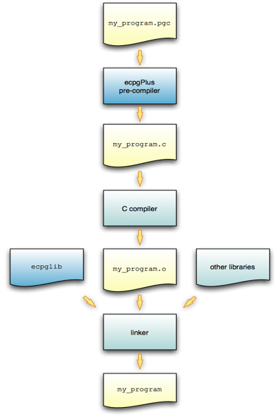

EnterpriseDB has enhanced ECPG (the PostgreSQL pre-compiler) to create ECPGPlus. ECPGPlus is a Pro\*C-compatible version of the PostgreSQL C pre-compiler. ECPGPlus translates a program that combines C code and embedded SQL statements into an equivalent C program. As it performs the translation, ECPGPlus verifies that the syntax of each SQL construct is correct.

The following diagram charts the path of a program containing embedded SQL statements as it is compiled into an executable:

To produce an executable from a C program that contains embedded SQL statements, pass the program (my\_program.pgc in the diagram above) to the ECPGPlus pre-compiler. ECPGPlus translates each SQL statement in my\_program.pgc into C code that calls the ecpglib API, and produces a C program (my\_program.c). Then, pass the C program to a C compiler; the C compiler generates an object file (my\_program.o). Finally, pass the object file (my\_program.o), as well as the ecpglib library file, and any other required libraries to the linker, which in turn produces the executable (my\_program).

While the ECPGPlus preprocessor validates the *syntax* of each SQL statement, it cannot validate the *semantics*. For example, the preprocessor will confirm that an INSERT statement is syntactically correct, but it cannot confirm that the table mentioned in the INSERT statement actually exists.

***Behind the Scenes***

A client application contains a mix of C code and SQL code comprised of the following elements:
 - C preprocessor directives
 - C declarations (variables, types, functions, ...)
 - C definitions (variables, types, functions, ...)
 - SQL preprocessor directives
 - SQL statements

For example:

> 1 \#include \<stdio.h\>
>
> 2 EXEC SQL INCLUDE sqlca;
>
> 3
>
> 4 extern void printInt(char \*label, int val);
>
> 5 extern void printStr(char \*label, char \*val);
>
> 6 extern void printFloat(char \*label, float val);
>
> 7
>
> 8 void displayCustomer(int custNumber)
>
> 9 {
>
> 10 EXEC SQL BEGIN DECLARE SECTION;
>
> 11 VARCHAR custName\[50\];
>
> 12 float custBalance;
>
> 13 int custID = custNumber;
>
> 14 EXEC SQL END DECLARE SECTION;
>
> 15
>
> 16 EXEC SQL SELECT name, balance
>
> 17 INTO :custName, :custBalance
>
> 18 FROM customer
>
> 19 WHERE id = :custID;
>
> 20
>
> 21 printInt("ID", custID);
>
> 22 printStr("Name", custName);
>
> 23 printFloat("Balance", custBalance);
>
> 24 }

In the above code fragment:
 - Line 1 specifies a directive to the C preprocessor.

> C preprocessor directives may be interpreted or ignored; the option is controlled by a command line option (-C PROC) entered when you invoke ECPGPlus. In either case, ECPGPlus copies each C preprocessor directive to the output file (4) without change; any C preprocessor directive found in the source file will appear in the output file.
 - Line 2 specifies a directive to the SQL preprocessor.

> SQL preprocessor directives are interpreted by the ECPGPlus preprocessor, and are not copied to the output file.
 - Lines 4 through 6 contain C declarations.

> C declarations are copied to the output file without change, except that each VARCHAR declaration is translated into an equivalent struct declaration.
 - Lines 10 through 14 contain an embedded-SQL declaration section.

    C variables that you refer to within SQL code are known as *host variables*. If you invoke the ECPGPlus preprocessor in Pro\*C mode (-C PROC), you may refer to *any* C variable within a SQL statement; otherwise you must declare each host variable within a BEGIN/END DECLARATION SECTION pair.
 - Lines 16 through 19 contain a SQL statement.

> SQL statements are translated into calls to the ECPGPlus run-time library.
 - Lines 21 through 23 contain C code.

> C code is copied to the output file without change.

Any SQL statement must be prefixed with EXEC SQL and extends to the next (unquoted) semicolon. For example:

> printf(“Updating employee salaries\\n”);
>
> EXEC SQL UPDATE emp SET sal = sal \* 1.25;
>
> EXEC SQL COMMIT;
>
> printf(“Employee salaries updated\\n”);

When the preprocessor encounters the code fragment shown above, it passes the C code (the first line and the last line) to the output file without translation and converts each EXEC SQL statement into a call to an ecpglib function. The result would appear similar to the following:

> printf("Updating employee salaries\\n");
>
> {
>
> ECPGdo( \_\_LINE\_\_, 0, 1, NULL, 0, ECPGst\_normal,
>
> "update emp set sal = sal \* 1.25",
>
> ECPGt\_EOIT, ECPGt\_EORT);
>
> }
>
> {
>
> ECPGtrans(\_\_LINE\_\_, NULL, "commit");
>
> }
>
> printf(“Employee salaries updated\\n”);

## Installation and Configuration

ECPGPlus is installed by the Advanced Server installation wizard as part of the Database Server component. By default, on a Linux installation, the executable is located in:

> /opt/PostgresPlus/9.4AS/bin
>
> On Windows, the executable is located in:
>
> C:\\Program Files\\PostgresPlus\\9.4AS\\bin

When invoking the ECPGPlus compiler, the executable must be in your search path (%PATH% on Windows, $PATH on Linux). Use the following commands to set the search path (substituting the name of the directory that holds the ECPGPlus executable for *ecpgPlus*):

> On Windows, use the command:
>
> SET PATH=*ecpgPlus*;%PATH%
>
> On Linux, use the command:
>
> PATH=*ecpgPlus*:$PATH

## Constructing a Makefile

A makefile contains a set of instructions that tell the make utility how to transform a program written in C (that contains embedded SQL) into a C program. To try the examples in this guide, you will need:
 - a C compiler (and linker)
 - the make utility
 - ECPGPlus preprocessor and library
 - a makefile that contains instructions for ECPGPlus

The following code is an example of a makefile for the samples included in this guide. To use the sample code, save it in a file named makefile in the directory that contains the source code file.

> INCLUDES = -I$(shell pg\_config --includedir)
> LIBPATH = -L $(shell pg\_config --libdir)
> CFLAGS += $(INCLUDES) -g
> LDFLAGS += -g
> LDLIBS += $(LIBPATH) -lecpg -lpq
>
> .SUFFIXES: .pgc,.pc
>
> .pgc.c:
> ecpg -c $(INCLUDES) $?
>
> .pc.c:
> ecpg -C PROC -c $(INCLUDES) $?

The first two lines use the pg\_config program to locate the necessary header files and library directories:

> INCLUDES = -I$(shell pg\_config --includedir)
> LIBPATH = -L $(shell pg\_config --libdir)

The pg\_config program is shipped with Advanced Server.

make knows that it should use the CFLAGS variable when running the C compiler and LDFLAGS and LDLIBS when invoking the linker. ECPG programs must be linked against the ECPG run-time library (-lecpg) and the libpq library (-lpq)

CFLAGS += $(INCLUDES) -g
LDFLAGS += -g
LDLIBS += $(LIBPATH) -lecpg -lpq

The sample makefile instructs make how to translate a .pgc or a .pc file into a C program. Two lines in the makefile specify the mode in which the source file will be compiled. The first compile option is:

> .pgc.c:
> ecpg -c $(INCLUDES) $?

The first option tells make how to transform a file that ends in .pgc (presumably, an ECPG source file) into a file that ends in .c (a C program), using community ECPG (without the ECPGPlus enhancements). It invokes the ECPG pre-compiler with the -c flag (instructing the compiler to convert SQL code into C), using the value of the INCLUDES variable and the name of the .pgc file.

> .pc.c:
> ecpg -C PROC -c $(INCLUDES) $?

The second option tells make how to transform a file that ends in .pg (an ECPG source file) into a file that ends in .c (a C program), using the ECPGPlus extensions. It invokes the ECPG pre-compiler with the -c flag (instructing the compiler to convert SQL code into C), as well as the -C PROC flag (instructing the compiler to use ECPGPlus in Pro\*C-compatibility mode), using the value of the INCLUDES variable and the name of the .pgc file.

When you run make, pass the name of the ECPG source code file you wish to compile. For example, to compile an ECPG source code file named customer\_list.pgc, use the command:

make customer\_list

The make utility consults the makefile (located in the current directory), discovers that the makefile contains a rule that will compile customer\_list.pgc into a C program (customer\_list.c), and then uses the rules built into make to compile customer\_list.c into an executable program.

## ECPGPlus Command Line Options

In the sample makefile shown above, make includes the -C option when invoking ECPGPlus to specify that ECPGPlus should be invoked in Pro\*C-compatible mode.

To display a complete list of the other ECPGPlus options available, navigate to the ECPGPlus installation directory, and enter:

> ./ecpg --help

The command line options are:

<table>
<thead>
<tr class="header">
<th>Option</th>
<th>Description</th>
</tr>
</thead>
<tbody>
<tr class="odd">
<td>-c</td>
<td>Automatically generate C code from embedded SQL code.</td>
</tr>
<tr class="even">
<td>-C <em>mode</em></td>
<td>
Use the -C option to specify a compatibility mode:

INFORMIX

INFORMIX_SE

PROC
</td>
</tr>
<tr class="odd">
<td>-D <em>symbol</em></td>
<td>Define a preprocessor <em>symbol.</em></td>
</tr>
<tr class="even">
<td>-h</td>
<td>Parse a header file, this option includes option '-c'.</td>
</tr>
<tr class="odd">
<td>-i</td>
<td>Parse system, include files as well.</td>
</tr>
<tr class="even">
<td>-I directory</td>
<td>Search <em>directory</em> for include files.</td>
</tr>
<tr class="odd">
<td>-o <em>outfile</em></td>
<td>Write the result to <em>outfile.</em></td>
</tr>
<tr class="even">
<td>-r <em>option</em></td>
<td>
Specify run-time behavior; <em>option</em> can be:

no_indicator - Do not use indicators, but instead use special values to represent NULL values.

prepare - Prepare all statements before using them.

questionmarks - Allow use of a question mark as a placeholder.

usebulk - Enable bulk processing for INSERT, UPDATE and DELETE statements that operate on host variable arrays.
</td>
</tr>
<tr class="odd">
<td>--regression</td>
<td>Run in regression testing mode.</td>
</tr>
<tr class="even">
<td>-t</td>
<td>Turn on autocommit of transactions.</td>
</tr>
<tr class="odd">
<td>-l</td>
<td>Disable #line directives.</td>
</tr>
<tr class="even">
<td>--help</td>
<td>Display the help options.</td>
</tr>
<tr class="odd">
<td>--version</td>
<td>Output version information.</td>
</tr>
</tbody>
</table>

Please Note: If you do not specify an output file name when invoking ECPGPlus, the output file name is created by stripping off the .pgc file name extension, and appending .c to the file name.

Each of the following sections leads with a code sample, followed by an explanation of each section within the code sample.

## Example - A Simple Query

The first code sample demonstrates how to execute a SELECT statement (which returns a single row), storing the results in a group of host variables. After declaring host variables, it connects to the edb sample database using a hard-coded role name and the associated password, and queries the emp table. The query returns the values into the declared host variables; after checking the value of the NULL indicator variable, it prints a simple result set onscreen and closes the connection.

/\*\*\*\*\*\*\*\*\*\*\*\*\*\*\*\*\*\*\*\*\*\*\*\*\*\*\*\*\*\*\*\*\*\*\*\*\*\*\*\*\*\*\*\*\*\*\*\*\*\*\*\*\*\*\*\*\*\*\*\*

\* print\_emp.pgc

\*

\*/

\#include \<stdio.h\>

int main(void)

{

EXEC SQL BEGIN DECLARE SECTION;

int v\_empno;

char v\_ename\[40\];

double v\_sal;

double v\_comm;

short v\_comm\_ind;

EXEC SQL END DECLARE SECTION;

EXEC SQL WHENEVER SQLERROR sqlprint;

EXEC SQL CONNECT TO edb
USER 'alice' IDENTIFIED BY '1safepwd';

EXEC SQL

SELECT

empno, ename, sal, comm

INTO

:v\_empno, :v\_ename, :v\_sal, :v\_comm INDICATOR:v\_comm\_ind

FROM

emp

WHERE

empno = 7369;

if (v\_comm\_ind)

printf("empno(%d), ename(%s), sal(%.2f) comm(NULL)\\n",

v\_empno, v\_ename, v\_sal);

else

printf("empno(%d), ename(%s), sal(%.2f) comm(%.2f)\\n",

v\_empno, v\_ename, v\_sal, v\_comm);

EXEC SQL DISCONNECT;

}

/\*\*\*\*\*\*\*\*\*\*\*\*\*\*\*\*\*\*\*\*\*\*\*\*\*\*\*\*\*\*\*\*\*\*\*\*\*\*\*\*\*\*\*\*\*\*\*\*\*\*\*\*\*\*\*\*\*\*\*\*

The code sample begins by including the prototypes and type definitions for the C stdio library, and then declares the main function:

\#include \<stdio.h\>

int main(void)

{

Next, the application declares a set of host variables used to interact with the database server:

EXEC SQL BEGIN DECLARE SECTION;

int v\_empno;

char v\_ename\[40\];

double v\_sal;

double v\_comm;

short v\_comm\_ind;

EXEC SQL END DECLARE SECTION;

Please note that if you plan to pre-compile the code in PROC mode, you may omit the BEGIN DECLARE…END DECLARE section. For more information about declaring host variables, refer to [Section 3.1.2](#_Declaring_Host_Variables), *Declaring* *Host* *Variables*.

The data type associated with each variable within the declaration section is a C data type. Data passed between the server and the client application must share a compatible data type; for more information about data types, see [Section 7.2](#supported-c-data-types), *Supported* *C* *Data* *Types*.

The next statement instructs the server how to handle an error:

EXEC SQL WHENEVER SQLERROR sqlprint;

If the client application encounters an error in the SQL code, the server will print an error message to stderr (standard error), using the sqlprint() function supplied with ecpglib. The next EXEC SQL statement establishes a connection with Advanced Server:

EXEC SQL CONNECT TO edb
USER 'alice' IDENTIFIED BY '1safepwd';

In our example, the client application connects to the edb database, using a role named alice with a password of 1safepwd.

The code then performs a query against the emp table:

EXEC SQL

SELECT

empno, ename, sal, comm

INTO

:v\_empno, :v\_ename, :v\_sal, :v\_comm INDICATOR :v\_comm\_ind

FROM

emp

WHERE

empno = 7369;

The query returns information about employee number 7369.

The SELECT statement uses an INTO clause to assign the retrieved values (from the empno, ename, sal and comm columns) into the :v\_empno, :v\_ename, :v\_sal and :v\_comm host variables (and the :v\_comm\_ind null indicator). The first value retrieved is assigned to the first variable listed in the INTO clause, the second value is assigned to the second variable, and so on.

The comm column contains the commission values earned by an employee, and could potentially contain a NULL value. The statement includes the INDICATOR keyword, and a host variable to hold a null indicator.

The code checks the null indicator, and displays the appropriate on-screen results:

if (v\_comm\_ind)

printf("empno(%d), ename(%s), sal(%.2f) comm(NULL)\\n",

v\_empno, v\_ename, v\_sal);

else

printf("empno(%d), ename(%s), sal(%.2f) comm(%.2f)\\n",

v\_empno, v\_ename, v\_sal, v\_comm);

If the null indicator is 0 (that is, false), the comm column contains a meaningful value, and the printf function displays the commission. If the null indicator contains a non-zero value, comm is NULL, and printf displays a value of NULL. Please note that a host variable (other than a null indicator) contains no meaningful value if you fetch a NULL into that host variable; you must use null indicators to identify any value which may be NULL.

The final statement in the code sample closes the connection to the server:

EXEC SQL DISCONNECT;

}

### Using Indicator Variables

The previous example included an *indicator* *variable* that identifies any row in which the value of the comm column (when returned by the server) was NULL. An indicator variable is an extra host variable that denotes if the content of the preceding variable is NULL or truncated. The indicator variable is populated when the contents of a row are stored. An indicator variable may contain the following values:

| Indicator Value                             | Denotes                                                                          |
| ------------------------------------------- | -------------------------------------------------------------------------------- |
| If an indicator variable is less than 0.    | The value returned by the server was NULL.                                       |
| If an indicator variable is equal to 0.     | The value returned by the server was not NULL, and was not truncated.            |
| If an indicator variable is greater than 0. | The value returned by the server was truncated when stored in the host variable. |

When including an indicator variable in an INTO clause, you are not required to include the optional INDICATOR keyword.

You may omit an indicator variable if you are certain that a query will never return a NULL value into the corresponding host variable. If you omit an indicator variable and a query returns a NULL value, ecpglib will raise a run-time error.

### Declaring Host Variables

You can use a *host* *variable* in a SQL statement at any point that a value may appear within that statement. A host variable is a C variable that you can use to pass data values from the client application to the server, and return data from the server to the client application. A host variable can be:
 - an array
 - a typedef
 - a pointer
 - a struct
 - any scalar C data type

The code fragments that follow demonstrate using host variables in code compiled in PROC mode, and in non-PROC mode. The SQL statement adds a row to the dept table, inserting the values returned by the variables v\_deptno, v\_dname and v\_loc into the deptno column, the dname column and the loc column, respectively.

If you are compiling in PROC mode, you may omit the EXEC SQL BEGIN DECLARE SECTION and EXEC SQL END DECLARE SECTION directives. PROC mode permits you to use C function parameters as host variables:

void addDept(int v\_deptno, char v\_dname, char v\_loc)
{
EXEC SQL INSERT INTO dept VALUES( :v\_deptno, :v\_dname, :v\_loc);
}

If you are not compiling in PROC mode, you must wrap embedded variable declarations with the EXEC SQL BEGIN DECLARE SECTION and the EXEC SQL END DECLARE SECTION directives, as shown below:

void addDept(int v\_deptno, char v\_dname, char v\_loc)
{
EXEC SQL BEGIN DECLARE SECTION;
int v\_deptno\_copy = v\_deptno;
char v\_dname\_copy\[14+1\] = v\_dname;
char v\_loc\_copy\[13+1\] = v\_loc;
EXEC SQL END DECLARE SECTION;

EXEC SQL INSERT INTO dept VALUES( :v\_deptno, :v\_dname, :v\_loc);
}

You can also include the INTO clause in a SELECT statement to use the host variables to retrieve information:

> EXEC SQL SELECT deptno, dname, loc
> INTO :v\_deptno, :v\_dname, v\_loc FROM dept;

Each column returned by the SELECT statement must have a type-compatible target variable in the INTO clause. This is a simple example that retrieves a single row; to retrieve more than one row, you must define a cursor, as demonstrated in the next example.

## Example - Using a Cursor to Process a Result Set

The code sample that follows demonstrates using a cursor to process a result set. There are four basic steps involved in creating and using a cursor:

1.  Use the DECLARE CURSOR statement to define a cursor.

2.  Use the OPEN CURSOR statement to open the cursor.

3.  Use the FETCH statement to retrieve data from a cursor.

4.  Use the CLOSE CURSOR statement to close the cursor.

After declaring host variables, our example connects to the edb database using a user-supplied role name and password, and queries the emp table. The query returns the values into a cursor named employees. The code sample then opens the cursor, and loops through the result set a row at a time, printing the result set. When the sample detects the end of the result set, it closes the connection.

/\*\*\*\*\*\*\*\*\*\*\*\*\*\*\*\*\*\*\*\*\*\*\*\*\*\*\*\*\*\*\*\*\*\*\*\*\*\*\*\*\*\*\*\*\*\*\*\*\*\*\*\*\*\*\*\*\*\*\*\*

\* print\_emps.pgc

\*

\*/

\#include \<stdio.h\>

int main(int argc, char \*argv\[\])

{

EXEC SQL BEGIN DECLARE SECTION;

char \*username = argv\[1\];

char \*password = argv\[2\];

int v\_empno;

char v\_ename\[40\];

double v\_sal;

double v\_comm;

short v\_comm\_ind;

EXEC SQL END DECLARE SECTION;

EXEC SQL WHENEVER SQLERROR sqlprint;

EXEC SQL CONNECT TO edb USER :username IDENTIFIED BY :password;

EXEC SQL DECLARE employees CURSOR FOR

SELECT

empno, ename, sal, comm 

FROM 

emp;

EXEC SQL OPEN employees;

EXEC SQL WHENEVER NOT FOUND DO break;

for (;;)

{

EXEC SQL FETCH NEXT FROM employees 

INTO

:v\_empno, :v\_ename, :v\_sal, :v\_comm INDICATOR :v\_comm\_ind;

if (v\_comm\_ind)

printf("empno(%d), ename(%s), sal(%.2f) comm(NULL)\\n",

v\_empno, v\_ename, v\_sal);

else

printf("empno(%d), ename(%s), sal(%.2f) comm(%.2f)\\n",

v\_empno, v\_ename, v\_sal, v\_comm);

}

EXEC SQL CLOSE employees;

EXEC SQL DISCONNECT;

}

/\*\*\*\*\*\*\*\*\*\*\*\*\*\*\*\*\*\*\*\*\*\*\*\*\*\*\*\*\*\*\*\*\*\*\*\*\*\*\*\*\*\*\*\*\*\*\*\*\*\*\*\*\*\*\*\*\*\*\*\*

The code sample begins by including the prototypes and type definitions for the C stdio library, and then declares the main function:

\#include \<stdio.h\>

int main(int argc, char \*argv\[\])

{

Next, the application declares a set of host variables used to interact with the database server:

EXEC SQL BEGIN DECLARE SECTION;

char \*username = argv\[1\];

char \*password = argv\[2\];

int v\_empno;

char v\_ename\[40\];

double v\_sal;

double v\_comm;

short v\_comm\_ind;

EXEC SQL END DECLARE SECTION;

argv\[\] is an array that contains the command line arguments entered when the user runs the client application. argv\[1\] contains the first command line argument (in this case, a username), and argv\[2\] contains the second command line argument (a password); please note that we have omitted the error-checking code you would normally include a real-world application. The declaration initializes the values of username and password, setting them to the values entered when the user invoked the client application.

You may be thinking that you could refer to argv\[1\] and argv\[2\] in a SQL statement (instead of creating a separate copy of each variable); that will not work. All host variables must be declared within a BEGIN/END DECLARE SECTION (unless you are compiling in PROC mode). Since argv is a function *parameter* (not an automatic variable), it cannot be declared within a BEGIN/END DECLARE SECTION. If you are compiling in PROC mode, you can refer to *any* C variable within a SQL statement.

The next statement instructs the server to respond to an SQL error by printing the text of the error message returned by ECPGPlus or the database server:

EXEC SQL WHENEVER SQLERROR sqlprint;

Then, the client application establishes a connection with Advanced Server:

EXEC SQL CONNECT TO edb USER :username IDENTIFIED BY :password;

The CONNECT statement creates a connection to the edb database, using the values found in the :username and :password host variables to authenticate the application to the server when connecting.

The next statement declares a cursor named employees:

EXEC SQL DECLARE employees CURSOR FOR

SELECT

empno, ename, sal, comm 

FROM 

emp;

employees will contain the result set of a SELECT statement on the emp table. The query returns employee information from the following columns: empno, ename, sal and comm. Notice that when you declare a cursor, you do not include an INTO clause - instead, you specify the target variables (or descriptors) when you FETCH from the cursor.

Before fetching rows from the cursor, the client application must OPEN the cursor:

EXEC SQL OPEN employees;

In the subsequent FETCH section, the client application will loop through the contents of the cursor; the client application includes a WHENEVER statement that instructs the server to break (that is, terminate the loop) when it reaches the end of the cursor:

EXEC SQL WHENEVER NOT FOUND DO break;

The client application then uses a FETCH statement to retrieve each row from the cursor INTO the previously declared host variables:

for (;;)

{

EXEC SQL FETCH NEXT FROM employees

INTO

:v\_empno, :v\_ename, :v\_sal, :v\_comm INDICATOR :v\_comm\_ind;

The FETCH statement uses an INTO clause to assign the retrieved values into the :v\_empno, :v\_ename, :v\_sal and :v\_comm host variables (and the :v\_comm\_ind null indicator). The first value in the cursor is assigned to the first variable listed in the INTO clause, the second value is assigned to the second variable, and so on.

The FETCH statement also includes the INDICATOR keyword and a host variable to hold a null indicator. If the comm column for the retrieved record contains a NULL value, v\_comm\_ind is set to a non-zero value, indicating that the column is NULL.

The code then checks the null indicator, and displays the appropriate on-screen results:

if (v\_comm\_ind)

printf("empno(%d), ename(%s), sal(%.2f) comm(NULL)\\n",

v\_empno, v\_ename, v\_sal);

else

printf("empno(%d), ename(%s), sal(%.2f) comm(%.2f)\\n",

v\_empno, v\_ename, v\_sal, v\_comm);

}

If the null indicator is 0 (that is, false), v\_comm contains a meaningful value, and the printf function displays the commission. If the null indicator contains a non-zero value, comm is NULL, and printf displays the string 'NULL'. Please note that a host variable (other than a null indicator) contains no meaningful value if you fetch a NULL into that host variable; you must use null indicators for any value which may be NULL.

The final statements in the code sample close the cursor (employees), and the connection to the server:

EXEC SQL CLOSE employees;
EXEC SQL DISCONNECT;

