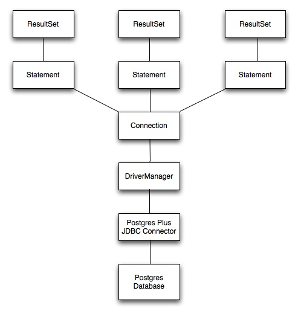
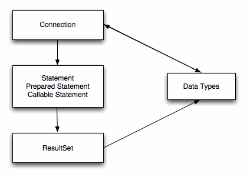

Sun Microsystems created a standardized interface for connecting Java applications to databases known as Java Database Connectivity (JDBC). The Postgres Plus Advanced Server JDBC Connector connects a Java application to a Postgres database.

## JDBC Driver Types

There are currently four different types of JDBC drivers, each with it’s own specific implementation, use and limitations. The Advanced Server JDBC Connector is a Type 4 driver.

Type 1 Driver
 - This driver type is the JDBC-ODBC bridge.
 - It is limited to running locally.
 - Must have ODBC installed on computer.
 - Must have ODBC driver for specific database installed on computer.
 - Generally can’t run inside an applet because of Native Method calls.

Type 2 Driver
 - This is the native database library driver.
 - Uses Native Database library on computer to access database.
 - Generally can’t run inside an applet because of Native Method calls.
 - Must have database library installed on client.

Type 3 Driver
 - 100% Java Driver, no native methods.
 - Does not require pre-installation on client.
 - Can be downloaded and configured on-the-fly just like any Java class file.
 - Uses a proprietary protocol for talking with a middleware server.
 - Middleware server converts from proprietary calls to DBMS specific calls

Type 4 Driver
 - 100% Java Driver, no native methods.
 - Does not require pre-installation on client.
 - Can be downloaded and configured on-the-fly just like any Java class file.
 - Unlike Type III driver, talks directly with the DBMS server.
 - Converts JDBC calls directly to database specific calls.

## The JDBC Interface

Figure 2.1 shows the core API interfaces in the JDBC specification and how they relate to each other. These interfaces are implemented in the java.sql package.

Figure 2.1 - JDBC Class Relationships

## JDBC Classes and Interfaces

The core API is composed of classes and interfaces; these classes and interfaces work together as shown in Figure 2.2:

Figure 2.2 - Core Classes and Interfaces

## The JDBC DriverManager

Figure 2.3 depicts the role of the DriverManager class in a typical JDBC application. The DriverManager acts as the bridge between a Java application and the backend database and determines which JDBC driver to use for the target database.

Figure 2.3 - DriverManager/Drivers

