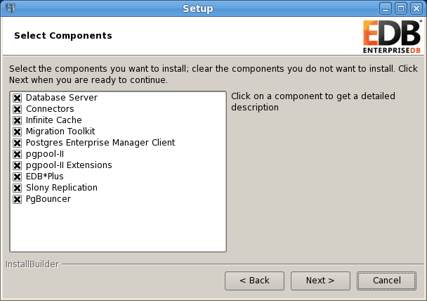

You can use an RPM package, a graphical Postgres installer, or Stack Builder to install Migration Toolkit. Stack Builder is distributed with both Advanced Server and the PostgreSQL one-click installer, available from EnterpriseDB. For more information about performing an installation with Stack Builder, see Section 4.3

Before installing Migration Toolkit, you must first install Java (version 1.7.0 or later). Free downloads of Java installers and installation instructions are available at:

<http://www.java.com/en/download/index.jsp>

## Using an RPM Package to Install Migration Toolkit

You can use an RPM package to install Migration Toolkit on a 64-bit Linux host. The Migration Toolkit RPM package resides in the enterprisedb-tools repository, and is named ppas-migrationtoolkit.

For information about configuring yum to install packages from the enterprisedb-tools repository, please see Section 3.1 of the Postgres Plus Advanced Server Installation Guide, available at:

[http://www.enterprisedb.com/docs/en/9.4/instguide/Postgres\_Plus\_Advanced\_Server\_Installation\_Guide.1.08.html\#](http://www.enterprisedb.com/docs/en/9.4/instguide/Postgres_Plus_Advanced_Server_Installation_Guide.1.08.html)

After using an RPM package to install Migration Toolkit, you must configure the Installation; see Section 7.4 of the Postgres Plus Advanced Server Installation Guide for more information:

[http://www.enterprisedb.com/docs/en/9.4/instguide/Postgres\_Plus\_Advanced\_Server\_Installation\_Guide.1.45.html\#](http://www.enterprisedb.com/docs/en/9.4/instguide/Postgres_Plus_Advanced_Server_Installation_Guide.1.45.html)

## Installing Migration Toolkit with the Graphical Installer

You can use the Postgres Plus Advanced Server or PostgreSQL graphical installer (available from the EnterpriseDB website) to install Migration Toolkit. When the graphical installer prompts you to select components for the installation, confirm that the Migration Toolkit option is checked on the Select Components dialog (as shown below, in Figure 4.1).

*Figure 4.1 - The Select Components dialog from the Advanced Server Installation Wizard.*

After installing Migration Toolkit with Advanced Server, you must install the appropriate source-specific drivers before performing a migration; please see Section 4.4 for more information.

## Using Stack Builder to Install Migration Toolkit

Please Note: This guide uses the term Stack Builder to refer to *either* StackBuilder Plus (distributed with Postgres Plus Advanced Server) or Stack Builder (distributed with the PostgreSQL one-click installer from EnterpriseDB).

Please note that you must have a Java JVM (version 1.7.0 or later) in place before Stack Builder can perform a Migration Toolkit installation. Free downloads of Java installers and installation instructions are available at:

<http://www.java.com/en/download/index.jsp>

The Java executable must be in your search path (%PATH% on Windows, $PATH on Linux/Unix). Use the following commands to set the search path (substituting the name of the directory that holds the Java executable for *javadir*):

> On Windows, use the command:
>
> SET PATH=*javadir*;%PATH%
>
> On Linux, use the command:
>
> PATH=*javadir*:$PATH

After setting the search path, you can use the Stack Builder installation wizard to install Migration Toolkit into either Advanced Server or PostgreSQL.

**Launching StackBuilder Plus from Advanced Server**

To launch StackBuilder Plus from an existing Advanced Server installation, navigate through the Start (or Applications) menu to the Postgres Plus Add-ons menu, and select the StackBuilder Plus menu option.

**Launching Stack Builder from PostgreSQL**

To launch Stack Builder from an existing PostgreSQL installation, navigate through the Start (or Applications) menu to the PostgreSQL menu, and select the Application StackBuilder Plus menu option.

Stack Builder opens as shown in Figure 4.2.

!\[image\]\(./images/image4.png)

Figure 4.2 - The Stack Builder welcome window.

Use the drop-down listbox to select the target server installation from the list of available servers. If your network requires you to use a proxy server to access the Internet, use the Proxy servers button to open the Proxy servers dialog and specify a proxy server; if you do not need to use a proxy server, click Next to open the application selection window.

!\[image\]\(./images/image5.png)

Figure 4.3 - The Stack Builder application selection window.

If you are using StackBuilder Plus to add Migration Toolkit to your Advanced Server installation, expand the Add-ons, tools and utilities node of the tree control, and check the box next to EnterpriseDB Migration Toolkit (as shown in Figure 4.3). Click Next to continue.

If you are using Stack Builder to add Migration Toolkit to your PostgreSQL installation, expand the EnterpriseDB Tools node of the tree control (located under the Registration-required and trial products node), and check the box next to Migration Toolkit. Click Next to continue.

To download the Migration Toolkit installer for your Advanced Server installation, you must provide the email address and password associated with your EnterpriseDB user account. Registration is free, and provides access to many EnterpriseDB resources, including the Migration Toolkit installer.

!\[image\]\(./images/image6.png)

Figure 4.4 – Provide EnterpriseDB user credentials.

When prompted, provide EnterpriseDB user credentials; if you do not have an EnterpriseDB user account, you can use the link provided (see Figure 4.4) to create an account.

!\[image\]\(./images/image7.png)

Figure 4.5 - The Stack Builder selection confirmation window.

Confirm that Migration Toolkit is included in the Selected Packages list and that the Download directory field contains an acceptable download location (as shown in Figure 4.5). Click Next to start the Migration Toolkit download (see Figure 4.6).

!\[image\]\(./images/image8.png)

Figure 4.6 – Downloading the Migration Toolkit installer.

!\[image\]\(./images/image9.png)

Figure 4.7 - Stack Builder confirms the file download.

When the download completes, Stack Builder confirms that the installation files have been successfully downloaded (Figure 4.7). Choose Next to open the Migration Toolkit installation wizard.

!\[image\]\(./images/image10.png)

Figure 4.8 – Select a language for the installation wizard.

When prompted by the Migration Toolkit installation wizard, specify a language for the installation (see Figure 4.8) and click OK to continue.

!\[image\]\(./images/image11.png)

Figure 4.9 - The Migration Toolkit installation wizard.

The Migration Toolkit installation wizard opens (as shown in Figure 4.9). Click Next to continue.

!\[image\]\(./images/image12.png)

Figure 4.10 - The EnterpriseDB license agreement.

Carefully review the license agreement (as shown in Figure 4.7) before highlighting the appropriate radio button; click Next to continue to the User Authentication window (shown in Figure 4.10).

To install Migration Toolkit, you must provide the email address and password associated with your EnterpriseDB user account. Registration is free, and provides access to many EnterpriseDB resources, including the Migration Toolkit installer.

If you do not have an EnterpriseDB user account, click the link to open a browser and provide registration information (see Figure 4.11).

!\[image\]\(./images/image13.png)

Figure 4.11 - The EnterpriseDB User Authentication window.

If you have registered your information with EnterpriseDB, enter the email address and password associated with your user account, and click Next to continue.

!\[image\]\(./images/image14.png)

Figure 4.12 - Specify a Migration Toolkit installation directory.

By default, Migration Toolkit will be installed in the edbmtk directory (under the PostgresPlus directory). Accept the default installation directory as displayed (see Figure 4.12), or modify the directory, and click Next to continue.

!\[image\]\(./images/image15.png)

Figure 4.13 - Completing the Migration Toolkit installation.

The installation wizard confirms that the Setup program is ready to install Migration Toolkit (as shown in Figure 4.13); click Next to start the installation.

!\[image\]\(./images/image16.png)

Figure 4.14 - Stack Builder confirms the installation is complete.

A dialog confirms that the Migration Toolkit installation is complete (see Figure 4.14); click Finish to exit the Migration Toolkit installer.

!\[image\]\(./images/image17.png)

Figure 4.15 - Stack Builder confirms the installation is complete.

When Stack Builder finalizes installation of the last selected component, it displays the Installation Completed window (shown in Figure 4.15). Click Finish to close Stack Builder.

After installing Migration Toolkit with Stack Builder, you must install the appropriate source-specific drivers before performing a migration; please see Section 4.4 for more information.

## Installing Source-Specific Drivers

Before invoking Migration Toolkit, you must download and install a freely available source-specific driver. To download a driver, or for a link to a vendor download site, visit the Third Party JDBC Drivers page at the EnterpriseDB website:

<http://www.enterprisedb.com/downloads/third-party-jdbc-drivers>

After downloading the source-specific driver, move the driver file into the JAVA\_HOME/jre/lib/ext directory.