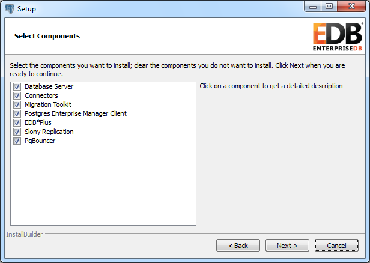

The Advanced Server .NET connector is a .NET data provider that allows a client application to connect to a database stored on an Advanced Server host. The .NET connector accesses the data directly, allowing the client application optimal performance, a broad spectrum of functionality, and access to Advanced Server features.

The .NET connector that is shipped with Advanced Server 9.4 supports .NET framework versions 4.0 and 4.5.

## The .NET Class Hierarchy

The .NET Class Hierarchy contains a number of classes that you can use to create objects that control a connection to the Advanced Server database and manipulate the data stored on the server. The following are just a few of the most commonly used object classes:

EDBConnection

> The EDBConnection class represents a connection to Advanced Server. An EDBConnection object contains a ConnectionString that instructs the .NET client how to connect to an Advanced Server database.

EDBCommand

> An EDBCommand object contains an SQL command that the client will execute against Advanced Server. Before you can execute an EDBCommand object, you must link it to an EDBConnection object.

EDBDataSet

> An EDBDataSet object contains a result set that is generated by one or more queries. An EDBDataSet object may be *typed* or *untyped*. A typed EDBDataSet allows you to access the result set values by column name. When you access data in an untyped result set, you must use generic accessor methods.

EDBDataReader

> An EDBDataReader object provides a way to read an Advanced Server result set. You can use an EDBDataReader object to step through an EDBDataSet one row at a time, forward-only.

EDBDataAdapter

> An EDBDataAdapter object links a result set to the Advanced Server database. You can modify values within a EDBDataSet, and use the EDBDataAdapter class to update the data stored in an Advanced Server database.

## Installing and Configuring the .NET Connector

By default, the Advanced Server installer for the Windows platform installs the .NET connector. To ensure that the .NET connector is installed during an Advanced Server installation, confirm that the check box next to Connectors is checked on the Select Components window of the installation wizard (see Figure 2.1).

*Figure 2.1 - The Select Components dialog.*

**Configuring the .NET Connector**

Before using the .NET connector, you must copy the following shared library files to your working directory:

> EDBDataProvider2.0.2.dll
>
> Mono.Security.dll

Select the library files from the directory that corresponds to the .NET Framework that you are using. The Advanced Server .NET connector files for .NET Framework 4.0 are located in:

> C:\\Program Files\\PostgresPlus\\9.4AS\\connectors\\dotnet\\4.0\\

The Advanced Server .NET connector files for .NET Framework 4.5 are located in:

> C:\\Program Files\\PostgresPlus\\9.4AS\\connectors\\dotnet\\4.5\\

Before you can use an Advanced Server .NET class, you must *import* the EnterpriseDB.EDBClient namespace into your program. Importing a namespace makes the compiler aware of the classes available within the namespace. The method you use to include the namespace varies by the type of application you are writing. For example, the following command imports a namespace into an ASP.NET page:

> \<% import namespace="EnterpriseDB.EDBClient" %\>

To import a namespace into a C\# application, write:

> using EnterpriseDB.EDBClient;

## Using the Examples in this Guide

To use the examples in this guide, place both the EDBDataProvider2.0.2.dll and the Mono.Security.dll in the same directory as the compiled form of your application.

All of the examples are written in C\# and each is embedded in an ASP.NET page; the same logic and code would be applicable with other .NET applications (WinForm or console applications, for example).

**The web.config File**

An Advanced Server connection string is stored in the web.config file. Save this file in an App.config file if you are not using ASP.NET pages.

Please create and save the following web.config file in the same directory as the sample code. The examples make use of the DB\_CONN\_STRING key from this configuration file to return a connection string from the Advanced Server host.

\<?xml version="1.0" encoding="utf-8"?\>

\<configuration\>

\<appSettings\>

\<add key="DB\_CONN\_STRING" value="Server=127.0.0.1;Port=5444;

User Id=enterprisedb;Password=enterprisedb;Database=edb" /\>

\</appSettings\>

\</configuration\>

