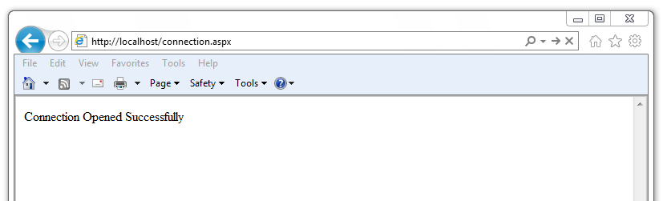
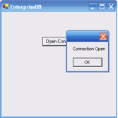

The sections that follow provide examples that demonstrate using the EDB object classes that are provided by the Advanced Server .NET connector that allow a .NET application to connect to and interact with an Advanced Server database.

## Opening a Database Connection

An EDBConnection object is responsible for handling the communication between an instance of Advanced Server and a .NET application. Before you can access data stored in an Advanced Server database, you must create and open an EDBConnection.

The examples that follow demonstrate the basic steps for connecting to an instance of Advanced Server. You must:

1.  Import the namespace EnterpriseDB.EDBClient.

2.  Create an instance of EDBConnection.

3.  Initialize the EDBConnection object by passing a connection string as a parameter to the constructor for the EDBConnection class.

4.  Call the Open method of the EDBConnection object to open the connection.

### Connection String Parameters

A valid connection string should specify location and authentication information for an Advanced Server instance. You must provide the connection string before opening the connection. A connection string must contain:
 - The name or IP address of the server
 - The name of the Advanced Server database
 - The name of an Advanced Server user
 - The password associated with that user

The following parameters may be included in the connection string:

CommandTimeout

> CommandTimeout specifies the length of time (in seconds) to wait for a command to finish execution before throwing an exception. The default value is 20.

ConnectionLifeTime

> Use ConnectionLifeTime to specify the length of time (in seconds) to wait before closing unused connections in the pool. The default value is 15.

Database

> Use the Database parameter to specify the name of the database to which the application should connect. If a database name is not specified, the database name will default to the name of the connecting user.

Encoding

> The Encoding parameter is obsolete; the parameter always returns the string unicode, and silently ignores attempts to set it.

Integrated Security

> By default, Integrated Security is set to false, and Windows Integrated Security is disabled. Specify a value of true to use Windows Integrated Security.

MaxPoolSize

> MaxPoolSize instructs EDBConnection to dispose of pooled connections when the pool exceeds the specified number of connections. The default value is 20.

MinPoolSize

> MinPoolSize instructs EDBConnection to pre-allocate the specified number of connections with the server. The default value is 1.

Password

> When using clear text authentication, specify the password that will be used to establish a connection with the server.

Pooling

> By default, Pooling is set to true to enable connection pooling. Specify a value of false to disable connection pooling.

Port

> The Port parameter specifies the port to which the application should connect.

Protocol

> The specific protocol version to use (instead of automatic); specify an integer value of 2 or 3.

SearchPath

> Use the SearchPath parameter to change the search path to named and public schemas.

Server

> The name or IP address of the Advanced Server host.

SSL

> By default, SSL is set to false; specify a value of true to attempt a secure connection.

sslmode

> Use sslmode to specify an SSL connection control preference. sslmode can be:
>
> prefer - Use SSL if possible.
>
> require - Throw an exception if an SSL connection cannot be established.
>
> allow - Connect without SSL. This parameter is not supported.
>
> disable - Do not attempt an SSL connection. This is the default behavior.

SyncNotification

> Use the SyncNotification parameter to specify that EDBDataprovider should use synchronous notifications. The default value is false.

Timeout

> Timeout specifies the length of time (in seconds) to wait for an open connection. The default value is 15.

User Id

> The User Id parameter specifies the user name that should be used for the connection.

### Example - Opening a Database Connection using ASP.NET

The following example demonstrates how to open a connection to an instance of Advanced Server and then close the connection. The connection is established using the credentials specified in the DB\_CONN\_STRING configuration parameter (see Section 2.3, *The web.config File*).

\<% @ Page Language="C\#" %\>

\<% @Import Namespace="EnterpriseDB.EDBClient" %\>

\<% @Import Namespace="System.Configuration" %\>

\<script language="C\#" runat="server"\>

private void Page\_Load(object sender, System.EventArgs e)

{

string strConnectionString = ConfigurationSettings.AppSettings

\["DB\_CONN\_STRING"\];

EDBConnection conn = new EDBConnection(strConnectionString);

try

{

conn.Open();

Response.Write("Connection opened successfully");

}

catch(EDBException exp)

{

exp.ToString();

}

finally

{

conn.Close();

}

}

\</script\>

If the connection is successful, a browser will display the following:

### Example - Opening a Database Connection from a Console Application

The following example opens a connection with an Advanced Server database using a console-based application.

Before writing the code for the console application, create an app.config file that stores the connection string to the database. Using a configuration file makes it convenient to update the connection string if the information changes.

\<?xml version="1.0" encoding="utf-8" ?\>

\<configuration\>

\<appSettings\>

\<add key="DB\_CONN\_STRING" value = "Server=127.0.0.1;Port=5444;

User Id=enterprisedb;Password=enterprisedb;Database=edb"/\>

\</appSettings\>

\</configuration\>

Using your text editor of choice, enter the following code sample into a file:

using System;

using System.Data;

using EnterpriseDB.EDBClient;

using System.Configuration;

namespace EnterpriseDB

{

class EDB

{

static void Main(string\[\] args)

{

string strConnectionString = ConfigurationSettings.AppSettings

\["DB\_CONN\_STRING"\];

EDBConnection conn = new EDBConnection(strConnectionString);

try

{

conn.Open();

Console.WriteLine("Connection Opened Successfully");

}

catch(Exception exp)

{

throw new Exception(exp.ToString());

}

finally

{

conn.Close();

}

}

}

}

Save the file as EDBConnection-Sample.cs and compile it with the following command:

csc /r:EDBDataProvider.dll /out:Console.exe EDBConnection-Sample.cs

Compiling the sample should generate a Console.exe file; you can execute the sample code by entering Console.exe. When executed, the console should verify that the:

> Connection Opened Successfully

### Example - Opening a Database Connection from a Windows Form Application

The following example demonstrates opening a database connection using a .NET WinForm application.

Save the following code as WinForm-Example.cs in a directory that contains both the EDBDataProvider.dll and the Mono.Security.dll.

using System;

using System.Windows.Forms;

using System.Drawing;

using EnterpriseDB.EDBClient;

namespace EDBTestClient

{

class Win\_Conn

{

static void Main(string\[\] args)

{

Form frmMain = new Form();

Button btnConn = new Button();

btnConn.Location = new System.Drawing.Point(104, 64);

btnConn.Name = "btnConn";

btnConn.Text = "Open Connection";

btnConn.Click += new System.EventHandler(btnConn\_Click);

frmMain.Controls.Add(btnConn);

frmMain.Text = "EnterpriseDB";

Application.Run(frmMain);

}

private static void btnConn\_Click(object sender, System.EventArgs e)

{

EDBConnection conn = null;

try

{

string connectionString = "Server=10.90.1.29;port=5444;

username=edb;password=edb;database=edb";

conn = new EDBConnection(connectionString);

conn.Open();

MessageBox.Show("Connection Open");

}

catch(EDBException exp)

{

MessageBox.Show(exp.ToString());

}

finally

{

conn.Close();

}

}

}

}

Note that you must change the database connection string to point to the database that you want to connect to before compiling the file with the following command:

csc /r:EDBDataProvider.dll /out:WinForm.exe WinForm-Example.cs

This command should generate a WinForm.exe file within the same folder that the executable was compiled under. Invoking the executable will display:

## Retrieving Database Records

You can use a SELECT statement to retrieve records from the database via a SELECT command. To execute a SELECT statement you must:
 - Create and open a database connection.
 - Create an EDBCommand object that represents the SELECT statement.
 - Execute the command with the ExecuteReader() method of the EDBCommand object returning a EDBDataReader
 - Loop through the EDBDataReader displaying the results or binding the EDBDataReader to some control.

An EDBDataReader object represents a forward-only and read-only stream of database records, presented one record at a time. To view a subsequent record in the stream, you must call the Read() method of the EDBDataReader object.

The example that follows:

1.  Imports the Advanced Server namespace: EnterpriseDB.EDBClient

2.  Initializes an EDBCommand object with a SELECT statement.

3.  Opens a connection to the database.

4.  Executes the EDBCommand by calling the ExecuteReader method of the EDBCommand object.

> The results of the SQL statement are retrieved into an EDBDataReader object.

5.  Loops through the contents of the EDBDataReader object to display the records returned by the query within a WHILE loop.

The Read() method advances to the next record (if a record exists) and returns true if a record exists, or false to indicate that the EDBDataReader has reached the end of the result set.

\<% @ Page Language="C\#" %\>

\<% @Import Namespace="EnterpriseDB.EDBClient" %\>

\<% @Import Namespace="System.Data" %\>

\<% @Import Namespace="System.Configuration" %\>

\<script language="C\#" runat="server"\>

private void Page\_Load(object sender, System.EventArgs e)

{

string strConnectionString = ConfigurationSettings.AppSettings

\["DB\_CONN\_STRING"\];

EDBConnection conn = new EDBConnection(strConnectionString);

try

{

conn.Open();

EDBCommand cmdSelect = new EDBCommand("SELECT \* FROM dept",conn);

cmdSelect.CommandType = CommandType.Text;

EDBDataReader drDept = cmdSelect.ExecuteReader();

while(drDept.Read())

{

Response.Write("Department Number: " + drDept\["deptno"\]);

Response.Write("\\tDepartment Name: " + drDept\["dname"\]);

Response.Write("\\tDepartment Location: " + drDept\["loc"\]);

Response.Write("\<br\>");

}

}

catch(Exception exp)

{

Response.Write(exp.ToString());

}

finally

{

conn.Close();

}

}

\</script\>

To exercise the sample code, save the code in your default web root directory in a file named:

> selectEmployees.aspx

To invoke the program, open a web-browser, and browse to:

> http://localhost/selectEmployees.aspx.

### Retrieving a Single Database Record

To retrieve a single result from a query, use the ExecuteScalar() method of the EDBCommand object. The ExecuteScalar() method returns the first value of the first column of the first row of the DataSet generated by the specified query.

\<% @ Page Language="C\#" %\>

\<% @Import Namespace="EnterpriseDB.EDBClient" %\>

\<% @Import Namespace="System.Data" %\>

\<% @Import Namespace="System.Configuration" %\>

\<script language="C\#" runat="server"\>

private void Page\_Load(object sender, System.EventArgs e)

{

string strConnectionString = ConfigurationSettings.AppSettings

\["DB\_CONN\_STRING"\];

EDBConnection conn = new EDBConnection(strConnectionString);

try

{

conn.Open();

EDBCommand cmd = new EDBCommand("SELECT MAX(sal) FROM emp",conn);

cmd.CommandType = CommandType.Text;

int maxSal = Convert.ToInt32(cmd.ExecuteScalar());

Response.Write("Emp Number: " + maxSal);

}

catch(Exception exp)

{

Response.Write(exp.ToString());

}

finally

{

conn.Close();

}

}

\</script\>

Save the sample code in a file in a web root directory named:

> selectscalar.aspx

To invoke the sample code, open a web-browser, and browse to:

> http://localhost/selectScalar.aspx

Please note that the sample includes an explicit conversion of the value returned by the ExecuteScalar() method. The ExecuteScalar() method returns an object; to view the object, you must convert it into an integer value by using the Convert.ToInt32 method.

## Parameterized Queries

A *parameterized* *query* is a query with one or more parameter markers embedded in the SQL statement. Before executing a parameterized query, you must supply a value for each marker found in the text of the SQL statement.

Parameterized queries are useful when you don't know the complete text of the query at the time you write your code. For example, the value referenced in a WHERE clause may be calculated from user input.

As demonstrated in the following example, you must declare the data type of each parameter specified in the parameterized query by creating an EDBParameter object and adding that object to the command's parameter collection. Then, you must specify a *value* for each parameter by calling the parameter's Value() function.

The example demonstrates use of a parameterized query with an UPDATE statement that increases an employee salary:

\<% @ Page Language="C\#" Debug="true"%\>

\<% @Import Namespace="EnterpriseDB.EDBClient" %\>

\<% @Import Namespace="System.Data" %\>

\<% @Import Namespace="System.Configuration" %\>

\<script language="C\#" runat="server" \>

private void Page\_Load(object sender, System.EventArgs e)

{

string strConnectionString = ConfigurationSettings.AppSettings

\["DB\_CONN\_STRING"\];

EDBConnection conn = new EDBConnection(strConnectionString);

string updateQuery = "UPDATE emp SET sal = sal+500 where empno = :ID";

try {

conn.Open();

EDBCommand cmdUpdate = new EDBCommand(updateQuery,conn);

cmdUpdate.Parameters.Add

(new EDBParameter(":ID", EDBTypes.EDBDbType.Integer));

cmdUpdate.Parameters\[0\].Value = 7788;

cmdUpdate.ExecuteNonQuery();

Response.Write("Record Updated");

}

catch(Exception exp) {

Response.Write(exp.ToString());

}

finally {

conn.Close();

}

}

\</script\>

Save the sample code in a file in a web root directory named:

> updateSalary.aspx

To invoke the sample code, open a web-browser, and browse to:

> http://localhost/updateSalary.aspx

## Inserting Records in a Database

You can use the ExecuteNonQuery() method of EDBCommand to add records to a database stored on an Advanced Server host with an Insert command.

In the example that follows, the insert command is stored in the variable cmd. The values prefixed with a colon (:) are placeholders for EDBParameters that are instantiated, assigned values and then added to the insert command's parameter collection in the statements that follow. The insert command is executed by the ExecuteNonQuery() method of the cmdInsert object.

The example adds a new employee to the emp table:

\<% @ Page Language="C\#" Debug="true"%\>

\<% @Import Namespace="EnterpriseDB.EDBClient" %\>

\<% @Import Namespace="System.Data" %\>

\<% @Import Namespace="System.Configuration" %\>

\<script language="C\#" runat="server" \>

private void Page\_Load(object sender, System.EventArgs e)

{

string strConnectionString = ConfigurationSettings.AppSettings

\["DB\_CONN\_STRING"\];

EDBConnection conn = new EDBConnection(strConnectionString);

try

{

conn.Open();

string cmd = "INSERT INTO emp(empno,ename) VALUES(:EmpNo, :EName)";

EDBCommand cmdInsert = new EDBCommand(cmd,conn);

cmdInsert.Parameters.Add(new EDBParameter(":EmpNo",

EDBTypes.EDBDbType.Integer));

cmdInsert.Parameters\[0\].Value = 1234;

cmdInsert.Parameters.Add(new EDBParameter(":EName",

EDBTypes.EDBDbType.Text));

cmdInsert.Parameters\[1\].Value = "Lola";

cmdInsert.ExecuteNonQuery();

Response.Write("Record inserted successfully");

}

catch(Exception exp)

{

Response.Write(exp.ToString());

}

finally

{

conn.Close();

}

}

\</script\>

Save the sample code in a file in a web root directory named:

> insertEmployee.aspx

To invoke the sample code, open a web-browser, and browse to:

> http://localhost/insertEmployee.aspx

## Deleting Records in a Database

You can use the ExecuteNonQuery() method of EDBCommand to delete records from a database stored on an Advanced Server host with a Delete statement.

In the example that follows, the delete command is stored in the variable strDeleteQuery. The code passes the employee number to the Delete command (specified by :EmpNo). The command is then executed using the ExecuteNonQuery() method.

The following example deletes the employee inserted in the previous example:

\<% @ Page Language="C\#" Debug="true"%\>

\<% @Import Namespace="EnterpriseDB.EDBClient" %\>

\<% @Import Namespace="System.Data" %\>

\<% @Import Namespace="System.Configuration" %\>

\<script language="C\#" runat="server" \>

private void Page\_Load(object sender, System.EventArgs e)

{

string strConnectionString = ConfigurationSettings.AppSettings

\["DB\_CONN\_STRING"\];

EDBConnection conn = new EDBConnection(strConnectionString);

string strDeleteQuery = "DELETE FROM emp WHERE empno = :ID";

try

{

conn.Open();

EDBCommand deleteCommand = new EDBCommand(strDeleteQuery,conn);

deleteCommand.Parameters.Add

(new EDBParameter(":ID", EDBTypes.EDBDbType.Integer));

deleteCommand.Parameters\[0\].Value = 1234;

deleteCommand.ExecuteNonQuery();

Response.Write("Record Deleted");

}

catch(Exception exp)

{

Response.Write(exp.ToString());

}

finally

{

conn.Close();

}

}

\</script\>

Save the sample code in a file in a web root directory named:

> deleteEmployee.aspx

To invoke the sample code, open a web-browser, and browse to:

> http://localhost/deleteEmployee.aspx

## Using SPL Stored Procedures in your .NET Application

You can include SQL statements in an application in two ways:
 - By adding the SQL statements directly in the .NET application code.
 - By packaging the SQL statements in a stored procedure, and executing the stored procedure from the .NET application.

In some cases, a stored procedure can provide advantages over embedded SQL statements. Stored procedures support complex conditional and looping constructs that are difficult to duplicate with SQL statements embedded directly in an application.

You can also see a significant improvement in performance by using stored procedures; a stored procedure only needs to be parsed, compiled and optimized once on the server side, while a SQL statement that is included in an application may be parsed, compiled and optimized each time it is executed from a .NET application.

To use a stored procedure in your .NET application you must:

1.  Create an SPL stored procedure on the Advanced Server host.

2.  Import the EnterpriseDB.EDBClient namespace.

3.  Pass the name of the stored procedure to the instance of the EDBCommand.

4.  Change the EDBCommand.CommandType to CommandType.StoredProcedure.

5.  Prepare() the command.

6.  Execute the command.

### Example - Executing a Stored Procedure without Parameters

Our sample procedure prints the name of department 10; the procedure takes no parameters, and returns no parameters. To create the sample procedure, invoke EDB-PSQL and connect to the Advanced Server host database. Enter the following SPL code at the command line:

CREATE OR REPLACE PROCEDURE list\_dept10

IS

v\_deptname VARCHAR2(30);

BEGIN

DBMS\_OUTPUT.PUT\_LINE('Dept No: 10');

SELECT dname INTO v\_deptname FROM dept WHERE deptno = 10;

DBMS\_OUTPUT.PUT\_LINE('Dept Name: ' || v\_deptname);

END;

When Advanced Server has validated the stored procedure it will echo CREATE PROCEDURE.

**Using the EDBCommand Object to Execute a Stored Procedure**

The CommandType property of the EDBCommand object is used to indicate the type of command being executed. The CommandType property is set to one of three possible CommandType enumeration values:
 - Use the default Text value when passing a SQL string for execution.
 - Use the StoredProcedure value, passing the name of a stored procedure for execution.
 - Use the TableDirect value when passing a table name. This value passes back all records in the specified table.

The CommandText property must contain a SQL string, stored procedure name, or table name depending on the value of the CommandType property.

The following example executes the stored procedure:

\<% @ Page Language="C\#" Debug="true"%\>

\<% @Import Namespace="EnterpriseDB.EDBClient" %\>

\<% @Import Namespace="System.Data" %\>

\<% @Import Namespace="System.Configuration" %\>

\<script language="C\#" runat="server" \>

private void Page\_Load(object sender, System.EventArgs e)

{

string strConnectionString = ConfigurationSettings.AppSettings

\["DB\_CONN\_STRING"\];

EDBConnection conn = new EDBConnection(strConnectionString);

try

{

conn.Open();

EDBCommand cmdStoredProc = new EDBCommand("list\_dept10",conn);

cmdStoredProc.CommandType = CommandType.StoredProcedure;

cmdStoredProc.Prepare();

cmdStoredProc.ExecuteNonQuery();

Response.Write("Stored Procedure Executed Successfully");

}

catch(Exception exp)

{

Response.Write(exp.ToString());

}

finally

{

conn.Close();

}

}

\</script\>

Save the sample code in a file in a web root directory named:

> storedProc.aspx

To invoke the sample code, open a web-browser, and browse to:

> http://localhost/storedProc.aspx

### Example - Executing a Stored Procedure with IN Parameters

The following example demonstrates calling a stored procedure that includes IN parameters. To create the sample procedure, invoke EDB-PSQL and connect to the Advanced Server host database. Enter the following SPL code at the command line:

CREATE OR REPLACE PROCEDURE

EMP\_INSERT

(

pENAME IN VARCHAR,

pJOB IN VARCHAR,

pSAL IN FLOAT4,

pCOMM IN FLOAT4,

pDEPTNO IN INTEGER,

pMgr IN INTEGER

)

AS

DECLARE

CURSOR TESTCUR IS SELECT MAX(EMPNO) FROM EMP;

MAX\_EMPNO INTEGER := 10;

BEGIN

OPEN TESTCUR;

FETCH TESTCUR INTO MAX\_EMPNO;

INSERT INTO EMP(EMPNO,ENAME,JOB,SAL,COMM,DEPTNO,MGR)

VALUES(MAX\_EMPNO+1,pENAME,pJOB,pSAL,pCOMM,pDEPTNO,pMgr);

CLOSE testcur;

END;

When Advanced Server has validated the stored procedure it will echo CREATE PROCEDURE.

**Passing Input values to a Stored Procedure**

Calling a stored procedure that contains parameters is very similar to executing a stored procedure without parameters. The major difference is that when calling a parameterized stored procedure you must use the EDBParameter collection of the EDBCommand object. When the EDBParameter is added to the EDBCommand collection, properties such as ParameterName, DbType, Direction, Size, and Value are set.

The following example demonstrates the process of executing a parameterized stored procedure from a C\#.

\<% @ Page Language="C\#" Debug="true"%\>

\<% @Import Namespace="EnterpriseDB.EDBClient" %\>

\<% @Import Namespace="System.Data" %\>

\<% @Import Namespace="System.Configuration" %\>

\<script language="C\#" runat="server" \>

private void Page\_Load(object sender, System.EventArgs e)

{

string strConnectionString = ConfigurationSettings.AppSettings

\["DB\_CONN\_STRING"\];

EDBConnection conn = new EDBConnection(strConnectionString);

string empName = "EDB";

string empJob = "Manager";

double salary = 1000;

double commission = 0.0;

int deptno = 20;

int manager = 7839;

try

{

conn.Open();

EDBCommand cmdStoredProc = new EDBCommand

("emp\_insert(:EmpName,:Job,:Salary,:Commission,:DeptNo,

:Manager)",conn);

cmdStoredProc.CommandType = CommandType.StoredProcedure;

cmdStoredProc.Parameters.Add(new EDBParameter

("EmpName", EDBTypes.EDBDbType.Varchar));

cmdStoredProc.Parameters\[0\].Value = empName;

cmdStoredProc.Parameters.Add(new EDBParameter

("Job", EDBTypes.EDBDbType.Varchar));

cmdStoredProc.Parameters\[1\].Value = empJob;

cmdStoredProc.Parameters.Add(new EDBParameter

("Salary", EDBTypes.EDBDbType.Float));

cmdStoredProc.Parameters\[2\].Value = salary;

cmdStoredProc.Parameters.Add(new EDBParameter

("Commission", EDBTypes.EDBDbType.Float));

cmdStoredProc.Parameters\[3\].Value = commission;

cmdStoredProc.Parameters.Add(new EDBParameter

("DeptNo", EDBTypes.EDBDbType.Integer));

cmdStoredProc.Parameters\[4\].Value = deptno;

cmdStoredProc.Parameters.Add

(new EDBParameter("Manager", EDBTypes.EDBDbType.Integer));

cmdStoredProc.Parameters\[5\].Value = manager;

cmdStoredProc.Prepare();

cmdStoredProc.ExecuteNonQuery();

Response.Write("Following Information Inserted Successfully

\<br\>");

string empInfo = "Employee Name: " + empName + "\<br\>";

empInfo += "Job: " + empJob + "\<br\>";

empInfo += "Salary: " + salary + "\<br\>";

empInfo += "Commission: " + commission + "\<br\>";

empInfo += "Manager: " + manager + "\<br\>";

Response.Write(empInfo);

}

catch(Exception exp)

{

Response.Write(exp.ToString());

}

finally

{

conn.Close();

}

}

\</script\>

\</script\>

Save the sample code in a file in a web root directory named:

> storedProcInParam.aspx

To invoke the sample code, open a web-browser, and browse to:

> http://localhost/storedProcInParam.aspx

In the example, the body of the Page\_Load method declares and instantiates an EDBConnection object. The sample then creates an EDBCommand object with the properties needed to execute the stored procedure.

The example then uses the Add method of the EDBCommand Parameter collection to add six input parameters.

> EDBCommand cmdStoredProc = new EDBCommand
> ("emp\_insert(:EmpName,:Job,:Salary,:Commission,:DeptNo,:Manager)",conn);
> cmdStoredProc.CommandType = CommandType.StoredProcedure;

It assigns a value to each parameter before passing them to the EMP\_INSERT stored procedure

The Prepare() method prepares the statement before calling the ExecuteNonQuery() method.

The ExecuteNonQuery method of the EDBCommand object executes the stored procedure. After the stored procedure has executed, a test record is inserted into the emp table and the values inserted are displayed on the webpage.

### Example - Executing a Stored Procedure with IN, OUT, and INOUT Parameters

The previous example demonstrated how to pass IN parameters to a stored procedure; the following examples demonstrate how to pass IN values and return OUT values from a stored procedure.

**Creating the Stored Procedure**

The following stored procedure passes the department number, and returns the corresponding location and department name. To create the sample procedure, open the EDB-PSQL command line, and connect to the Advanced Server host database. Enter the following SPL code at the command line:

CREATE OR REPLACE PROCEDURE

DEPT\_SELECT

(

pDEPTNO IN INTEGER,

pDNAME OUT VARCHAR,

pLOC OUT VARCHAR

)

AS

DECLARE

CURSOR TESTCUR IS SELECT DNAME,LOC FROM DEPT;

REC RECORD;

BEGIN

OPEN TESTCUR;

FETCH TESTCUR INTO REC;

pDNAME := REC.DNAME;

pLOC := REC.LOC;

CLOSE testcur;

END;

When Advanced Server has validated the stored procedure it will echo CREATE PROCEDURE.

**Receiving Output values from a Stored Procedure**

When retrieving values from OUT parameters you must explicitly specify the direction of out parameters as Output. You can retrieve the values from Output parameters in two ways:
 - Call the ExecuteReader method of the EDBCommand and explicitly loop through the returned EDBDataReader, searching for the values of OUT parameters.
 - Call the ExecuteNonQuery method of EDBCommand and explicitly get the value of a declared Output parameter by calling that EDBParameter value property.

In each method, you must declare each parameter, indicating the *direction* of the parameter (ParameterDirection.Input, ParameterDirection.Output or ParameterDirection.InputOutput). Before invoking the procedure, you must provide a value for each IN and INOUT parameter. After the procedure returns, you may retrieve the OUT and INOUT parameter values from the command.Parameters\[\] array.

The following code listing demonstrates using the ExecuteReader method to retrieve a result set:

\<% @ Page Language="C\#" Debug="true"%\>

\<% @Import Namespace="EnterpriseDB.EDBClient" %\>

\<% @Import Namespace="System.Data" %\>

\<% @Import Namespace="System.Configuration" %\>

\<script language="C\#" runat="server" \>

private void Page\_Load(object sender, System.EventArgs e)

{

string strConnectionString =

ConfigurationSettings.AppSettings\["DB\_CONN\_STRING"\];

EDBConnection conn = new EDBConnection(strConnectionString);

try

{

conn.Open();

EDBCommand command = new EDBCommand("DEPT\_SELECT

(:pDEPTNO,:pDNAME,:pLOC)", conn);

command.CommandType = CommandType.StoredProcedure;

command.Parameters.Add(new EDBParameter("pDEPTNO",

EDBTypes.EDBDbType.Integer,10,"pDEPTNO",

ParameterDirection.Input,false ,2,2,

System.Data.DataRowVersion.Current,1));

command.Parameters.Add(new EDBParameter("pDNAME",

EDBTypes.EDBDbType.Varchar,10,"pDNAME",

ParameterDirection.Output,false ,2,2,

System.Data.DataRowVersion.Current,1));

command.Parameters.Add(new EDBParameter("pLOC",

EDBTypes.EDBDbType.Varchar,10,"pLOC",

ParameterDirection.Output,false ,2,2,

System.Data.DataRowVersion.Current,1));

command.Prepare();

command.Parameters\[0\].Value = 10;

EDBDataReader result = command.ExecuteReader();

int fc = result.FieldCount;

while(result.Read())

{

for(int i = 0;i \< fc; i++)

{

Response.Write("RESULT\["+i+"\]="+ Convert.ToString

(command.Parameters\[i\].Value));

Response.Write("\<br\>");

}

}

}

catch(EDBException exp)

{

Response.Write(exp.ToString());

}

finally

{

conn.Close();

}

}

\</script\>

The following code listing demonstrates using the ExecuteNonQuery method to retrieve a result set:

\<% @ Page Language="C\#" Debug="true"%\>

\<% @Import Namespace="EnterpriseDB.EDBClient" %\>

\<% @Import Namespace="System.Data" %\>

\<% @Import Namespace="System.Configuration" %\>

\<script language="C\#" runat="server" \>

private void Page\_Load(object sender, System.EventArgs e)

{

string strConnectionString = ConfigurationSettings.AppSettings

\["DB\_CONN\_STRING"\];

EDBConnection conn = new EDBConnection(strConnectionString);

try

{

conn.Open();

EDBCommand command = new EDBCommand("DEPT\_SELECT

(:pDEPTNO,:pDNAME,:pLOC)", conn);

command.CommandType = CommandType.StoredProcedure;

command.Parameters.Add(new EDBParameter("pDEPTNO",

EDBTypes.EDBDbType.Integer,10,"pDEPTNO",

ParameterDirection.Input,false ,2,2,

System.Data.DataRowVersion.Current,1));

command.Parameters.Add(new EDBParameter("pDNAME",

EDBTypes.EDBDbType.Varchar,10,"pDNAME",

ParameterDirection.Output,false ,2,2,

System.Data.DataRowVersion.Current,1));

command.Parameters.Add(new EDBParameter("pLOC",

EDBTypes.EDBDbType.Varchar,10,"pLOC",

ParameterDirection.Output,false ,2,2,

System.Data.DataRowVersion.Current,1));

command.Prepare();

command.Parameters\[0\].Value = 10;

command.ExecuteNonQuery();

Response.Write(command.Parameters\["pDNAME"\].Value.ToString());

Response.Write(command.Parameters\["pLOC"\].Value.ToString());

}

catch(EDBException exp)

{

Response.Write(exp.ToString());

}

finally

{

conn.Close();

}

}

\</script\>

## Using a Ref Cursor in a .NET Application

A *ref cursor* is a cursor variable that contains a pointer to a query result set. The result set is determined by the execution of the OPEN FOR statement using the cursor variable. A cursor variable is not tied to a particular query like a static cursor. The same cursor variable may be opened a number of times with the OPEN FOR statement containing different queries and each time, a new result set will be created for that query and made available via the cursor variable.

There are two ways to declare a cursor variable:
 - Use the SYS\_REFCURSOR built-in data type to declare a weakly-typed ref cursor.
 - Define a strongly-typed ref cursor that declares a variable of that type.

SYS\_REFCURSOR is a ref cursor type that allows any result set to be associated with it. This is known as a weakly-typed ref cursor. The following example is a declaration of a weakly-typed ref cursor:

> name SYS\_REFCURSOR;

Following is an example of a strongly-typed ref cursor:

> TYPE *cursor\_type\_name* IS REF CURSOR RETURN emp%ROWTYPE;

**Creating the Stored Procedure**

The following sample code creates a stored procedure called refcur\_inout\_callee. To create the sample procedure, invoke EDB-PSQL and connect to the Advanced Server host database. Enter the following SPL code at the command line:

CREATE OR REPLACE PROCEDURE

refcur\_inout\_callee(v\_refcur IN OUT SYS\_REFCURSOR)

IS

BEGIN

OPEN v\_refcur FOR SELECT ename FROM emp;

END;

To use the above defined procedure from .NET code, you must specify the data type of the ref cursor being passed as an IN parameter, as shown in the above script.

The following C\# code uses the stored procedure to retrieve employee names from the emp table:

using System;

using System.Data;

using EnterpriseDB.EDBClient;

using System.Configuration;

namespace EDBRefCursor

{

class EmpRefcursor

{

\[STAThread\]

static void Main(string\[\] args)

{

string strConnectionString =

ConfigurationSettings.AppSettings\["DB\_CONN\_STRING"\];

EDBConnection conn = new EDBConnection(strConnectionString);

conn.Open();

EDBTransaction tran = conn.BeginTransaction();

try

{

EDBCommand command = new EDBCommand("refcur\_inout\_callee

(:refCursor)", conn);

command.CommandType = CommandType.StoredProcedure;

command.Transaction = tran;

command.Parameters.Add(new EDBParameter(

"refCursor",EDBTypes.EDBDbType.RefCursor,10,"refCursor",

ParameterDirection.InputOutput,false,

2,2,System.Data.DataRowVersion.Current,null));

command.Prepare();

command.Parameters\[0\].Value = null;

EDBDataReader result =

command.ExecuteReader(CommandBehavior.SequentialAccess);

EDBDataReader reader = (EDBDataReader)command.Parameters\[0\].Value;

int fc = reader.FieldCount;

while(reader.Read())

{

for(int i = 0;i \< fc; i++)

{

Console.WriteLine(reader.GetString(i));

}

}

result.Close();

Console.ReadLine();

}

catch(Exception ex)

{

Console.WriteLine(ex.Message.ToString());

}

}

}

}

The following .NET code snippet displays the result on the console:

for(int i = 0;i \< fc; i++)

{

Console.WriteLine(reader.GetString(i));

}

Please note that you must bind the EDBDbType.RefCursor type in EDBParameter() if you are using a ref cursor parameter.
