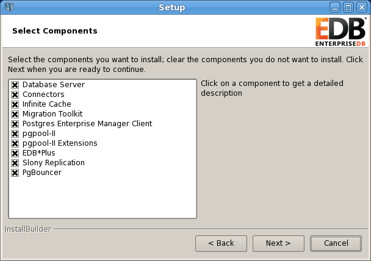

EDB-ODBC is an interface that allows an ODBC compliant client application to connect to an Advanced Server database. The EDB-ODBC connector allows an application that was designed to work with other databases to run on Advanced Server; EDB-ODBC provides a way for the client application to establish a connection, send queries and retrieve results from Advanced Server.

While EDB-ODBC provides a level of application portability, it should be noted that the portability is limited; EDB-ODBC provides a connection, but does not guarantee command compatibility. Commands that are acceptable in another database, may not work in Advanced Server.

The major components in a typical ODBC application are:
 - The client application - written in a language that has a binding for ODBC
 - The ODBC Administrator - handles named connections for Windows or Linux
 - The database specific ODBC driver - EDB-ODBC
 - The ODBC compliant server - Postgres Plus Advanced Server

Client applications can be written in any language that has a binding for ODBC; C, MS-Access, and C++ are just a few.

## Installing EDB-ODBC

The EDB-ODBC Connector is distributed with and installed via the Postgres Plus Advanced Server installer. To install Advanced Server and the ODBC connector, launch the graphical installer. When the Advanced Server Select Components dialog (see Figure 2.1) opens, confirm that the box next to Connectors is checked to include EDB-ODBC in the installation.

*Figure 2.1 - The Select Components dialog.*

You can also install the Advanced Server Connectors without installing a complete version of Advanced Server. Invoke the Advanced Server installation wizard; when the Features dialog opens, uncheck the box to the left of Database Server (and any other unwanted components) before choosing Next.

## Creating a Data Source

When a client application tries to establish a connection with a server, it typically provides a data source name (also known as a "DSN"). The driver manager looks through the ODBC configuration database for a data source whose name matches the DSN provided by the application.

On a Linux or Unix host, data sources are defined in a file; that file is usually named /etc/odbc.ini, but the name (and location) may vary. Use the following command to find out where unixODBC is searching for data source definitions:

$ odbc\_config --odbcini --odbcinstini

On a Windows host, data sources are typically defined in the Windows registry.

You can also store a data source definition (called a "File DSN") in a plain-text file of your choice. A typical data source definition for the EDB-ODBC driver looks like this:

> $ cat /etc/odbc.ini
>
> \[EnterpriseDB\]
>
> Description = EnterpriseDB DSN
>
> Driver = EnterpriseDB
>
> Trace = yes
>
> TraceFile = /tmp/odbc.log
>
> Database = edb
>
> Servername = localhost
>
> UserName = enterprisedb
>
> Password = manager
>
> Port = 5444

The first line in the data source is the data source name. The name is a unique identifier, enclosed in square brackets. The data source name is followed by a series of 'keyword=value' pairs that identify individual connection properties that make up the data source.

The ODBC administrator utility creates named data sources for ODBC connections. In most cases, an ODBC administrator utility is distributed with the operating system (if you’re using Windows or unixODBC, the tool is called the ODBC Data Source Administrator). If your operating system doesn’t include an ODBC administrator, third-party options are available online.

Sections 2.3.1 and 2.3.2 walk you through adding a data source in Windows and Linux using the graphical tools available for each operating system. During the process of defining a data source, you’ll be asked to specify a set of connection properties. Section 2.3 contains information about *optional* data source connection properties; you can specify connection properties with graphical tools or edit the odbc.ini file with a text editor.

## EDB-ODBC Connection Properties

The following table describes the connection properties that you can specify through the dialogs in the graphical connection manager tools, or in the odbc.ini file that defines a named data source. The columns identify the connection property (as it appears in the ODBC Administrator dialogs), the corresponding keyword (as it appears in the odbc.ini file), the default value of the property, and a description of the connection property.

<table>
<thead>
<tr class="header">
<th>Property</th>
<th>Keyword name</th>
<th>Default value</th>
<th>Description</th>
</tr>
</thead>
<tbody>
<tr class="odd">
<td>Database</td>
<td>Database</td>
<td>None</td>
<td>The name of the database that you are connecting to.</td>
</tr>
<tr class="even">
<td>Driver</td>
<td>Driver</td>
<td>EDB-ODBC</td>
<td>The name of the ODBC driver.</td>
</tr>
<tr class="odd">
<td>Server</td>
<td>Servername</td>
<td>Localhost</td>
<td>The name or IP address of the server that you are connecting to.</td>
</tr>
<tr class="even">
<td>dbms_name</td>
<td>dbms_name</td>
<td>EnterpriseDB</td>
<td>Database system. Either EnterpriseDB or PostgreSQL.</td>
</tr>
<tr class="odd">
<td>Description</td>
<td>Description</td>
<td></td>
<td>Descriptive name of the data source.</td>
</tr>
<tr class="even">
<td>User Name</td>
<td>Username</td>
<td></td>
<td>The name of the user that this data source uses to connect to the server.</td>
</tr>
<tr class="odd">
<td>Password</td>
<td>Password</td>
<td></td>
<td>The password of the user associated with this named data source.</td>
</tr>
<tr class="even">
<td>CPTimeout</td>
<td>CPTimeout</td>
<td>0</td>
<td>Number of seconds before a connection times out (in a connection pooling environment).</td>
</tr>
<tr class="odd">
<td>Port</td>
<td>Port</td>
<td>5444</td>
<td>The TCP port that the postmaster is listening on.</td>
</tr>
<tr class="even">
<td>Protocol</td>
<td>Protocol</td>
<td>7.4</td>
<td>If specified, forces the driver to use the given protocol version.</td>
</tr>
<tr class="odd">
<td>Level of Rollback on Errors</td>
<td>Use the Protocol option to specify rollback behavior.</td>
<td>Transaction Level</td>
<td>
Specifies how the driver handles errors:

0 - Don't rollback

1 - Rollback the transaction

2 - Rollback the statement
</td>
</tr>
<tr class="even">
<td>Usage Count</td>
<td>UsageCount</td>
<td>1</td>
<td>The number of installations using this driver.</td>
</tr>
<tr class="odd">
<td>Read Only</td>
<td>ReadOnly</td>
<td>No</td>
<td>Specifies that the connection is READONLY.</td>
</tr>
<tr class="even">
<td>Show System Tables</td>
<td>ShowSystemTables</td>
<td>No</td>
<td>If enabled, the driver reports system tables in the result set of the SQLTables() function.</td>
</tr>
<tr class="odd">
<td>OID Options: Show Column</td>
<td>ShowOidColumn</td>
<td>No</td>
<td>If enabled, the SQLColumns() function reports the OID column.</td>
</tr>
<tr class="even">
<td>OID Options: Fake Index</td>
<td>FakeOidIndex</td>
<td>No</td>
<td>If enabled, the SQLStatistics() function reports that a unique index exists on each OID column.</td>
</tr>
<tr class="odd">
<td>Keyset Query Optimization</td>
<td>Ksqo</td>
<td>On</td>
<td>If enabled, enforces server-side support for keyset queries (generated by the MS Jet database engine).</td>
</tr>
<tr class="even">
<td>Recognize Unique Indexes</td>
<td>UniqueIndex</td>
<td>On</td>
<td>If enabled, the SQLStatistics() function will report unique indexes. If not enabled, the SQLStatistics() function reports that indexes allow duplicate values.</td>
</tr>
<tr class="odd">
<td>Use Declare/Fetch</td>
<td>UseDeclareFetch</td>
<td>Off</td>
<td>If enabled, the driver will use server-side cursors. To enable UseDeclareFetch, specify a value of 1; to disable UseDeclareFetch, specify a value of 0.</td>
</tr>
<tr class="even">
<td>CommLog</td>
<td>CommLog</td>
<td>Off</td>
<td>If enabled, records all client/server traffic in a log file.</td>
</tr>
<tr class="odd">
<td>Parse Statements</td>
<td>Parse</td>
<td>Off</td>
<td>If enabled, the driver parses simple SELECT statements when you call the SQLNumResultCols(), SQLDescribeCol() or SQLColAttributes() functions.</td>
</tr>
<tr class="even">
<td>Cancel as FreeStmt</td>
<td>CancelAsFreeStmt</td>
<td>Off</td>
<td>If enabled, the SQLCancel() function will call SQLFreeStmt(SQL_Close) on your behalf.</td>
</tr>
<tr class="odd">
<td>MyLog</td>
<td>Debug</td>
<td>Off</td>
<td>If enabled, the driver records its work in a log file. On Windows, the file name is C:\mylog_&lt;process-id&gt;; on Linux the file name is /tmp/mylog_&lt;username&gt;&lt;process-id&gt;.log.</td>
</tr>
<tr class="even">
<td>Unknown Sizes</td>
<td>UnknownSizes</td>
<td>Maximum</td>
<td>Determines how the SQLDescribeCol() and SQLColAttributes() functions compute the size of a column. Specify 0 to force the driver to report the maximum size allowed for the type; specify 1 to force the driver to report an unknown length or 2 to force the driver to search the result set to find the longest value. Do not specify 2 if you have enabled UseDeclareFetch.</td>
</tr>
<tr class="odd">
<td>Text as LongVarchar</td>
<td>TextAsLongVarChar</td>
<td>8190</td>
<td>If enabled, the driver treats TEXT columns as if they are of type SQL_LONGVARCHAR. If disabled, the driver treats TEXT columns as SQL_VARCHAR values.</td>
</tr>
<tr class="even">
<td>Unknown as Long Varchar</td>
<td>LongVarChar</td>
<td>False</td>
<td>If enabled, the driver treats values of unknown type as SQL_LONGVARCHAR values. If unchecked, the driver will treat values of unknown type as SQL_VARCHAR values. By default, values of unknown type are treated as Y values.</td>
</tr>
<tr class="odd">
<td>Bools as Char</td>
<td>BoolsAsChar</td>
<td>On</td>
<td>If enabled, the driver treats BOOL columns as SQL_CHAR values. If disabled, BOOL columns are treated as SQL_BIT values.</td>
</tr>
<tr class="even">
<td>Max Varchar</td>
<td>MaxVarcharSize</td>
<td>255</td>
<td>If enabled, the driver treats VARCHAR and BPCHAR values longer than MaxVarCharSize as SQL_LONGVARCHAR values</td>
</tr>
<tr class="odd">
<td>Max Long Varchar Size</td>
<td>MaxLongVarcharSize</td>
<td>8190</td>
<td>
If TextAsLongVarChar is on, the driver reports TEXT values are MaxLongVarcharSize bytes long.

If UnknownAsLongVarChar is on, columns of unknown type are MaxLongVarcharSize bytes long; otherwise, they are reported to be MaxVarcharSize bytes in length.
</td>
</tr>
<tr class="even">
<td>Cache Size</td>
<td>Fetch</td>
<td>100</td>
<td>Determines the number of rows fetched by the driver when UseDeclareFetch is enabled.</td>
</tr>
<tr class="odd">
<td>SysTable Prefixes</td>
<td>ExtraSysTablePrefixes</td>
<td>dd_;</td>
<td>Use the SysTablePrefixes field to specify a semi-colon delimited list of prefixes that indicate that a table is a system table. By default, the list contains dd_;.</td>
</tr>
<tr class="even">
<td>LF&lt;-&gt; CR/LF conversion</td>
<td>LFConversion</td>
<td>System Dependent</td>
<td>The LF&lt;-&gt;CR/LF conversion option instructs the driver to convert line-feed characters to carriage-return/line-feed pairs when fetching character values from the server and convert carriage-return/line-feed pairs back to line-feed characters when sending character values to the server. By default, this option is enabled.</td>
</tr>
<tr class="odd">
<td>Updatable Cursors</td>
<td>UpdatableCursors</td>
<td>Off</td>
<td>Permits positioned UPDATE and DELETE operations using the SQLSetPos() or SQLBulkOperations() functions.</td>
</tr>
<tr class="even">
<td>Bytea as Long VarBinary</td>
<td>ByteaAsLongVarBinary</td>
<td>Off</td>
<td>If enabled, the driver treats BYTEA values as if they are of type SQL_LONGVARBINARY. If disabled, BYTEA values are treated as SQL_VARBINARY values.</td>
</tr>
<tr class="odd">
<td>Bytea as LO</td>
<td>ByteaAsLO</td>
<td>False</td>
<td>If enabled, the driver treats BYTEA values as if they are large objects.</td>
</tr>
<tr class="even">
<td>Row versioning</td>
<td>RowVersioning</td>
<td>Off</td>
<td>The Row Versioning option specifies if the driver should include the xmin column when reporting the columns in a table. The xmin value is the ID of the transaction that created the row. You must use row versioning if you plan to create cursors where SQL_CONCURRENCY = SQL_CONCUR_ROWVER.</td>
</tr>
<tr class="odd">
<td>Disallow Premature</td>
<td>DisallowPremature</td>
<td>No/0</td>
<td>Determines driver behavior if you try to retrieve information about a query without executing the query. If Yes, the driver declares a cursor for the query and fetches the meta-data from the cursor. If No, the driver executes the command as soon as you request any meta-data.</td>
</tr>
<tr class="even">
<td>True is -1</td>
<td>TrueIsMinus1</td>
<td>Off/0</td>
<td>TrueIsMinus1 tells the driver to return BOOL values of TRUE as -1. If this option is not enabled, the driver will return BOOL values of TRUE as 1. The driver always returns BOOL values of FALSE as 0.</td>
</tr>
<tr class="odd">
<td>Server side prepare</td>
<td>UseServerSidePrepare</td>
<td>No/0</td>
<td>If enabled, the driver uses the PREPARE and EXECUTE commands to implement the Prepare/Execute model.</td>
</tr>
<tr class="even">
<td>Use GSSAPI for GSS request</td>
<td>GssAuthUseGSS</td>
<td>False/0</td>
<td>If set to True/1, the driver will send a GSSAPI authentication request to the server. Windows only.</td>
</tr>
<tr class="odd">
<td>Int8 As</td>
<td>BI</td>
<td>0</td>
<td>
The value of BI determines how the driver treats BIGINT values:

If -5 as a SQL_BIGINT,

If 2 as a SQL_NUMERIC,

If 8 as a SQL_DOUBLE,

If 4 as a SQL_INTEGER,

If 12 as a SQL_VARCHAR,

If 0 (on an MS Jet client), as a SQL_NUMERIC,

If 0 on any other client, as a SQL_BIGINT.
</td>
</tr>
<tr class="even">
<td>Extra options</td>
<td>AB</td>
<td>0x0</td>
<td>
0x1 - Forces the output of short-length formatted connection strings. Specify this option if you are using the MFC CDatabase class.

0x2 - Allows MS Access to recognize PostgreSQL's serial type as AutoNumber type.

0x4 - Return ANSI character types for the inquiries from applications. Specify this option for applications that have difficulty handling Unicode data.

0x8 - If set, NULL dates are reported as empty strings and empty strings are interpreted as NULL dates on input.

0x10 - Determines if SQLGetInfo returns information about all tables, or only accessible tables. If set, only information is returned for accessible tables.

0x20 - If set, each SQL command is processed in a separate network round-trip, otherwise, SQL commands are grouped into as few round-trips as possible to reduce network latency.
</td>
</tr>
<tr class="odd">
<td>Connect Settings</td>
<td>ConnSettings</td>
<td></td>
<td>Contains a semicolon-delimited list of SQL commands that are executed when the driver connects to the server.</td>
</tr>
<tr class="even">
<td></td>
<td>Socket</td>
<td>4096</td>
<td>Specifies the buffer size that the driver uses to connect to the client.</td>
</tr>
<tr class="odd">
<td></td>
<td>Lie</td>
<td>Off</td>
<td>If enabled, the driver claims to support unsupported ODBC features.</td>
</tr>
<tr class="even">
<td>Lowercase Identifier</td>
<td>LowerCaseIdentifier</td>
<td>Off</td>
<td>If enabled, the driver translates identifiers to lowercase.</td>
</tr>
<tr class="odd">
<td>Disable Genetic Optimizer</td>
<td>Optimizer</td>
<td>Yes/1</td>
<td>Disables the genetic query optimizer.</td>
</tr>
<tr class="even">
<td>Allow Keyset</td>
<td>UpdatableCursors</td>
<td>Yes/1</td>
<td>Allow Keyset driven cursors</td>
</tr>
<tr class="odd">
<td>SSL mode</td>
<td>SSLMode</td>
<td>Disabled</td>
<td>If libpq (and its dependencies) are installed in the same directory as the EDB-ODBC driver, enabling SSL Mode allows you to use SSL and other utilities.</td>
</tr>
<tr class="even">
<td>Force Abbreviated Connection String</td>
<td>CX</td>
<td>No/0</td>
<td>Enables the option to force abbreviation of connection string.</td>
</tr>
<tr class="odd">
<td>Fake MSS</td>
<td>FakeOidIndex</td>
<td>No/0</td>
<td>Impersonates MS SQL Server enabling MS Access to recognize PostgreSQL’s serial type as AutoNumber type.</td>
</tr>
<tr class="even">
<td>BDE Environment</td>
<td>BDE</td>
<td>No/0</td>
<td>Enabling this option tunes EDB-ODBC to cater to Borland Database Engine compliant output (related to Unicode).</td>
</tr>
<tr class="odd">
<td>XA_Opt</td>
<td>INI_XAOPT</td>
<td>Yes/1</td>
<td>If enabled, calls to SQL_TABLES only include user-accessible tables.</td>
</tr>
</tbody>
</table>

### Adding a Data Source Definition in Windows

The Windows ODBC Data Source Administrator is a graphical interface that creates named data sources. You can open the ODBC Data Source Administrator (shown in Figure 2.2) by navigating to the Control Panel, opening the Administrative Tools menu, and double-clicking the Data Sources (ODBC) icon.

Figure 2.2 - The Windows Data Source Administrator

Click the Add button to open the Create New Data Source dialog (shown in Figure 2.3). Choose EnterpriseDB 9.4(ANSI) or EnterpriseDB 9.4 (UNICODE) from the list of drivers and click Finish.

Figure 2.3 - The Create New Data Source dialog.

The EnterpriseDB ODBC Driver dialog opens (see Figure 2.4).

Figure 2.4 - Define the data source.

Use the fields on the dialog to define the named data source:
 - Enter the Database name in the Database field.
 - Enter the host name or IP address of Advanced Server in the Server field.
 - Enter the name of a user in the User Name field.
 - Enter the password of the user in the Password field.
 - Enter a descriptive name for the named data source in the Description field.
 - If libpq is installed in the same directory as the EDB-ODBC driver, the drop-down listbox next to the SSL Mode label will be active, allowing you to use SSL and other Advanced Server utilities.
 - Accept the default port number (5444), or enter an alternative number in the Port field.

Use the Datasource button (located in the Options box) to open the Advanced Options dialog (see Figure 2.5) and specify connection properties.

The Global button opens a dialog on which you can specify logging options for the EDB-ODBC driver (not the data source, but the driver itself).

Figure 2.5 - Page 1 of the Advanced Options dialog.
 - Check the box next to Disable Genetic Optimizer to disable the genetic query optimizer. By default, the query optimizer is on.
 - Check the box next to KSQO (Keyset Query Optimization) to enable server-side support for keyset queries. By default, Keyset Query Optimization is on.
 - Check the box next to Recognize Unique Indexes to force the SQLStatistics() function to report unique indexes; if the option is not checked, the SQLStatistics() function will report that all indexes allow duplicate values. By default, Recognize Unique Indexes is on.
 - Check the box next to Use Declare/Fetch to specify that the driver should use server-side cursors whenever your application executes a SELECT command. By default, Use Declare/Fetch is off.
 - Check the box next to CommLog (C:\\psqlodbc\_xxxx.log) to record all client/server traffic in a log file. By default, logging is off.
 - Check the box next to Parse Statements to specify that the driver (rather than the server) should attempt to parse simple SELECT statements when you call the SQLNumResultCols(), SQLDescribeCol(), or SQLColAttributes() function. By default, this option is off.
 - Check the box next to Cancel as FreeStmt (Exp) to specify that the SQLCancel() function should call SQLFreeStmt(SQLClose) on your behalf. By default, this option is off.
 - Check the box next to MyLog (C:\\mylog\_xxxx.log) to record a detailed record of driver activity in a log file. The log file is named c:\\mylog\_*process-id*.log. By default, logging is off.

The radio buttons in the Unknown Sizes box specify how the SQLDescribeCol() and SQLColAttributes() functions compute the size of a column of unknown type (see Section 3.7, *Supported Data Types* for a list of known data types).
 - Choose the button next to Maximum to specify that the driver report the maximum size allowed for a VARCHAR or LONGVARCHAR (dependent on the Unknowns as LongVarChar setting). If Unknowns as LongVarChar is enabled, the driver returns the maximum size of a LONGVARCHAR (specified in the Max LongVarChar field in the Miscellaneous box). If Unknowns as LongVarChar is not enabled, the driver returns the size specified in the Max VarChar field (in the Miscellaneous box).
 - Choose the button next to Don’t know to specify that the driver report a length of "unknown".
 - Choose the button next to Longest to specify that the driver search the result set and report the longest value found. (Note: you should not specify Longest if UseDeclareFetch is enabled.)

The properties in the Data Type Options box determine how the driver treats columns of specific types:
 - Check the box next to Text as LongVarChar to treat TEXT values as if they are of type SQL\_LONGVARCHAR. If the box is not checked, the driver will treat TEXT values as SQL\_VARCHAR values. By default, TEXT values are treated as SQL\_LONGVARCHAR values.
 - Check the box next to Unknowns as LongVarChar to specify that the driver treat values of unknown type as SQL\_LONGVARCHAR values. If unchecked, the driver will treat values of unknown type as SQL\_VARCHAR values. By default, values of unknown type are treated as SQL\_VARCHAR values.
 - Check the box next to Bools as Char to specify that the driver treat BOOL values as SQL\_CHAR values. If unchecked, BOOL values are treated as SQL\_BIT values. By default, BOOL values are treated as SQL\_CHAR values.

You can specify values for some of the properties associated with the named data source in the fields in the Miscellaneous box:
 - Indicate the maximum length allowed for a VARCHAR value in the Max VarChar field. By default, this value is set to 255.
 - Enter the maximum length allowed for a LONGVARCHAR value in the Max LongVarChar field. By default, this value is set to 8190.
 - Specify the number of rows fetched by the driver (when UseDeclareFetch is enabled) in the Cache Size field. The default value is 100.
 - Use the SysTablePrefixes field to specify a semi-colon delimited list of prefixes that indicate that a table is a system table. By default, the list contains dd\_;.

You can reset the values on this dialog to their default settings by choosing the Defaults button.

Click the Apply button to apply any changes to the data source properties, or the Cancel button to exit the dialog without applying any changes. Choose the OK button to apply any changes to the dialog and exit.

Select the Page 2 button (in the upper-left hand corner of the Advanced Options dialog) to access a second set of advanced options (shown in figure 2.6).

Figure 2.6 - Page 2 of the Advanced Options dialogs.
 - Check the box next to Read Only to prevent the driver from executing the following commands: INSERT, UPDATE, DELETE, CREATE, ALTER, DROP, GRANT, REVOKE or LOCK. Invoking the Read Only option also prevents any calls that use ODBC’s procedure call escape syntax (call=procedure-name?). By default, this option is off.
 - Check the box next to Show System Tables to include system tables in the result set of the SQLTables() function. If the option is enabled, the driver will include any table whose name starts with pg\_ or any of the prefixes listed in the SysTablePrefixes field of Page 1 of the Advanced Options dialog. By default, this option is off.
 - Check the box next to Show sys/dbo Tables \[Access\] to access objects in the sys schema and dbo schema through the ODBC data source. By default, this option is enabled (checked).
 - Check the box next to LF\<-\>CR/LF conversion to instruct the driver to convert line-feed characters to carriage-return/line-feed pairs when fetching character values from the server and convert carriage-return/line-feed pairs back to line-feed characters when sending character values to the server. By default, this option is enabled.
 - Check the box next to Updatable Cursors to specify that the driver should permit positioned UPDATE and DELETE operations with the SQLSetPos() or SQLBulkOperations() functions. By default, this option is enabled.
 - Check the box next to bytea as LO to specify that the driver should treat BYTEA values as if they are SQL\_LONGVARBINARY values. If the box is not checked, EDB-ODBC will treat BYTEA values as if they are SQL\_VARBINARY values. By default, BYTEA values are treated as SQL\_VARBINARY values.
 - Check the box next to Row Versioning to include the xmin column when reporting the columns in a table. The xmin column is the ID of the transaction that created the row. You must use row versioning if you plan to create cursors where SQL\_CONCURRENCY = SQL\_CONCUR\_ROWVER. By default, Row Versioning is off.
 - Check the box next to Disallow Premature to specify that the driver should retrieve meta-data about a query (i.e., the number of columns in a result set, or the column types) without actually executing the query. If this option is not specified, the driver executes the query when you request meta-data about the query. By default, Disallow Premature is off.
 - Check the box next to True is -1 to tell the driver to return BOOL values of True as a -1. If this option is not enabled, the driver will return BOOL values of True as 1. The driver always returns BOOL values of False as 0.
 - Check the box next to Server side prepare to tell the driver to use the PREPARE and EXECUTE commands to implement the Prepare/Execute model.
 - Check the box next to use gssapi for GSS request to instruct the driver to send a GSSAPI connection request to the server.
 - Enter the database system (either EnterpriseDB or PostgreSQL) in the dbms\_name field. The value entered here is returned in the SQL\_DBMS\_NAME argument when the SQLGetInfo() function is called. The default is EnterpriseDB.

Use the radio buttons in the Int8 As box to specify how the driver should return BIGINT values to the client. Select the radio button next to default to specify the default type of NUMERIC if the client is MS Jet, BIGINT if the client is any other ODBC client. You can optionally specify that the driver return BIGINT values as a bigint (SQL\_BIGINT), numeric (SQL\_NUMERIC), varchar (SQL\_VARCHAR), double (SQL\_DOUBLE), or int4 (SQL\_INTEGER).

The default value of the Extra Opts field is 0x0. Extra Opts may be:

| Option | Specifies                                                                                                                                                                  |
| ------ | -------------------------------------------------------------------------------------------------------------------------------------------------------------------------- |
| 0x1    | Forces the output of short-length formatted connection string. Select this option when you are using the MFC CDatabase class.                                              |
| 0x2    | Allows MS Access to recognize PostgreSQL's serial type as AutoNumber type.                                                                                                 |
| 0x4    | Return ANSI character types for the inquiries from applications. Select this option for applications that have difficulty handling Unicode data.                           |
| 0x8    | If set, NULL dates are reported as empty strings and empty strings are interpreted as NULL dates on input.                                                                 |
| 0x10   | Determines if SQLGetInfo returns information about all tables, or only accessible tables. If set, only information is returned for accessible tables.                      |
| 0x20   | If set, each SQL command is processed in a separate network round-trip, otherwise, SQL commands are grouped into as few round-trips as possible to reduce network latency. |

The Protocol box contains radio buttons that tell the driver to interact with the server using a specific front-end/back-end protocol version. By default, the Protocol selected is 7.4+; you can optionally select from versions 6.4+, 6.3 or 6.2.

The Level of Rollback on errors box contains radio buttons that specify how the driver handles error handling:

| Option      | Specifies                                                                                                                  |
| ----------- | -------------------------------------------------------------------------------------------------------------------------- |
| Transaction | If the driver encounters an error, it will rollback the current transaction.                                               |
| Statement   | If the driver encounters an error, it will rollback the current statement.                                                 |
| Nop         | If the driver encounters an error, you must manually rollback the current transaction before the application can continue. |

The OID Options box contains options that control the way the driver exposes the OID column contained in some tables:
 - Check the box next to Show Column to include the OID column in the result set of the SQLColumns() function. If this box is not checked, the OID column is hidden from SQLColumns().
 - Check the box next to Fake Columns to specify that the SQLStatistics() function should report that a unique index exists on each OID column.

Use the Connect Settings field to specify a list of parameter assignments that the driver will use when opening this connection. Any configuration parameter that you can modify with a SET statement can be included in the semi-colon delimited list. For example:

set search\_path to company1,public;

When you’ve defined the connection properties for the named data source, click the Apply button to apply the options; you can optionally exit without saving any options by choosing Cancel. Select the OK button to save the options and exit.

Choose the Global button (on the EnterpriseDB ODBC Driver dialog) to open the Global Settings dialog (shown in Figure 2.7). The options on this dialog control logging options for the EDB-ODBC driver. Use this dialog to enforce logging when the driver is used without a named data source, or for logging driver operations that occur before the connection string is parsed.

Figure 2.7 – The Global Settings dialog
 - Check the box next to the CommLog field to record all client/server traffic in a log file. The logfile is named C:\\psqlodbc\_*process-id* where *process-id* is the name of the process in use.
 - Check the box next to the Mylog field to keep a logfile of the driver’s activity. The logfile is named c:\\mylog\_*process-id* where *process-id* is the name of the process in use.
 - Specify a location for the logfiles in the Folder for logging field.

When you’ve entered the connection information for the named data source, click the Test button to verify that the driver manager can connect to the defined data source (see Figure 2.8).

*Figure 2.8 - The Connection is successful.*

Click the OK button to exit Connection Test dialog. If the connection is successful, click the Save button to save the named data source. If there are problems establishing a connection, adjust the parameters and test again.

### Adding a Data Source Definition in Linux

The Linux ODBC Administrator is a graphical tool that is distributed with unixODBC; you can use the ODBC Administrator to manage ODBC drivers and named resources. To add the ODBC Administrator to your system, open a terminal window, assume superuser privileges, and enter:

> yum install unixODBC

followed by:

> yum install unixODBC-kde

To invoke the ODBC Administrator (shown in Figure 2.9), open a terminal window and enter ODBCConfig.

Figure 2.9 - The unixODBC Data Source Administrator

When you install the Advanced Server Connectors component, the EDB-ODBC driver is added to the list of drivers in the ODBC Administrator. Click Advanced, and then select the Drivers tab to verify that the enterprisedb driver appears in the list (see Figure 2.10).

Figure 2.10 – The Drivers tab shows the installed EDB-ODBC driver.

If the EDB-ODBC driver does not appear in the list of drivers, you can add it using the ODBC Administrator. To add a driver definition, select the Drivers tab, and click Add. The Driver Properties (new) window opens, as shown in Figure 2.11.

Figure 2.11 – The Driver Properties window.

Complete the Driver Properties window to register the EDB-ODBC driver with the driver manager:
 - Add a unique name for the driver to the Name field.
 - Add a driver description to the Description field.
 - Add the path to the location of the EDB-ODBC driver in the Driver field. By default, the complete path to the driver is:

> /opt/PostgresPlus/connectors/odbc/lib/edb-odbc.so
 - Add the path to the location of the EDB-ODBC driver setup file in the Setup field. By default, the complete path to the driver setup file is:

> /opt/PostgresPlus/connectors/odbc/lib/libodbcedbS.so

When you’ve described the driver properties for the EDB-ODBC driver, click OK. The ODBC Data Source Administrator window now includes the EDB-ODBC driver in the list of available ODBC drivers (Figure 2.12).

Figure 2.12 – The Drivers tab shows the new driver definition.

With the EDB-ODBC driver available to the driver manager, you can add a data source. Click the Data Source Named option in the left panel, and then choose the appropriate DSN tab for the type of data source name you would like to add:
 - Choose the User tab to add a named data source that is available only to the current user (the data source will be stored in \~*user*/.odbc.ini).
 - Choose the System tab add a named data source that is available to all users. All system data sources are stored in a single file (usually /etc/odbc.ini).
 - Choose the File tab to add a named data source that is available to all users, but that is stored in a file of your choosing.

Select the appropriate tab and click Add. The Create a New Data Source… window opens, as shown in Figure 2.13.

Figure 2.13 – Select a driver for the named data source.

Select the EDB-ODBC driver from the list, and click OK to open the Data Source Properties window.

Complete the Data Source Properties (new) window (shown in Figure 2.14), specifying the connection properties for the EDB-ODBC driver.

Figure 2.14 – The Data Source Properties window.
 - Enter the data source name in the Name field.
 - Enter a description of the named data source in the Description field.
 - The unixODBC driver includes a trace utility that records the sequence of calls made an ODBC application to a log file. Specify Yes in the Trace field to turn the trace utility on. Note that using the trace utility can slow down an application.
 - Use the TraceFile field to specify a file to receive information returned by the Trace utility.
 - Enter the name of the Advanced Server database in the Database field.
 - Enter the host name or IP address of Advanced Server in the Servername field.
 - Enter the name of a user in the Username field.
 - Enter the password for the user in the Password field.
 - Enter a port number (or accept the default value of 5444) in the Port field.
 - Use the Protocol field to specify a front-end/back-end protocol version; the default value is 6.4. You can optionally select from protocol versions 7.4, 6.4, 6.3 or 6.2.
 - Use the ReadOnly field to specify Yes to prevent the driver from executing the following commands: INSERT, UPDATE, DELETE, CREATE, ALTER, DROP, GRANT, REVOKE or LOCK. Enabling the Read Only option also prevents any calls that use the ODBC procedure call escape syntax (call=procedure-name?). By default, ReadOnly is set to No.
 - Use the RowVersioning field to specify Yes if the driver should include the xmin column when reporting the columns in a table. The xmin column is the ID of the transaction that created the row. You must use row versioning if you plan to create cursors where SQL\_CONCURRENCY = SQL\_CONCUR\_ROWVER. By default, Row Versioning is set to No.
 - Use the ShowSystemTables field to specify Yes if the driver should include system tables in the result set of the SQLTables() function. By default, this field is set to No.
 - Use the ShowOidColumn field to specify Yes if the driver should include the OID column in the result set of the SQLColumns() function. If ShowOidColumn is set to No, the OID column is hidden from SQLColumns(). By default, this option is set to No.
 - Use the FakeOidIndex field to specify Yes if the SQLStatistics() function should report that a unique index exists on each OID column. This is useful when your application needs a unique identifier and your table doesn’t include one. The default value is No.
 - Use the ConnSettings field to specify a list of parameter assignments that the driver will use when opening this connection.

When you’ve defined the connection properties, click OK.

The new data source is added to the list of data source names (shown in Figure 2.15).

Figure 2.15 – The new data source is included on the Data Source Names list.

