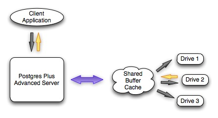
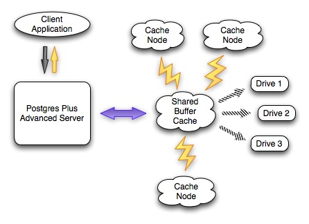

Advanced Server provides various tools for performance analysis and tuning. These features are described in this section.

## Dynatune

Advanced Server supports dynamic tuning of the database server to make the optimal usage of the system resources available on the host machine on which it is installed. The two parameters that control this functionality are located in the postgresql.conf file. These parameters are:
 - edb\_dynatune
 - edb\_dynatune\_profile

### edb\_dynatune

edb\_dynatune determines how much of the host system's resources are to be used by the database server based upon the host machine's total available resources and the intended usage of the host machine.

When Advanced Server is initially installed, the edb\_dynatune parameter is set in accordance with the selected usage of the host machine on which it was installed - i.e., development machine, mixed use machine, or dedicated server. For most purposes, there is no need for the database administrator to adjust the various configuration parameters in the postgresql.conf file in order to improve performance.

You can change the value of the edb\_dynatune parameter after the initial installation of Advanced Server by editing the postgresql.conf file. The postmaster must be restarted in order for the new configuration to take effect.

The edb\_dynatune parameter can be set to any integer value between 0 and 100, inclusive. A value of 0, turns off the dynamic tuning feature thereby leaving the database server resource usage totally under the control of the other configuration parameters in the postgresql.conf file.

A low non-zero, value (e.g., 1 - 33) dedicates the least amount of the host machine's resources to the database server. This setting would be used for a development machine where many other applications are being used.

A value in the range of 34 - 66 dedicates a moderate amount of resources to the database server. This setting might be used for a dedicated application server that may have a fixed number of other applications running on the same machine as Advanced Server.

The highest values (e.g., 67 - 100) dedicate most of the server's resources to the database server. This setting would be used for a host machine that is totally dedicated to running Advanced Server.

Once a value of edb\_dynatune is selected, database server performance can be further fine-tuned by adjusting the other configuration parameters in the postgresql.conf file. Any adjusted setting overrides the corresponding value chosen by edb\_dynatune. You can change the value of a parameter by un-commenting the configuration parameter, specifying the desired value, and restarting the database server.

### edb\_dynatune\_profile

The edb\_dynatune\_profile parameter is used to control tuning aspects based upon the expected workload profile on the database server. This parameter takes effect upon startup of the database server.

The possible values for edb\_dynatune\_profile are:

| Value     | Usage                                                                                             |
| --------- | ------------------------------------------------------------------------------------------------- |
| oltp      | Recommended when the database server is processing heavy online transaction processing workloads. |
| reporting | Recommended for database servers used for heavy data reporting.                                   |
| mixed     | Recommended for servers that provide a mix of transaction processing and data reporting.          |

## Infinite Cache

**Note:** Infinite Cache has been deprecated and may be removed in a future release. Please contact your EnterpriseDB Account Manager or [mailto:sales@enterprisedb.com](mailto:sales@enterprisedb.com) for more information.

Database performance is typically governed by two competing factors:
 - Memory access is fast; disk access is slow.
 - Memory space is scarce; disk space is abundant.

Advanced Server tries very hard to minimize disk I/O by keeping frequently used data in memory. When the first server process starts, it creates an in-memory data structure known as the *buffer cache*. The buffer cache is organized as a collection of 8K (8192 byte) pages: each page in the buffer cache corresponds to a page in some table or index. The buffer cache is shared between all processes servicing a given database.

When you select a row from a table, Advanced Server reads the page that contains the row into the shared buffer cache. If there isn't enough free space in the cache, Advanced Server *evicts* some other page from the cache. If Advanced Server evicts a page that has been modified, that data is written back out to disk; otherwise, it is simply discarded. Index pages are cached in the shared buffer cache as well.

Figure 7.1 demonstrates the flow of data in a typical Advanced Server session:

Figure 7.1 – Data Flow

A client application sends a query to the Postgres server and the server searches the shared buffer cache for the required data. If the requested data is found in the cache, the server immediately sends the data back to the client. If not, the server reads the page that holds the data into the shared buffer cache, evicting one or more pages if necessary. If the server decides to evict a page that has been modified, that page is written to disk.

As you can see, a query will execute much faster if the required data is found in the shared buffer cache.

One way to improve performance is to increase the amount of memory that you can devote to the shared buffer cache. However, most computers impose a strict limit on the amount of RAM that you can install. To help circumvent this limit, Infinite Cache lets you utilize memory from other computers connected to your network.

With Infinite Cache properly configured, Advanced Server will dedicate a portion of the memory installed on each *cache server* as a secondary memory cache. When a client application sends a query to the server, the server first searches the shared buffer cache for the required data; if the requested data is not found in the cache, the server searches for the necessary page in one of the cache servers.

Figure 7.2 shows the flow of data in an Advanced Server session with Infinite Cache:

Figure 7.2 – Data flow with Infinite Cache

When a client application sends a query to the server, the server searches the shared buffer cache for the required data. If the requested data is found in the cache, the server immediately sends the data back to the client. If not, the server sends a request for the page to a specific cache server; if the cache server holds a copy of the page it sends the data back to the server and the server copies the page into the shared buffer cache. If the required page is not found in the primary cache (the shared buffer cache) or in the secondary cache (the cloud of cache servers), Advanced Server must read the page from disk. Infinite Cache improves performance by utilizing RAM from other computers on your network in order to avoid reading frequently accessed data from disk.

**Updating the Cache Node Configuration**

You can add or remove cache servers without restarting the database server by adding or deleting cache nodes from the list defined in the edb\_icache\_servers configuration parameter. For more information about changing the configuration parameter, see Section 7.2.2.2.

When you add one or more cache nodes, the server re-allocates the cache, dividing the cache evenly amongst the servers; each of the existing cache servers loses a percentage of the information that they have cached. You can calculate the percentage of the cache that remains valid with the following formula:

(*existing\_nodes* \* 100) / (*existing\_nodes* + *new\_nodes*)

For example, if an Advanced Server installation with three existing cache nodes adds an additional cache node, 75% of the existing cache remains valid after the reconfiguration.

If cache nodes are removed from a server, the data that has been stored on the remaining cache nodes is preserved. If one cache server is removed from a set of five cache servers, Advanced Server preserves the 80% of the distributed cache that is stored on the four remaining cache nodes.

When you change the cache server configuration (by adding or removing cache servers), the portion of the cache configuration that is preserved is not re-written unless the cache is completely re-warmed using the edb\_icache\_warm() function or edb\_icache\_warm utility. If you do not re-warm the cache servers, new cache servers will accrue cache data as queries are performed on the server.

**Infinite Cache Offers a Second Performance Advantage: Compression.**

Without Infinite Cache, Advanced Server will read each page from disk as an 8K chunk; when a page resides in the shared buffer cache, it consumes 8K of RAM. With Infinite Cache, Postgres can *compress* each page before sending it to a cache server. A compressed page can take significantly less room in the secondary cache, making more space available for other data and effectively increasing the size of the cache. A compressed page consumes less network bandwidth as well, decreasing the amount of time required to retrieve a page from the secondary cache.

The fact that Infinite Cache can compress each page may make it attractive to configure a secondary cache server on the same computer that runs your Postgres server. If, for example, your computer is configured with 6GB of RAM, you may want to allocate a smaller amount (say 1GB) for the primary cache (the shared buffer cache) and a larger amount (4GB) to the secondary cache (Infinite Cache), reserving 1GB for the operating system. Since the secondary cache resides on the same computer, there is very little overhead involved in moving data between the primary and secondary cache. All data stored in the Infinite Cache is compressed so the secondary cache can hold many more pages than would fit into the (uncompressed) shared buffer cache. If you had allocated 5GB to the shared buffer cache, the cache could hold no more than 65000 pages (approximately). By assigning 4GB of memory to Infinite Cache, the cache may be able to hold 130000 pages (at 2x compression), 195000 pages (at 3x compression) or more. The compression factor that you achieve is determined by the amount of redundancy in the data itself and the edb\_icache\_compression\_level parameter.

To use Infinite Cache, you must specify a list of one or more cache servers (computers on your network) and start the edb\_icache daemon on each of those servers.

Infinite Cache is supported on Linux, HPUX and Solaris systems only.

Please Note: Infinite Cache and the effective\_io\_concurrency parameter can potentially interfere with each other. You should disable asynchronous I/O requests (by setting the value of effective\_io\_concurrency to 0 in the postgresql.conf file) if you enable the Infinite Cache feature.

### Installing Infinite Cache

Advanced Server includes Infinite Cache functionality as part of a standard installation with either the graphical installer or the RPM installer. You can also optionally install only the Infinite Cache daemon on a supporting cache server.

For information about using the RPM packages to install Infinite Cache, please see the EDB Postgres Advanced Server Installation Guide available at:

<http://www.enterprisedb.com/products-services-training/products/documentation/enterpriseedition>

To use the graphical installer to install Advanced Server with Infinite Cache functionality, confirm that the box next to the Database Server option (located on the Select Components dialog, shown in Figure 7.3) is selected when running the installation wizard.

!\[image\]\(./images/image30.png)

*Figure 7.3: The Select Components dialog.*

The Database Server option installs the following Infinite Cache components:
 - The edb-icache service script.
 - The Infinite Cache configuration file (edb-icache).
 - A command line tool that allows you to pre-load the cache servers (edb-icache-warm).
 - The edb\_icache libraries (code libraries required by the edb-icache daemon).

The graphical installation wizard can selectively install only the Infinite Cache daemon on a cache server. To install the edb-icache daemon on a cache server, deploy the installation wizard on the machine hosting the cache; when the Setup: Select Components window opens, de-select all options except Infinite Cache (as shown in Figure 7.4).

!\[image\]\(./images/image31.png)

*Figure 8.4: Installing only the Infinite Cache Daemon.*

The Infinite Cache Daemon option installs the following:
 - The edb-icache service script.
 - The Infinite Cache configuration file (edb-icache).
 - A command line tool that allows you to pre-load the cache servers (edb-icache-warm).
 - The edb\_icache libraries (code libraries required by the edb-icache daemon).

### Configuring the Infinite Cache Server

Configuring Infinite Cache is a three-step process:
 - Specify Infinite Cache server settings in the Infinite Cache configuration file.
 - Modify the Advanced Server postgresql.conf file, enabling Infinite Cache, and specifying connection and compression settings.
 - Start the Infinite Cache service.

#### Modifying Infinite Cache Settings

The Infinite Cache configuration file is named edb-icache, and contains two parameters and their associated values:

PORT=11211

CACHESIZE=500

To modify a parameter, open the edb-icache file (located in the /opt/edb/icache/etc directory) with your editor of choice, and modify the parameter values:

PORT

> Use the PORT variable to specify the port where Infinite Cache will listen for connections from Advanced Server.

CACHESIZE

> Use the CACHESIZE variable to specify the size of the cache (in MB).

#### Enabling Infinite Cache

The postgresql.conf file includes three configuration parameters that control the behavior of Infinite Cache. The postgresql.conf file is read each time you start the Advanced Server database server. To modify a parameter, open the postgresql.conf file (located in the $PGDATA directory) with your editor of choice, and edit the section of the configuration file shown below:

\# - Infinite Cache

\#edb\_enable\_icache = off

\#edb\_icache\_servers = '' \#'host1:port1,host2,ip3:port3,ip4'

\#edb\_icache\_compression\_level = 6

Lines that begin with a pound sign (\#) are treated as comments; to enable a given parameter, remove the pound sign and specify a value for the parameter. When you've updated and saved the configuration file, restart the database server for the changes to take effect.

edb\_enable\_icache

> Use the edb\_enable\_icache parameter to enable or disable Infinite Cache. When edb\_enable\_icache is set to on, Infinite Cache is enabled; if the parameter is set to off, Infinite Cache is disabled.
>
> If you set edb\_enable\_icache to on, you must also specify a list of cache servers by setting the edb\_icache\_servers parameter (described in the next section).
>
> The default value of edb\_enable\_icache is off.

edb\_icache\_servers

> The edb\_icache\_servers parameter specifies a list of one or more servers with active edb-icache daemons. edb\_icache\_servers is a string value that takes the form of a comma-separated list of *hostname:port* pairs. You can specify each pair in any of the following forms:
 - > *hostname*
 - > *IP-address*
 - > *hostname:portnumber*
 - > *IP-address:portnumber*

> If you do not specify a port number, Infinite Cache assumes that the cache server is listening at port 11211. This configuration parameter will take effect only if edb\_enable\_icache is set to on. Use the edb\_icache\_servers parameter to specify a maximum of 128 cache nodes.

edb\_icache\_compression\_level

> The edb\_icache\_compression\_level parameter controls the compression level that is applied to each page before storing it in the distributed Infinite Cache. This parameter must be an integer in the range 0 to 9.
 - > A compression level of 0 disables compression; it uses no CPU time for compression, but requires more storage space and network resources to process.
 - > A compression level of 9 invokes the maximum amount of compression; it increases the load on the CPU, but less data flows across the network, so network demand is reduced. Each page takes less room on the Infinite Cache server, so memory requirements are reduced.
 - > A compression level of 5 or 6 is a reasonable compromise between the amount of compression received and the amount of CPU time invested.

> By default, edb\_icache\_compression\_level is set to 6.
>
> When Advanced Server reads data from disk, it typically reads the data in 8K increments. If edb\_icache\_compression\_level is set to 0, each time Advanced Server sends an 8K page to the Infinite Cache server that page is stored (uncompressed) in 8K of cache memory. If the edb\_icache\_compression\_level parameter is set to 9, Advanced Server applies the maximum compression possible before sending it to the Infinite Cache server, so a page that previously took 8K of cached memory might take 2K of cached memory. Exact compression numbers are difficult to predict, as they are dependent on the nature of the data on each page.
>
> The compression level must be set by the superuser and can be changed for the current session while the server is running. The following command disables the compression mechanism for the currently active session:

SET edb\_icache\_compression\_level = 0

The following example shows a typical collection of Infinite Cache settings:

edb\_enable\_icache = on

edb\_icache\_servers = 'localhost,192.168.2.1:11200,192.168.2.2'

edb\_icache\_compression\_level = 6

Please Note: Infinite Cache and the effective\_io\_concurrency parameter can potentially interfere with each other. You should disable asynchronous I/O requests (by setting the value of effective\_io\_concurrency to 0 in the postgresql.conf file) if you enable the Infinite Cache feature. By default, effective\_io\_concurrency is set to 1.

#### Controlling the Infinite Cache Server

**Linux**

On Linux, the Infinite Cache service script is named edb-icache. The service script resides in the /etc/init.d directory. You can control the Infinite Cache service, or check the status of the service with the following command:

> /etc/init.d/edb-icache *action*

Where *action* specifies:
 - start to start the service.
 - stop to stop the service
 - restart to stop and then start the service.
 - status to return the status of the service.

### Dynamically Modifying Infinite Cache Server Nodes

You can dynamically modify the Infinite Cache server nodes; to change the Infinite Cache server configuration, use the edb\_icache\_servers parameter in the postgresql.conf file to:
 - specify additional cache information to add a server/s.
 - delete server information to remove a server/s.
 - specify additional server information and delete existing server information to both add and delete servers during the same reload operation.

After updating the edb\_icache\_servers parameter in the postgresql.conf file, you must reload the configuration parameters for the changes to take effect. You can use the menu-driven reload options (navigate through the EDB Postgres menu to the Advanced Server 9.6 menu; continue to the Expert Configuration menu, and select the Reload Configuration option). If prompted, enter your password to reload the configuration parameters.

Alternatively, you can use the pg\_ctl reload command to update the server's configuration parameters at the command line:

> pg\_ctl reload -D *data*\_*directory*

Where *data*\_*directory* specifies the complete path to the data directory.

Please Note: If the server detects a problem with the value specified for the edb\_icache\_servers parameter during a server reload, it will ignore changes to the parameter and use the last valid parameter value. If you are performing a server restart, and the parameter contains an invalid value, the server will return an error.

### Controlling the edb-icache Daemons

edb-icache is a high-performance memory caching daemon that distributes and stores data in shared buffers. The server transparently interacts with edb-icache daemon to store and retrieve data.

Before starting the database server, the edb-icache daemon must be running on each server node. Log into each server and start the edb-icache server (on that host) by issuing the following command:

\# edb-icache -u enterprisedb -d -m 1024

Where:

\-u

> \-u specifies the user name

\-m

> \-m specifies the amount of memory to be used by edb-icache. The default is 64MB.

\-d

> \-d designates that the service should run in the background

To gracefully kill an edb-icache daemon (close any in-use files, flush buffers, and exit), execute the command:

> \# killall -TERM edb-icache

If the edb-icache daemon refuses to die, you may need to use the following command:

> \# killall -KILL edb-icache

#### Command Line Options

To view the command line options for the edb-icache daemon, use the following command:

\# /opt/edb/icache/bin/edb-icache -h

The command line options are:

<table>
<thead>
<tr class="header">
<th>Parameter</th>
<th>Description</th>
</tr>
</thead>
<tbody>
<tr class="odd">
<td>-p &lt;port_number&gt;</td>
<td>The TCP port number the Infinite Cache daemon is listening on. The default is 11211.</td>
</tr>
<tr class="even">
<td>-U &lt;UDP_number&gt;</td>
<td>The UDP port number the Infinite Cache daemon is listening on. The default is 0 (off).</td>
</tr>
<tr class="odd">
<td>-s &lt;pathname&gt;</td>
<td>The Unix socket pathname the Infinite Cache daemon is listening on. If included, the server limits access to the host on which the Infinite Cache daemon is running, and disables network support for Infinite Cache.</td>
</tr>
<tr class="even">
<td>-a &lt;mask&gt;</td>
<td>The access mask for the Unix socket, in octal form. The default value is 0700.</td>
</tr>
<tr class="odd">
<td>-l &lt;ip_addr&gt;</td>
<td>Specifies the IP address that the daemon is listening on. If an individual address is not specified, the default value is INDRR_ANY; all IP addresses assigned to the resource are available to the daemon.</td>
</tr>
<tr class="even">
<td>-d</td>
<td>Run as a daemon.</td>
</tr>
<tr class="odd">
<td>-r</td>
<td>Maximize core file limit.</td>
</tr>
<tr class="even">
<td>-u &lt;username&gt;</td>
<td>Assume the identity of the specified user (when run as root).</td>
</tr>
<tr class="odd">
<td>-m &lt;numeric&gt;</td>
<td>Max memory to use for items in megabytes. Default is 64 MB.</td>
</tr>
<tr class="even">
<td>-M</td>
<td>Return error on memory exhausted (rather than removing items).</td>
</tr>
<tr class="odd">
<td>-c &lt;numeric&gt;</td>
<td>Max simultaneous connections. Default is 1024.</td>
</tr>
<tr class="even">
<td>-k</td>
<td>Lock down all paged memory. Note that there is a limit on how much memory you may lock. Trying to allocate more than that would fail, so be sure you set the limit correctly for the user you started the daemon with (not for -u &lt;username&gt; user; under sh this is done with 'ulimit -S -l NUM_KB').</td>
</tr>
<tr class="odd">
<td>-v</td>
<td>Verbose (print errors/warnings while in event loop).</td>
</tr>
<tr class="even">
<td>-vv</td>
<td>Very verbose (include client commands and responses).</td>
</tr>
<tr class="odd">
<td>-vvv</td>
<td>Extremely verbose (also print internal state transitions).</td>
</tr>
<tr class="even">
<td>-h</td>
<td>Print the help text and exit.</td>
</tr>
<tr class="odd">
<td>-i</td>
<td>Print memcached and libevent licenses.</td>
</tr>
<tr class="even">
<td>-P &lt;file&gt;</td>
<td>Save PID in &lt;file&gt;, only used with -d option.</td>
</tr>
<tr class="odd">
<td>-f &lt;factor&gt;</td>
<td>Chunk size growth factor. Default value is 1.25.</td>
</tr>
<tr class="even">
<td>-n &lt;bytes&gt;</td>
<td>Minimum space allocated for key+value+flags. Default is 48.</td>
</tr>
<tr class="odd">
<td>-L</td>
<td>Use large memory pages (if available). Increasing the memory page size could reduce the number of transition look-aside buffer misses and improve the performance. To get large pages from the OS, Infinite Cache will allocate the total item-cache in one large chunk.</td>
</tr>
<tr class="even">
<td>-D &lt;char&gt;</td>
<td>
Use &lt;char&gt; as the delimiter between key prefixes and IDs. This is used for per-prefix stats reporting. The default is":" (colon).

If this option is specified, stats collection is enabled automatically; if not, then it may be enabled by sending the stats detail on command to the server.
</td>
</tr>
<tr class="odd">
<td>-t &lt;num&gt;</td>
<td>Specifies the number of threads to use. Default is 4.</td>
</tr>
<tr class="even">
<td>-R</td>
<td>Maximum number of requests per event; this parameter limits the number of requests process for a given connection to prevent starvation, default is 20.</td>
</tr>
<tr class="odd">
<td>-C</td>
<td>Disable use of CAS (check and set).</td>
</tr>
<tr class="even">
<td>-b</td>
<td>Specifies the backlog queue limit, default is 1024.</td>
</tr>
<tr class="odd">
<td>-B</td>
<td>Specifies the binding protocol. Possible values are ascii, binary or auto; default value is auto.</td>
</tr>
<tr class="even">
<td>-I</td>
<td>Override the size of each slab page. Specifies the max item size; default 1 MB, minimum size is 1 k, maximum is 128 MB).</td>
</tr>
</tbody>
</table>

#### edb-icache-tool

edb-icache-tool provides a command line interface that queries the edb-icache daemon to retrieve statistical information about a specific cache node. The syntax is:

edb-icache-tool \<*host*\[:*port*\]\> stats

> *host* specifies the address of the host that you are querying.
>
> *port* specifies the port that the daemon is listening on.

edb-icache-tool retrieves the statistics described in the following table:

| Statistic              | Description                                                                                                                             |
| ---------------------- | --------------------------------------------------------------------------------------------------------------------------------------- |
| accepting\_conns       | Will this server accept new connection(s)? 1 if yes, otherwise 0.                                                                       |
| auth\_cmds             | Number of authentication commands handled by this server, success or failure.                                                           |
| auth\_errors           | Number of failed authentications.                                                                                                       |
| bytes                  | Total number of bytes in use.                                                                                                           |
| bytes\_read            | Total number of bytes received by this server (from the network).                                                                       |
| bytes\_written         | Total number of bytes sent by this server (to the network).                                                                             |
| cas\_badval            | Number of keys that have been compared and swapped by this server but the comparison (original) value did not match the supplied value. |
| cas\_hits              | Number of keys that have been compared and swapped by this server and found present.                                                    |
| cas\_misses            | Number of keys that have been compared and swapped by this server and not found.                                                        |
| cmd\_flush             | Cumulative number of flush requests sent to this server.                                                                                |
| cmd\_get               | Cumulative number of read requests sent to this server.                                                                                 |
| cmd\_set               | Cumulative number of write requests sent to this server.                                                                                |
| conn\_yields           | Number of times any connection yielded to another due to hitting the edb-icache -R limit.                                               |
| connection\_structures | Number of connection structures allocated by the server.                                                                                |
| curr\_connections      | Number of open connections.                                                                                                             |
| curr\_items            | Number of items currently stored by the server.                                                                                         |
| decr\_hits             | Number of decrement requests satisfied by this server.                                                                                  |
| decr\_misses           | Number of decrement requests not satisfied by this server.                                                                              |
| delete\_hits           | Number of delete requests satisfied by this server.                                                                                     |
| delete\_misses         | Number of delete requests not satisfied by this server.                                                                                 |
| evictions              | Number of valid items removed from cache to free memory for new items.                                                                  |
| get\_hits              | Number of read requests satisfied by this server.                                                                                       |
| get\_misses            | Number of read requests not satisfied by this server.                                                                                   |
| incr\_hits             | Number of increment requests satisfied by this server.                                                                                  |
| incr\_misses           | Number of increment requests not satisfied by this server.                                                                              |
| limit\_maxbytes        | Number of bytes allocated on this server for storage.                                                                                   |
| listen\_disabled\_num  | Cumulative number of times this server has hit its connection limit.                                                                    |
| pid                    | Process ID (on cache server).                                                                                                           |
| pointer\_size          | Default pointer size on host OS (usually 32 or 64).                                                                                     |
| reclaimed              | Number of times an entry was stored using memory from an expired entry.                                                                 |
| rusage\_user           | Accumulated user time for this process (seconds.microseconds).                                                                          |
| rusage\_system         | Accumulated system time for this process (seconds.microseconds).                                                                        |
| threads                | Number of worker threads requested.                                                                                                     |
| total\_time            | Number of seconds since this server's base date (usually midnight, January 1, 1970, UTC).                                               |
| total\_connections     | Total number of connections opened since the server started running.                                                                    |
| total\_items           | Total number of items stored by this server (cumulative).                                                                               |
| uptime                 | Amount of time that server has been active.                                                                                             |
| version                | edb-icache version.                                                                                                                     |

In the following example, edb-icache-tool retrieves statistical information about an Infinite Cache server located at the address, 192.168.23.85 and listening on port 11213:

\# edb-icache-tool 192.168.23.85:11213 stats

Field Value

accepting\_conns 1

auth\_cmds 0

auth\_errors 0

bytes 52901223

bytes\_read 188383848

bytes\_written 60510385

cas\_badval 0

cas\_hits 0

cas\_misses 0

cmd\_flush 1

cmd\_get 53139

cmd\_set 229120

conn\_yields 0

connection\_structures 34

curr\_connections 13

curr\_items 54953

decr\_hits 0

decr\_misses 0

delete\_hits 0

delete\_misses 0

evictions 0

get\_hits 52784

get\_misses 355

incr\_hits 0

incr\_misses 0

limit\_maxbytes 314572800

listen\_disabled\_num 0

pid 7226

pointer\_size 32

reclaimed 0

rusage\_system 10.676667

rusage\_user 3.068191

threads 4

time 1320919080

total\_connections 111

total\_items 229120

uptime 7649

version 1.4.5

### Warming the edb-icache Servers

When the server starts, the primary and secondary caches are empty. When Advanced Server processes a client request, the server reads the required data from disk and stores a copy in each cache. You can improve server performance by *warming* (or pre-loading) the data into the memory cache before a client asks for it.

There are two advantages to warming the cache. Advanced Server will find data in the cache the first time it is requested by a client application, instead of waiting for it to be read from disk. Also, manually warming the cache with the data that your applications are most likely to need saves time by avoiding future random disk reads. If you don't warm the cache at startup, Advanced Server performance may not reach full speed until the client applications happen to load commonly used data into the cache.

There are several ways to load pages to warm the Infinite Cache server nodes. You can:
 - Use the edb\_icache\_warm utility to warm the caches from the command line.
 - Use the edb\_icache\_warm() function from within edb-psql.
 - Use the edb\_icache\_warm() function via scripts to warm the cache.

While it is not necessary to re-warm the cache after making changes to an existing cache configuration, re-warming the cache can improve performance by bringing the new configuration of cache servers up-to-date.

#### The edb\_icache\_warm() Function

The edb\_icache\_warm() function comes in two variations; the first variation warms not only the table, but any indexes associated with the table. If you use the second variation, you must make additional calls to warm any associated indexes.

The first form of the edb\_icache\_warm() function warms the given table and any associated indexes into the cache. The signature is:

edb\_icache\_warm(table\_name)

You may specify table\_name as a table name, OID, or regclass value.

\# edb-psql edb -c "select edb\_icache\_warm('accounts')"

When you call the first form of edb\_icache\_warm(), Advanced Server reads each page in the given table, compresses the page (if configured to do so), and then sends the compressed data to an Infinite Cache server. edb\_icache\_warm() also reads, compresses, and caches each page in each index defined for the given table.

The second form of the edb\_icache\_warm() function warms the pages that contain the specified range of bytes into the cache. The signature of the second form is:

edb\_icache\_warm(table-spec, startbyte, endbyte):

You must make subsequent calls to specify indexes separately when using this form of the edb\_icache\_warm() function.

\# edb-psql edb -c "select edb\_icache\_warm('accounts', 1, 10000)"

The edb\_icache\_warm() function is typically called by a utility program (such as the edb\_icache\_warm utility) to spread the warming process among multiple processes that operate in parallel.

#### Using the edb\_icache\_warm Utility

You can use the edb\_icache\_warm command-line utility to load the cache servers with specified tables, allowing fast access to relevant data from the cache.

The syntax for edb\_icache\_warm is:

\# edb\_icache\_warm –d *database* –t *tablename*

The only required parameter is *tablename*. *tablename* can be specified with or without the -t option. All other parameters are optional; if omitted, default values are inferred from Advanced Server environment variables.

The options for edb\_icache\_warm are:

<table>
<thead>
<tr class="header">
<th>Option</th>
<th>Variable</th>
<th>Description</th>
</tr>
</thead>
<tbody>
<tr class="odd">
<td>-h</td>
<td><em>Hostname</em></td>
<td>
The name of the host running Advanced Server. Include this parameter if you are running Advanced Server on a remote host.

The default value is PGHOST.
</td>
</tr>
<tr class="even">
<td>-p</td>
<td><em>Portname</em></td>
<td>Port in use by Advanced Server. Default value is PGPORT.</td>
</tr>
<tr class="odd">
<td>-j</td>
<td><em>process count</em></td>
<td>Number of (parallel) processes used to warm the cache. The default value is 1.</td>
</tr>
<tr class="even">
<td>-U</td>
<td><em>Username</em></td>
<td>The Advanced Server username. Unless specified, this defaults to PGUSER.</td>
</tr>
<tr class="odd">
<td>-d</td>
<td><em>Database</em></td>
<td>The name of database containing the tables to be warmed. Default value is PGDATABASE.</td>
</tr>
<tr class="even">
<td>-t</td>
<td><em>Tablename</em></td>
<td>Name of table to be warmed. The index for the table is also warmed. Required.</td>
</tr>
</tbody>
</table>

### Retrieving Statistics from Infinite Cache

#### Using edb\_icache\_stats()

You can view Infinite Cache statistics by using the edb\_icache\_stats() function at the edb-psql command line (or any other query tool). The edb\_icache\_stats() function returns a result set that reflects the state of an Infinite Cache node or nodes and the related usage statistics. The result set includes:

| Statistic                | Description                                                                              |
| ------------------------ | ---------------------------------------------------------------------------------------- |
| *hostname*               | Host name (or IP address) of server                                                      |
| *Port*                   | Port number at which edb-icache daemon is listening                                      |
| *State*                  | Health of this server                                                                    |
| *write\_failures*        | Number of write failures                                                                 |
| *Bytes*                  | Total number of bytes in use                                                             |
| *bytes\_read*            | Total number of bytes received by this server (from the network)                         |
| *bytes\_written*         | Total number of bytes sent by this server (to the network)                               |
| *cmd\_get*               | Cumulative number of read requests sent to this server                                   |
| *cmd\_set*               | Cumulative number of write requests sent to this server                                  |
| *connection\_structures* | Number of connection structures allocated by the server                                  |
| *curr\_connections*      | Number of open connections                                                               |
| *curr\_items*            | Number of items currently stored by the server                                           |
| *Evictions*              | Number of valid items removed from cache to free memory for new items                    |
| *get\_hits*              | Number of read requests satisfied by this server                                         |
| *get\_misses*            | Number of read requests not satisfied by this server                                     |
| *limit\_maxbytes*        | Number of bytes allocated on this server for storage                                     |
| *Pid*                    | Process ID (on cache server)                                                             |
| *pointer\_size*          | Default pointer size on host OS (usually 32 or 64)                                       |
| *rusage\_user*           | Accumulated user time for this process (seconds.microseconds)                            |
| *rusage\_system*         | Accumulated system time for this process (seconds.microseconds)                          |
| *Threads*                | Number of worker threads requested                                                       |
| *total\_time*            | Number of seconds since this server's base date (usually midnight, January 1, 1970, UTC) |
| *total\_connections*     | Total number of connections opened since the server started running                      |
| *total\_items*           | Total number of items stored by this server (cumulative)                                 |
| *Uptime*                 | Amount of time that server has been active                                               |
| *Version*                | edb-icache version                                                                       |

You can use SQL queries to view Infinite Cache statistics. To view the server status of all Infinite Cache nodes:

SELECT hostname, port, state FROM edb\_icache\_stats()

hostname | port | state

\---------------+-------+--------

192.168.23.85 | 11211 | UNHEALTHY

192.168.23.85 | 11212 | ACTIVE

(2 rows)

Use the following command to view complete statistics (shown here using edb-psql's expanded display mode, \\x) for a specified node:

SELECT \* FROM edb\_icache\_stats() WHERE hostname = '192.168.23.85:11211'

\-\[RECORD 1\]-----------+--------------

hostname | 192.168.23.85

port | 11211

state | ACTIVE

write\_failures | 0

bytes | 225029460

bytes\_read | 225728252

bytes\_written | 192806774

cmd\_get | 23313

cmd\_set | 27088

connection\_structures | 53

curr\_connections | 3

curr\_items | 27088

evictions | 0

get\_hits | 23266

get\_misses | 47

limit\_maxbytes | 805306368

pid | 4240

pointer\_size | 32

rusage\_user | 0.481926

rusage\_system | 1.583759

threads | 1

total\_time | 1242199782

total\_connections | 66

total\_items | 27088

uptime | 714

version | 1.2.6

#### edb\_icache\_server\_list

The edb\_icache\_server\_list view exposes information about the status and health of all Infinite Cache servers listed in the edb\_icache\_servers GUC. The edb\_icache\_server\_list view is created using the edb\_icache stats() API. The view exposes the following information for each server:

| Statistic         | Description                                           |
| ----------------- | ----------------------------------------------------- |
| *Hostname*        | Host name (or IP address) of server                   |
| *Port*            | Port number at which edb-icache daemon is listening   |
| *State*           | Health of this server                                 |
| *write\_failures* | Number of write failures                              |
| *total\_memory*   | Number of bytes allocated to the cache on this server |
| *memory\_used*    | Number of bytes currently used by the cache           |
| *memory\_free*    | Number of unused bytes remaining in the cache         |
| *hit\_ratio*      | Percentage of cache hits                              |

The state column will contain one of the following four values, reflecting the health of the given server:

| Server State   | Description                                                                                                                      |
| -------------- | -------------------------------------------------------------------------------------------------------------------------------- |
| Active         | The server is known to be up and running.                                                                                        |
| Unhealthy      | An error occurred while interacting with the cache server. Postgres will attempt to re-establish the connection with the server. |
| Offline        | Postgres can no longer contact the given server.                                                                                 |
| Manual Offline | You have taken the server offline with the edb\_icache\_server\_enable() function.                                               |

Use the following SELECT statement to return the health of each node in the Infinite Cache server farm:

SELECT hostname, port, state FROM edb\_icache\_server\_list

hostname | port | state

\---------------+-------+-------

192.168.23.85 | 11211 | ACTIVE

192.168.23.85 | 11212 | ACTIVE

(2 rows)

Use the following command to view complete details about a specific Infinite Cache node (shown here using edb-psql's \\x expanded-view option):

SELECT \* FROM edb\_icache\_server\_list WHERE hostname = '192.168.23.85:11211'

\-\[RECORD 1\]-----------+--------------

hostname | 192.168.23.85

port | 11211

state | ACTIVE

write\_failures | 0

total\_memory | 805306368

memory\_used | 225029460

memory\_free | 580276908

hit\_ratio | 99.79

### Retrieving Table Statistics

Advanced Server provides six system views that contain statistical information on a per-table basis. The views are:
 - pg\_statio\_all\_tables
 - pg\_statio\_sys\_tables
 - pg\_statio\_user\_tables
 - pg\_statio\_all\_indexes
 - pg\_statio\_sys\_indexes
 - pg\_statio\_user\_indexes

You can use standard SQL queries to view and compare the information stored in the views. The views contain information that will allow you to observe the effectiveness of the Advanced Server buffer cache and the icache servers.

#### pg\_statio\_all\_tables

The pg\_statio\_all\_tables view contains one row for each table in the database. The view contains the following information:

| Column Name              | Description                                                 |
| ------------------------ | ----------------------------------------------------------- |
| relid                    | The OID of the table.                                       |
| schemaname               | The name of the schema that the table resides in.           |
| relname                  | The name of the table.                                      |
| heap\_blks\_read         | The number of heap blocks read.                             |
| heap\_blks\_hit          | The number of heap blocks hit.                              |
| heap\_blks\_icache\_hit  | The number of heap blocks found on an icache server.        |
| idx\_blks\_read          | The number of index blocks read.                            |
| idx\_blks\_hit           | The number of index blocks hit.                             |
| idx\_blks\_icache\_hit   | The number of index blocks found on an icache server.       |
| toast\_blks\_read        | The number of toast blocks read.                            |
| toast\_blks\_hit         | The number of toast blocks hit.                             |
| toast\_blks\_icache\_hit | The number of toast blocks found on an icache server.       |
| tidx\_blks\_read         | The number of index toast blocks read.                      |
| tidx\_blks\_hit          | The number of index toast blocks hit.                       |
| tidx\_blks\_icache\_hit  | The number of index toast blocks found on an icache server. |

You can execute a simple query to view performance statistics for a specific table:

SELECT \* FROM pg\_statio\_all\_tables WHERE relname=’jobhist’;

\-\[ RECORD 1 \]---------+---------

relid | 16402

schemaname | public

relname | jobhist

heap\_blks\_read | 1

heap\_blks\_hit | 51

heap\_blks\_icache\_hit | 0

idx\_blks\_read | 2

idx\_blks\_hit | 17

idx\_blks\_icache\_hit | 0

toast\_blks\_read |

toast\_blks\_hit |

toast\_blks\_icache\_hit |

tidx\_blks\_read |

tidx\_blks\_hit |

tidx\_blks\_icache\_hit |

Or, you can view the statistics by activity level. The following example displays the statistics for the ten tables that have the greatest heap\_blks\_icache\_hit activity:

SELECT \* FROM pg\_statio\_all\_tables ORDER BY heap\_blks\_icache\_hit DESC LIMIT 10;

relid schemaname relname

heap\_blks\_read heap\_blks\_hit heap\_blks\_icache\_hit

idx\_blks\_read idx\_blks\_hit idx\_blks\_icache\_hit

toast\_blks\_read toast\_blks\_hit toast\_blks\_icache\_hit

tidx\_blks\_read tidx\_blks\_hit tidx\_blks\_icache\_hit

\-----------------------------------------------------------------------------

16390 public pgbench\_accounts

264105 71150 81498

13171 282541 18053

1259 pg\_catalog pg\_class

22 2904 18

14 3449 11

1249 pg\_catalog pg\_attribute

49 1619 16

17 2841 13

1255 pg\_catalog pg\_proc

38 276 11

33 682 16

0 0 0

0 0 0

2619 pg\_catalog pg\_statistic

20 295 8

4 436 4

0 0 0

0 0 0

2617 pg\_catalog pg\_operator

20 293 8

19 791 10

2602 pg\_catalog pg\_amop

10 721 6

13 1154 13

2610 pg\_catalog pg\_index

10 633 6

8 719 8

1247 pg\_catalog pg\_type

17 235 5

12 433 4

2615 pg\_catalog pg\_namespace

4 260 4

6 330 4

0 0 0

0 0 0

(10 rows)

#### pg\_statio\_sys\_tables

The pg\_statio\_sys\_tables view contains one row for each table in a system-defined schema. The statistical information included in this view is the same as for pg\_statio\_all\_tables.

#### pg\_statio\_user\_tables

The pg\_statio\_user\_tables view contains one row for each table in a user-defined schema. The statistical information in this view is the same as for pg\_statio\_all\_tables.

#### pg\_statio\_all\_indexes

The pg\_statio\_all\_indexes view contains one row for each index in the current database. The view contains the following information:

| Column Name            | Description                                           |
| ---------------------- | ----------------------------------------------------- |
| relid                  | The OID of the indexed table                          |
| indexrelid             | The OID of the index.                                 |
| schemaname             | The name of the schema that the table resides in.     |
| relname                | The name of the table.                                |
| indexrelname           | The name of the index                                 |
| idx\_blks\_read        | The number of index blocks read.                      |
| idx\_blks\_hit         | The number of index blocks hit.                       |
| idx\_blks\_icache\_hit | The number of index blocks found on an icache server. |

You can execute a simple query to view performance statistics for the indexes on a specific table:

SELECT \* FROM pg\_statio\_all\_indexes WHERE relname=’pg\_attribute’;

\-\[ RECORD 1 \]---------+---------

relid | 1249

indexrelid | 2658

schemaname | pg\_catalog

relname | pg\_attribute

indexrelname | pg\_attribute\_relid\_attnam\_index

idx\_blks\_read | 10

idx\_blks\_hit | 1200

idx\_blks\_icache\_hit | 0

\-\[ RECORD 2 \]---------+---------

relid | 1249

indexrelid | 2659

schemaname | pg\_catalog

relname | pg\_attribute

indexrelname | pg\_attribute\_relid\_attnum\_index

idx\_blks\_read | 12

idx\_blks\_hit | 3917

idx\_blks\_icache\_hit | 0

The result set from the query includes the statistical information for two indexes; the pg\_attribute table has two indexes.

You can also view the statistics by activity level. The following example displays the statistics for the ten indexes that have the greatest idx\_blks\_icache\_hit activity:

SELECT \* FROM pg\_statio\_all\_indexes ORDER BY idx\_blks\_icache\_hit DESC LIMIT 10;

relid indexrelid schemaname relname

indexrelname idx\_blks\_read idx\_blks\_hit idx\_blks\_icache\_hit

\-----------------------------------------------------------------------------

16390 16401 public pgbench\_accounts

pgbench\_accounts\_pkey 13171 282541 18053

1249 2659 pg\_catalog pg\_attribute

pg\_attr\_relid\_attnum\_index 14 2749 13

1255 2690 pg\_catalog proc

pg\_proc\_oid\_index 16 580 12

1259 2663 pg\_catalog pg\_class

pg\_class\_relname\_nsp\_index 10 2019 7

2602 2654 pg\_catalog pg\_amop

pg\_amop\_opr\_fam\_index 7 453 7

2603 2655 pg\_catalog pg\_amproc

pg\_amproc\_fam\_proc\_index 6 605 6

2617 2688 pg\_catalog pg\_operator

pg\_operator\_oid\_index 7 452 6

2602 2653 pg\_catalog pg\_amop

pg\_amop\_fam\_strat\_index 6 701 6

2615 2684 pg\_catalog pg\_namespace pg\_namespace\_nspname\_index 4 328 4

1262 2672 pg\_catalog pg\_database pg\_database\_oid\_index 4 254 4

#### pg\_statio\_sys\_indexes

The pg\_statio\_sys\_indexes view contains one row for each index on the system tables. The statistical information in this view is the same as in pg\_statio\_all\_indexes.

#### pg\_statio\_user\_indexes

The pg\_statio\_user\_indexes view contains one row for each index on a table that resides in a user-defined schema. The statistical information in this view is the same as in pg\_statio\_all\_indexes.

### edb\_icache\_server\_enable()

You can use the edb\_icache\_server\_enable() function to take the Infinite Cache server offline for maintenance or other planned downtime. The syntax is:

void edb\_icache\_server\_enable(*host* TEXT, *port* INTEGER, *online* BOOL)

*host* specifies the host that you want to disable. The host name may be specified by name or numeric address.

*port* specifies the port number that the Infinite Cache server is listening on.

*online* specifies the state of the Infinite Cache server. The value of online must be true or false.

To take a server offline, specify the host that you want to disable, the port number that the Infinite Cache server is listening on, and false. To bring the Infinite Cache server back online, specify the host name and port number, and pass a value of true.

The state of a server taken offline with the edb\_icache\_server\_enable() function is MANUAL OFFLINE. Advanced Server will not automatically reconnect to an Infinite Cache server that you have taken offline with edb\_icache\_server\_enable(..., false); you must bring the server back online by calling edb\_icache\_server\_enable(..., true).

### Infinite Cache Log Entries

When you start Advanced Server, a message that includes Infinite Cache status, cache node count and cache node size is written to the server log. The following example shows the server log for an active Infinite Cache installation with two 750 MB cache servers:

\*\* EnterpriseDB Dynamic Tuning Agent\*\*\*\*\*\*\*\*\*\*\*\*\*\*\*\*\*\*\*\*\*\*\*\*\*\*\*\*\*\*\*\*\*\*\*\*\*\*

\* System Utilization: 66 % \*

\* Autovacuum Naptime: 60 Seconds \*

\* Infinite Cache: on \*

\* Infinite Cache Servers: 2 \*

\* Infinite Cache Size: 1.500 GB \*

\*\*\*\*\*\*\*\*\*\*\*\*\*\*\*\*\*\*\*\*\*\*\*\*\*\*\*\*\*\*\*\*\*\*\*\*\*\*\*\*\*\*\*\*\*\*\*\*\*\*\*\*\*\*\*\*\*\*\*\*\*\*\*\*\*\*\*\*\*\*\*\*\*\*

### Allocating Memory to the Cache Servers

As mentioned earlier in this document, each computer imposes a limit on the amount of *physical* memory that you can install. However, modern operating systems typically simulate a larger *address* space so that programs can transparently access more memory than is actually installed. This "virtual memory" allows a computer to run multiple programs that may simultaneously require more memory than is physically available. For example, you may run an e-mail client, a web browser, and a database server which each require 1GB of memory on a machine that contains only 2GB of physical RAM. When the operating system runs out of physical memory, it starts swapping bits and pieces of the currently running programs to disk to make room to satisfy your current demand for memory.

*This can bring your system to a grinding halt.*

Since the primary goal of Infinite Cache is to improve performance by limiting disk I/O, you should avoid dedicating so much memory to Infinite Cache that the operating system must start swapping data to disk. If the operating system begins to swap to disk, you lose the benefits offered by Infinite Cache.

The overall demand for physical memory can vary throughout the day; if the server is frequently idle, you may never encounter swapping. If you have dedicated a large portion of physical memory to the cache, and system usage increases, the operating system may start swapping. To get the best performance and avoid disk swapping, dedicate a server node to Infinite Cache so other applications on that computer will not compete for physical memory.

## Index Advisor

The Index Advisor utility helps determine which columns you should index to improve performance in a given workload. Index Advisor considers B-tree (single-column or composite) index types, and does not identify other index types (GIN, GiST, Hash) that may improve performance. Index Advisor is installed with EDB Postgres Advanced Server.

Index Advisor works with Advanced Server's query planner by creating *hypothetical* *indexes* that the query planner uses to calculate execution costs as if such indexes were available. Index Advisor identifies the indexes by analyzing SQL queries supplied in the workload.

There are three ways to use Index Advisor to analyze SQL queries:
 - Invoke the Index Advisor utility program, supplying a text file containing the SQL queries that you wish to analyze; Index Advisor will generate a text file with CREATE INDEX statements for the recommended indexes.
 - Provide queries at the EDB-PSQL command line that you want Index Advisor to analyze.
 - Access Index Advisor through the Postgres Enterprise Manager client. When accessed via the PEM client, Index Advisor works with SQL Profiler, providing indexing recommendations on code captured in SQL traces. For more information about using SQL Profiler and Index Advisor with PEM, please see Section 8.4 of the *PEM Getting Started Guide* available from the EnterpriseDB website at:

> <http://www.enterprisedb.com/products-services-training/products/postgres-enterprise-manager>

Index Advisor will attempt to make indexing recommendations on INSERT, UPDATE, DELETE and SELECT statements. When invoking Index Advisor, you supply the workload in the form of a set of queries (if you are providing the command in an SQL file) or an EXPLAIN statement (if you are specifying the SQL statement at the psql command line). Index Advisor displays the query plan and estimated execution cost for the supplied query, but does not actually execute the query.

During the analysis, Index Advisor compares the query execution costs with and without hypothetical indexes. If the execution cost using a hypothetical index is less than the execution cost without it, both plans are reported in the EXPLAIN statement output, metrics that quantify the improvement are calculated, and Index Advisor generates the CREATE INDEX statement needed to create the index.

If no hypothetical index can be found that reduces the execution cost, Index Advisor displays only the original query plan output of the EXPLAIN statement.

*Index Advisor does not actually create indexes on the tables. Use the CREATE INDEX statements supplied by Index Advisor to add any recommended indexes to your tables.*

A script supplied with Advanced Server creates the table in which Index Advisor stores the indexing recommendations generated by the analysis; the script also creates a function and a view of the table to simplify the retrieval and interpretation of the results.

If you choose to forego running the script, Index Advisor will log recommendations in a temporary table that is available only for the duration of the Index Advisor session.

### Index Advisor Components

The Index Advisor shared library interacts with the query planner to make indexing recommendations. The Advanced Server installer creates the following shared library in the libdir subdirectory of your Advanced Server home directory:

On Linux:

index\_advisor.so

On Windows:

index\_advisor.dll

Please note that libraries in the libdir directory can only be loaded by a superuser. A database administrator can allow a non-superuser to use Index Advisor by manually copying the Index Advisor file from the libdir directory into the libdir/plugins directory (under your Advanced Server home directory). Only a trusted non-superuser should be allowed access to the plugin; this is an unsafe practice in a production environment.

The installer also creates the Index Advisor utility program and setup script:

pg\_advise\_index

pg\_advise\_index is a utility program that reads a user-supplied input file containing SQL queries and produces a text file containing CREATE INDEX statements that can be used to create the indexes recommended by the Index Advisor. The pg\_advise\_index program is located in the bin subdirectory of the Advanced Server home directory.

index\_advisor.sql

index\_advisor.sql is a script that creates a permanent Index Advisor log table along with a function and view to facilitate reporting of recommendations from the log table. The script is located in the share/contrib subdirectory of the Advanced Server directory.

The index\_advisor.sql script creates the index\_advisor\_log table, the show\_index\_recommendations() function and the index\_recommendations view. These database objects must be created in a schema that is accessible by, and included in the search path of the role that will invoke Index Advisor.

index\_advisor\_log

Index Advisor logs indexing recommendations in the index\_advisor\_log table. If Index Advisor does not find the index\_advisor\_log table in the user's search path, Index Advisor will store any indexing recommendations in a temporary table of the same name. The temporary table exists only for the duration of the current session.

show\_index\_recommendations()

show\_index\_recommendations() is a PL/pgSQL function that interprets and displays the recommendations made during a specific Index Advisor session (as identified by its backend process ID).

index\_recommendations

Index Advisor creates the index\_recommendations view based on information stored in the index\_advisor\_log table during a query analysis. The view produces output in the same format as the show\_index\_recommendations() function, but contains Index Advisor recommendations for all stored sessions, while the result set returned by the show\_index\_recommendations() function are limited to a specified session.

### Index Advisor Configuration

Index Advisor does not require any configuration to generate recommendations that are available only for the duration of the current session; to store the results of multiple sessions, you must create the index\_advisor\_log table (where Advanced Server will store Index Advisor recommendations). To create the index\_advisor\_log table , you must run the index\_advisor.sql script.

When selecting a storage schema for the Index Advisor table, function and view, keep in mind that all users that invoke Index Advisor (and query the result set) must have USAGE privileges on the schema. The schema must be in the search path of all users that are interacting with the Index Advisor.

1.  Place the selected schema at the start of your search\_path parameter. For example, if your search path is currently:

> search\_path=public, accounting
>
> and you want the Index Advisor objects to be created in a schema named advisor, use the command:
>
> SET search\_path = advisor, public, accounting;

2.  Run the index\_advisor.sql script to create the database objects. If you are running the psql client, you can use the command:

> \\i *full*\_*pathname*/index\_advisor.sql
>
> Specify the pathname to the index\_advisor.sql script in place of *full\_pathname*.

3.  Grant privileges on the index\_advisor\_log table to all Index Advisor users; this step is not necessary if the Index Advisor user is a superuser, or the owner of these database objects.

<!-- end list -->
 - Grant SELECT and INSERT privileges on the index\_advisor\_log table to allow a user to invoke Index Advisor.
 - Grant DELETE privileges on the index\_advisor\_log table to allow the specified user to delete the table contents.
 - Grant SELECT privilege on the index\_recommendations view.

The following example demonstrates the creation of the Index Advisor database objects in a schema named ia, which will then be accessible to an Index Advisor user with user name *ia\_user*:

$ edb-psql -d edb -U enterprisedb

edb-psql (9.6.0.0)

Type "help" for help.

edb=\# CREATE SCHEMA ia;
CREATE SCHEMA
edb=\# SET search\_path TO ia;

SET
edb=\# \\i /opt/edb/as9.6/share/contrib/index\_advisor.sql
CREATE TABLE
CREATE INDEX
CREATE INDEX
CREATE FUNCTION
CREATE FUNCTION
CREATE VIEW
edb=\# GRANT USAGE ON SCHEMA ia TO ia\_user;
GRANT
edb=\# GRANT SELECT, INSERT, DELETE ON index\_advisor\_log TO ia\_user;
GRANT
edb=\# GRANT SELECT ON index\_recommendations TO ia\_user;
GRANT

While using Index Advisor, the specified schema (ia) must be included in *ia\_user*'s search\_path parameter.

### Using Index Advisor

When you invoke Index Advisor, you must supply a workload; the workload is either a query (specified at the command line), or a file that contains a set of queries (executed by the pg\_advise\_index() function). After analyzing the workload, Index Advisor will either store the result set in a temporary table, or in a permanent table. You can review the indexing recommendations generated by Index Advisor and use the CREATE INDEX statements generated by Index Advisor to create the recommended indexes.

Note: You should not run Index Advisor in read-only transactions.

The following examples assume that superuser enterprisedb is the Index Advisor user, and the Index Advisor database objects have been created in a schema in the search\_path of superuser enterprisedb.

The examples in the following sections use the table created with the statement shown below:

CREATE TABLE t( a INT, b INT );
INSERT INTO t SELECT s, 99999 - s FROM generate\_series(0,99999) AS s;

ANALYZE t;

The resulting table contains the following rows:

a | b

\-------+-------

0 | 99999

1 | 99998

2 | 99997

3 | 99996

.

.

.

99997 | 2

99998 | 1

99999 | 0

#### Using the pg\_advise\_index Utility

When invoking the pg\_advise\_index utility, you must include the name of a file that contains the queries that will be executed by pg\_advise\_index; the queries may be on the same line, or on separate lines, but each query must be terminated by a semicolon. Queries within the file should not begin with the EXPLAIN keyword.

The following example shows the contents of a sample workload.sql file:

SELECT \* FROM t WHERE a = 500;

SELECT \* FROM t WHERE b \< 1000;

Run the pg\_advise\_index program as shown in the code sample below:

$ pg\_advise\_index -d edb -h localhost -U enterprisedb -s 100M -o advisory.sql workload.sql

poolsize = 102400 KB

load workload from file 'workload.sql'

Analyzing queries .. done.

size = 2184 KB, benefit = 1684.720000

size = 2184 KB, benefit = 1655.520000

/\* 1. t(a): size=2184 KB, benefit=1684.72 \*/

/\* 2. t(b): size=2184 KB, benefit=1655.52 \*/

/\* Total size = 4368KB \*/

In the code sample, the -d, -h, and -U options are psql connection options.

\-s

\-s is an optional parameter that limits the maximum size of the indexes recommended by Index Advisor. If Index Advisor does not return a result set, -s may be set too low.

\-o

The recommended indexes are written to the file specified after the -o option.

The information displayed by the pg\_advise\_index program is logged in the index\_advisor\_log table. In response to the command shown in the example, Index Advisor writes the following CREATE INDEX statements to the advisory.sql output file

create index idx\_t\_1 on t (a);
create index idx\_t\_2 on t (b);

You can create the recommended indexes at the psql command line with the CREATE INDEX statements in the file, or create the indexes by executing the advisory.sql script.

$ edb-psql -d edb -h localhost -U enterprisedb -e -f advisory.sql

create index idx\_t\_1 on t (a);

CREATE INDEX

create index idx\_t\_2 on t (b);

CREATE INDEX

#### Using Index Advisor at the psql Command Line

You can use Index Advisor to analyze SQL statements entered at the edb-psql (or psql) command line; the following steps detail loading the Index Advisor plugin and using Index Advisor:

1.  Connect to the server with the edb-psql command line utility, and load the Index Advisor plugin:

> $ edb-psql -d edb -U enterprisedb
> …
> edb=\# LOAD 'index\_advisor';
> LOAD

2.  Use the edb-psql command line to invoke each SQL command that you would like Index Advisor to analyze. Index Advisor stores any recommendations for the queries in the index\_advisor\_log table. If the index\_advisor\_log table does not exist in the user's search\_path, a temporary table is created with the same name. This temporary table exists only for the duration of the user's session.

After loading the Index Advisor plugin, Index Advisor will analyze all SQL statements and log any indexing recommendations for the duration of the session.

If you would like Index Advisor to analyze a query (and make indexing recommendations) without actually executing the query, preface the SQL statement with the EXPLAIN keyword.

If you do not preface the statement with the EXPLAIN keyword, Index Advisor will analyze the statement while the statement executes, writing the indexing recommendations to the index\_advisor\_log table for later review.

In the example that follows, the EXPLAIN statement displays the normal query plan, followed by the query plan of the same query, if the query were using the recommended hypothetical index:

edb=\# EXPLAIN SELECT \* FROM t WHERE a \< 10000;

QUERY PLAN

\-----------------------------------------------------------------------------

Seq Scan on t (cost=0.00..1693.00 rows=10105 width=8)

Filter: (a \< 10000)

Result (cost=0.00..337.10 rows=10105 width=8)

One-Time Filter: '===\[ HYPOTHETICAL PLAN \]==='::text

\-\> Index Scan using "\<hypothetical-index\>:1" on t
(cost=0.00..337.10 rows=10105 width=8)

Index Cond: (a \< 10000)

(6 rows)

edb=\# EXPLAIN SELECT \* FROM t WHERE a = 100;

QUERY PLAN

\-----------------------------------------------------------------------------

Seq Scan on t (cost=0.00..1693.00 rows=1 width=8)

Filter: (a = 100)

Result (cost=0.00..8.28 rows=1 width=8)

One-Time Filter: '===\[ HYPOTHETICAL PLAN \]==='::text

\-\> Index Scan using "\<hypothetical-index\>:3" on t
(cost=0.00..8.28 rows=1 width=8)

Index Cond: (a = 100)

(6 rows)

After loading the Index Advisor plugin, the default value of index\_advisor.enabled is on. The Index Advisor plugin must be loaded to use a SET or SHOW command to display the current value of index\_advisor.enabled.

You can use the index\_advisor.enabled parameter to temporarily disable Index Advisor without interrupting the psql session:

edb=\# SET index\_advisor.enabled TO off;
SET

To enable Index Advisor, set the parameter to on:

edb=\# SET index\_advisor.enabled TO on;
SET

### Reviewing the Index Advisor Recommendations

There are several ways to review the index recommendations generated by Index Advisor. You can:
 - Query the index\_advisor\_log table.
 - Run the show\_index\_recommendations function.
 - Query the index\_recommendations view.

#### Using the show\_index\_recommendations() Function

To review the recommendations of the Index Advisor utility using the show\_index\_recommendations() function, call the function, specifying the process ID of the session:

SELECT show\_index\_recommendations( *pid* );

Where *pid* is the process ID of the current session. If you do not know the process ID of your current session, passing a value of NULL will also return a result set for the current session.

The following code fragment shows an example of a row in a result set:

edb=\# SELECT show\_index\_recommendations(null);

show\_index\_recommendations

\---------------------------------------------------------------------

create index idx\_t\_a on t(a);/\* size: 2184 KB, benefit: 3040.62,

gain: 1.39222666981456 \*/

(1 row)

In the example, create index idx\_t\_a on t(a) is the SQL statement needed to create the index suggested by Index Advisor. Each row in the result set shows:
 - The command required to create the recommended index.
 - The maximum estimated size of the index.
 - The calculated benefit of using the index.
 - The estimated gain that will result from implementing the index.

You can display the results of all Index Advisor sessions from the following view:

SELECT \* FROM index\_recommendations;

#### Querying the index\_advisor\_log Table

Index Advisor stores indexing recommendations in a table named index\_advisor\_log. Each row in the index\_advisor\_log table contains the result of a query where Index Advisor determines it can recommend a hypothetical index to reduce the execution cost of that query.

| Column       | Type        | Description                                              |
| ------------ | ----------- | -------------------------------------------------------- |
| reloid       | oid         | OID of the base table for the index                      |
| relname      | name        | Name of the base table for the index                     |
| attrs        | integer\[\] | Recommended index columns (identified by column number)  |
| benefit      | real        | Calculated benefit of the index for this query           |
| index\_size  | integer     | Estimated index size in disk-pages                       |
| backend\_pid | integer     | Process ID of the process generating this recommendation |
| timestamp    | timestamp   | Date/Time when the recommendation was generated          |

You can query the index\_advisor\_log table at the psql command line. The following example shows the index\_advisor\_log table entries resulting from two Index Advisor sessions. Each session contains two queries, and can be identified (in the table below) by a different backend\_pid value. For each session, Index Advisor generated two index recommendations.

edb=\# SELECT \* FROM index\_advisor\_log;

reloid | relname | attrs | benefit | index\_size | backend\_pid | timestamp

\--------+---------+-------+---------+------------+-------------+----------------------------------

16651 | t | {1} | 1684.72 | 2184 | 3442 | 22-MAR-11 16:44:32.712638 -04:00

16651 | t | {2} | 1655.52 | 2184 | 3442 | 22-MAR-11 16:44:32.759436 -04:00

16651 | t | {1} | 1355.9 | 2184 | 3506 | 22-MAR-11 16:48:28.317016 -04:00

16651 | t | {1} | 1684.72 | 2184 | 3506 | 22-MAR-11 16:51:45.927906 -04:00

(4 rows)

Index Advisor added the first two rows to the table after analyzing the following two queries executed by the pg\_advise\_index utility:

SELECT \* FROM t WHERE a = 500;

SELECT \* FROM t WHERE b \< 1000;

The value of 3442 in column backend\_pid identifies these results as coming from the session with process ID 3442.

The value of 1 in column attrs in the first row indicates that the hypothetical index is on the first column of the table (column a of table t).

The value of 2 in column attrs in the second row indicates that the hypothetical index is on the second column of the table (column b of table t).

Index Advisor added the last two rows to the table after analyzing the following two queries (executed at the psql command line):

edb=\# EXPLAIN SELECT \* FROM t WHERE a \< 10000;

QUERY PLAN

\----------------------------------------------------------------------------------------------

Seq Scan on t (cost=0.00..1693.00 rows=10105 width=8)

Filter: (a \< 10000)

Result (cost=0.00..337.10 rows=10105 width=8)

One-Time Filter: '===\[ HYPOTHETICAL PLAN \]==='::text

\-\> Index Scan using "\<hypothetical-index\>:1" on t (cost=0.00..337.10 rows=10105 width=8)

Index Cond: (a \< 10000)

(6 rows)

edb=\# EXPLAIN SELECT \* FROM t WHERE a = 100;

QUERY PLAN

\----------------------------------------------------------------------------------------

Seq Scan on t (cost=0.00..1693.00 rows=1 width=8)

Filter: (a = 100)

Result (cost=0.00..8.28 rows=1 width=8)

One-Time Filter: '===\[ HYPOTHETICAL PLAN \]==='::text

\-\> Index Scan using "\<hypothetical-index\>:3" on t (cost=0.00..8.28 rows=1 width=8)

Index Cond: (a = 100)

(6 rows)

The values in the benefit column of the index\_advisor\_log table are calculated using the following formula:

benefit = (normal execution cost) - (execution cost with hypothetical index)

The value of the benefit column for the last row of the index\_advisor\_log table (shown in the example) is calculated using the query plan for the following SQL statement:

EXPLAIN SELECT \* FROM t WHERE a = 100;

The execution costs of the different execution plans are evaluated and compared:

benefit = (Seq Scan on t cost) - (Index Scan using \<hypothetical-index\>)

and the benefit is added to the table:

benefit = 1693.00 - 8.28
benefit = 1684.72

You can delete rows from the index\_advisor\_log table when you no longer have the need to review the results of the queries stored in the row.

#### Querying the index\_recommendations View

The index\_recommendations view contains the calculated metrics and the CREATE INDEX statements to create the recommended indexes for all sessions whose results are currently in the index\_advisor\_log table. You can display the results of all stored Index Advisor sessions by querying the index\_recommendations view as shown below:

> SELECT \* FROM index\_recommendations;

Using the example shown in the previous section (*Querying the index\_advisor\_log Table*), the index\_recommendations view displays the following:

edb=\# SELECT \* FROM index\_recommendations;

backend\_pid | show\_index\_recommendations

\-------------+---------------------------------------------------------------------------------------------

3442 | create index idx\_t\_a on t(a);/\* size: 2184 KB, benefit: 1684.72, gain: 0.771392654586624 \*/

3442 | create index idx\_t\_b on t(b);/\* size: 2184 KB, benefit: 1655.52, gain: 0.758021539820856 \*/

3506 | create index idx\_t\_a on t(a);/\* size: 2184 KB, benefit: 3040.62, gain: 1.39222666981456 \*/

(3 rows)

Within each session, the results of all queries that benefit from the same recommended index are combined to produce one set of metrics per recommended index, reflected in the fields named benefit and gain.

The formulas for the fields are as follows:

size = MAX(index size of all queries)

benefit = SUM(benefit of each query)

gain = SUM(benefit of each query) / MAX(index size of all queries)

So for example, using the following query results from the process with a backend\_pid of 3506:

reloid | relname | attrs | benefit | index\_size | backend\_pid | timestamp

\--------+---------+-------+---------+------------+-------------+----------------------------------

16651 | t | {1} | 1355.9 | 2184 | 3506 | 22-MAR-11 16:48:28.317016 -04:00

16651 | t | {1} | 1684.72 | 2184 | 3506 | 22-MAR-11 16:51:45.927906 -04:00

The metrics displayed from the index\_recommendations view for backend\_pid 3506 are:

backend\_pid | show\_index\_recommendations

\-------------+---------------------------------------------------------------------------------------------

3506 | create index idx\_t\_a on t(a);/\* size: 2184 KB, benefit: 3040.62, gain: 1.39222666981456 \*/

The metrics from the view are calculated as follows:

benefit = (benefit from 1st query) + (benefit from 2nd query)

benefit = 1355.9 + 1684.72

benefit = 3040.62

and

gain = ((benefit from 1st query) + (benefit from 2nd query)) / MAX(index size of all queries)

gain = (1355.9 + 1684.72) / MAX(2184, 2184)

gain = 3040.62 / 2184

gain = 1.39223

The gain metric is useful when comparing the relative advantage of the different recommended indexes derived during a given session. The larger the gain value, the better the cost effectiveness derived from the index weighed against the possible disk space consumption of the index.

### Limitations

Index Advisor does not consider Index Only scans; it does consider Index scans when making recommendations.

Index Advisor ignores any computations found in the WHERE clause. Effectively, the index field in the recommendations will not be any kind of expression; the field will be a simple column name.

Index Advisor does not consider inheritance when recommending hypothetical indexes. If a query references a parent table, Index Advisor does not make any index recommendations on child tables.

Restoration of a pg\_dump backup file that includes the index\_advisor\_log table or any tables for which indexing recommendations were made and stored in the index\_advisor\_log table, may result in "broken links" between the index\_advisor\_log table and the restored tables referenced by rows in the index\_advisor\_log table because of changes in object identifiers (OIDs).

If it is necessary to display the recommendations made prior to the backup, you can replace the old OIDs in the reloid column of the index\_advisor\_log table with the new OIDs of the referenced tables using the SQL UPDATE statement:

UPDATE index\_advisor\_log SET reloid = new\_oid WHERE reloid = old\_oid;

## SQL Profiler

Inefficient SQL code is one of, if not the leading cause of database performance problems. The challenge for database administrators and developers is locating and then optimizing this code in large, complex systems.

*SQL Profiler* helps you locate and optimize poorly running SQL code.

Specific features and benefits of SQL Profiler include the following:
 - **On-Demand Traces.** You can capture SQL traces at any time by manually setting up your parameters and starting the trace.
 - **Scheduled Traces.** For inconvenient times, you can also specify your trace parameters and schedule them to run at some later time.
 - **Save Traces.** Execute your traces and save them for later review.
 - **Trace Filters.** Selectively filter SQL captures by database and by user, or capture every SQL statement sent by all users against all databases.
 - **Trace Output Analyzer.** A graphical table lets you quickly sort and filter queries by duration or statement, and a graphical or text based EXPLAIN plan lays out your query paths and joins.
 - **Index Advisor Integration.** Once you have found your slow queries and optimized them, you can also let the Index Advisor recommend the creation of underlying table indices to further improve performance.

For more information about SQL Profiler and Postgres Enterprise Manager, visit the EnterpriseDB website at:

[http://www.enterprisedb.com/postgres-enterprise-manager](http://www.enterprisedb.com/products-services-training/products/postgres-enterprise-manager)

