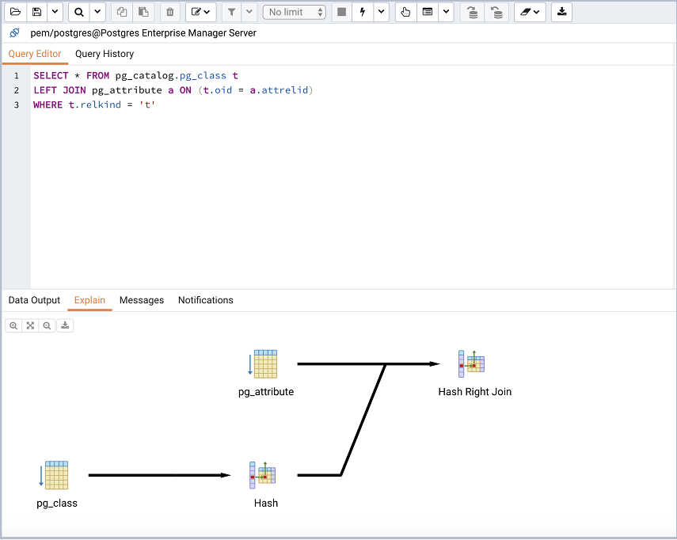

PEM contains a feature-rich Interactive Development Environment (IDE) that allows you to issue ad-hoc SQL queries against Postgres servers. To open the `Query Tool SQL IDE` from within PEM, simply highlight the name of the database you want to query in the tree control, and select `Query tool` from the `Tools` menu.

The `Query Tool` dialog provides an interface that allows you to manually enter SQL queries, graphically execute and interpret SQL statements, `EXPLAIN` queries and much more.

<figure><figcaption aria-hidden="true"><em>The PEM Query Tool</em></figcaption></figure>

The upper panel of the Query Tool contains the SQL Editor. You can use the panel to manually enter a query, or read the query from a file. If you are manually entering a SQL query, the edit entry window also contains autocompletion code and formatting features that help you write queries.

<figure><figcaption aria-hidden="true"><em>The Query Tool Graphical explain</em></figcaption></figure>

After executing a query, you can view the result set or an `EXPLAIN` plan in the lower panel of the Query Tool. As with all PEM features, detailed online help text is available with the click of a button.
