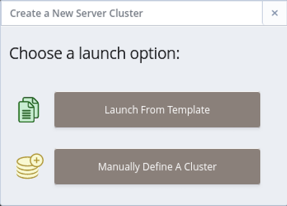
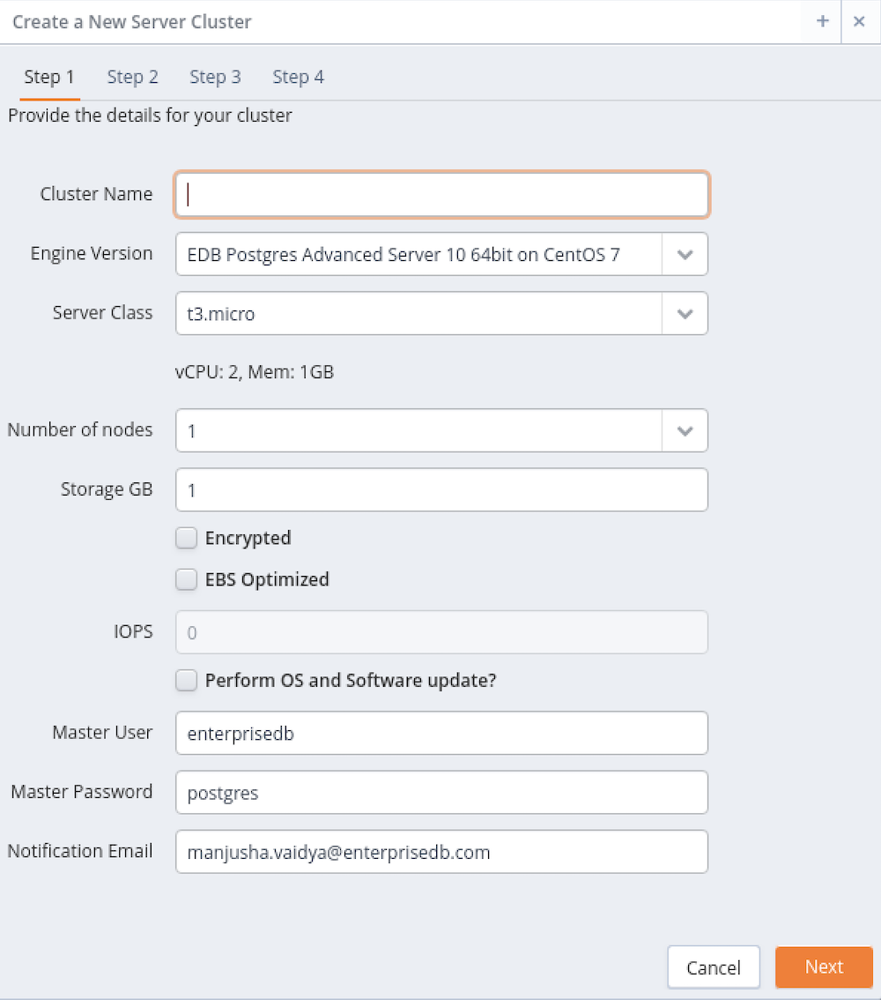
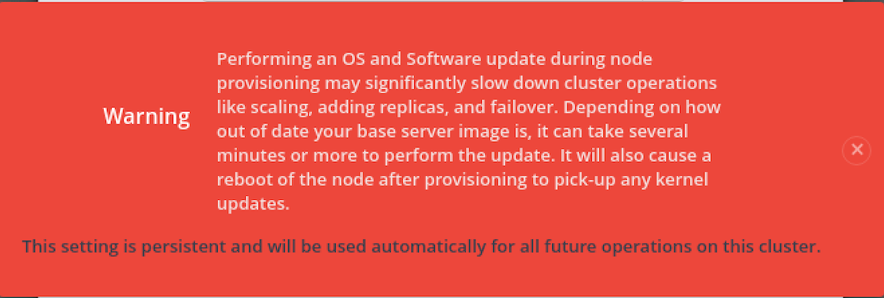
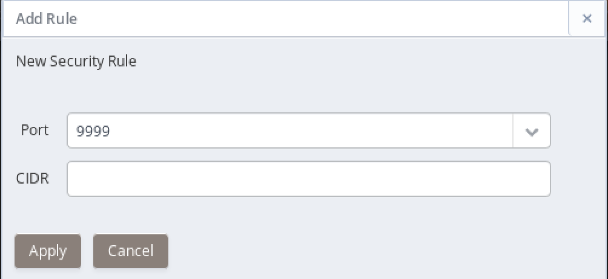
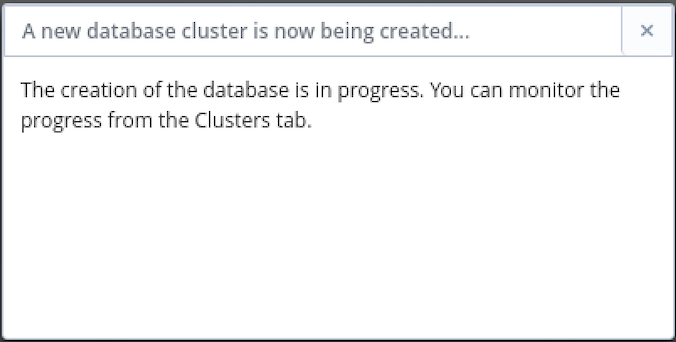
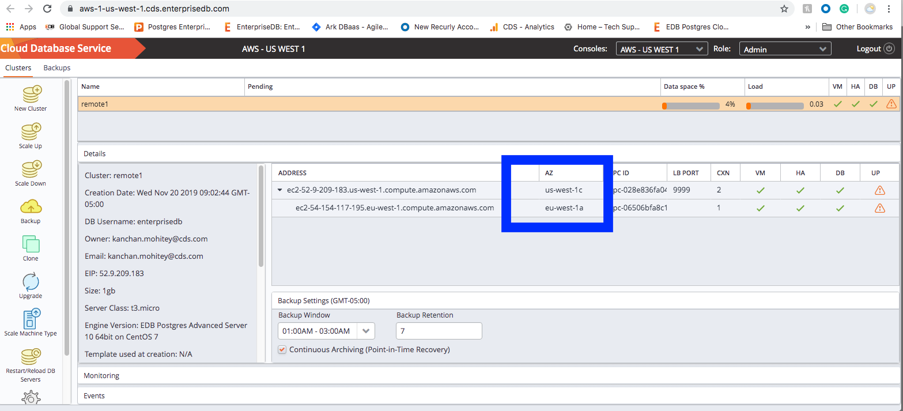
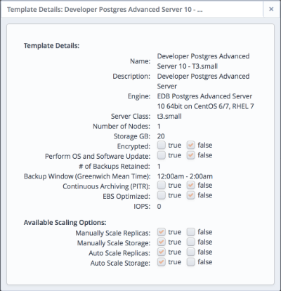
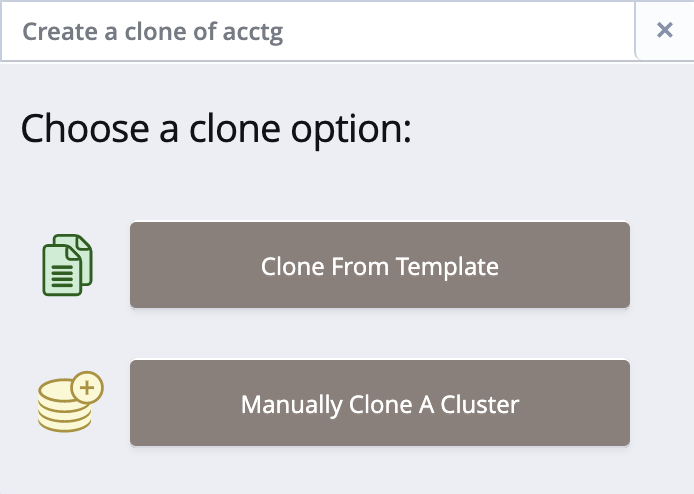
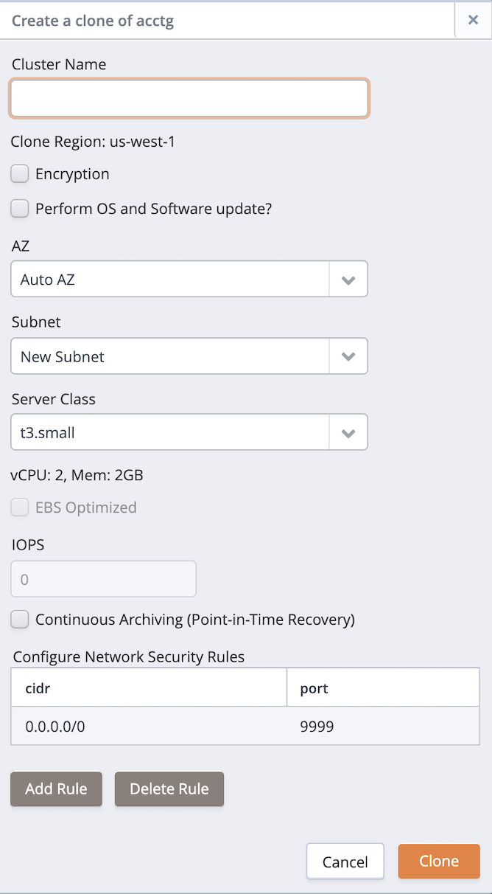

create server cluster

To create a server cluster, click the `New Cluster` button from the `Clusters` tab to open the `Create a new Server Cluster` dialog and define a new cluster.

The `Create a New Server Cluster` dialog will prompt you to select a deployment option.

If you select the `Launch From Template` option on the deployment method selection dialog, a dialog opens that allows you to use a pre-defined template for the cluster configuration.

You can also use an existing cluster or a backup as a starting point for a new cluster.

manually create cluster define cluster

## Manually Creating a Cluster

Before you can connect to a database from a client application, you must create a server cluster. Use the `Manually Define A Cluster` button located on the `Create a New Server Cluster` dialog to open the `Create a New Server Cluster` dialog.

Use fields on the `Create a New Server Cluster` dialog to specify information about the new cluster:

  - Specify a name for the new server cluster in the `Cluster Name` field.

  - Use the drop-down listbox in the `Engine Version` field to select the version of the Postgres engine that you wish to use.

  - Use the drop-down listbox in the `Server Class` field to specify the size of each cluster node. The server class determines the size and type (compute power and RAM) of each node within the cluster. The CPU and memory resources available with the selected server class are displayed below the server class.
    
    You can adjust the amount of storage used by the cluster, or number of replicas in the cluster as your resource demands change. For example, you can start with a m1.small instance, and later, easily upgrade to a more capable c1.medium instance as your performance requirements dictate.
    
    The resources available to the selected server class are displayed below the `Server Class` field.

  - Use the drop-down listbox in the `Number of nodes` field to specify the number of server nodes that you wish to create. The name specified in the `Cluster Name` field will apply to the master node; each additional node will act as a replication server for the master node.

  - Use the `Storage GB` field to specify the initial size of the data space (in Gigabytes).
    
      - Check the box next to `Encrypted` to indicate that the cluster should be encrypted. CDS uses the aes-xts-plain (512-bit) cipher suite to provide an encryption environment that is both secure and transparent to connecting clients. When encryption is enabled, everything residing on the cluster is encrypted except for the root filesystem.
      - Check the box next to `EBS Optimized` to specify that your cluster should use an Amazon EBS-optimized instance and provisioned IOPS to guarantee a level of I/O performance.

  - The `IOPS` field is enabled for those clusters that will reside on an EBS-optimized instance. If applicable, use the field to specify the level of I/O performance that will be maintained for the cluster by automatic scaling. The maximum value is 30 times the size of your cluster; for example, if you have a 4 Gigabyte cluster, you can specify a maximum value of 120.
    
    Check the box next to `Perform OS and Software ? update` to specify that a software update should be performed whenever the cluster is provisioned. When you check the box next to `Perform OS and Software update ?`, CDS will warn you that enabling this functionality can significantly slow down cluster operations.

Updating packages may slow down cluster maintenance operations; an update can easily take 10 minutes or more, and may initiate a reboot of the node. This setting is persistent; if you enable software updates for a cluster, you cannot directly disable software updates for that cluster at a later time.

  - Enter the name of the database superuser in the `Master User` field.
  - Enter the password associated with the database superuser in the `Master Password` field.
  - Use the `Notification Email` field to provide the email address that will receive notices about changes to the cluster status.

Click the `Next` button to continue to the `Step 2` tab.

Use the fields on the `Step 2` tab to specify additional database information:

  - Use the `Region` drop-down listbox to the right of each node to select the region in which the node will reside. You can create cluster with nodes in multiple regions. Creating cluster nodes spread across regions provides additional high availability to cluster users against any specific region failure.
  - Use the `Auto AZ` drop-down listbox to the right of each node to select the availability zone in which the node will reside. For the selected region, available AZs will be populated automatically, you can select the AZ from the drop-down list. If you select Auto AZ, cluster will be created in one of the available AZs.
  - Use the `New Subnet` drop-down listbox to the right of each node to select the subnet that the node will use. Please note that if you manually specify a subnet, you must select a subnet that resides on your private network.

Click the `Next` button to continue to the `Step 3` tab.

Use the fields on the `Step 3` tab to define security rules that allow access to the cluster through the load balancing port (`9999`) or through the database server listener port (`5444` for Advanced Server or `5432` for PostgreSQL).

Click the `Add Rule` button to open the `Add Rule` dialog and add a new security rule.

On the `Add Rule` dialog:

  - Use the `Port` drop-down listbox to select the port that the CIDR will use to access the cluster.
  - Use the `CIDR` field to specify the address or address range that will be able to access the server through the port.

When you're finished, click `Apply` to create the security rule.

To delete a rule from the list, highlight the entry and click the `Delete Rule` button; you will be prompted to confirm that you wish to delete the entry before the server removes the rule.

Click `Next` to continue to the `Step 4` tab.

Use the fields on the `Step 4` tab to specify database backup details:

  - Use the `# of automatic backups to retain` field to specify the number of server backups stored. When the specified number of server backups is reached, CDS will delete the oldest backup to make room for a new backup.
    
    When point-in-time recovery (PITR) is enabled, the value specified in the \# of automatic backups to retain setting determines the duration of the PITR backup window. For example, if you specify a value of 7, the PITR backup window will be 7 calendar days long.

  - Use the `Backup Window` field to specify a time that it is convenient to backup the server; you may wish to schedule backups to occur when the CPU load is the lightest.

  - Check the box next to `Continuous Archiving (Point-in-Time Recovery)` to enable point-in-time recovery for the cluster. When enabled, a base backup is automatically performed that can to be used to restore to a specific point in time. All subsequent automatic scheduled backups will also support point-in-time recovery. Note that if you deselect this option, the cluster (and subsequent automatic backups) will be re-configured to not include support for point-in-time recovery.

Use the `Previous` button or select a tab to return to a tab to review or update information; when you have completed the `Create a New Server` dialog, click `Launch` to create the database cluster.

A popup dialog confirms that CDS is creating a new cluster; click the `X` in the upper-right corner of the popup to close the popup.

Navigate to the `Clusters` tab to monitor the creation of the cluster.

In the above figure, the cluster consists of the master node residing in one region (`us-west-1c`) and the replica node residing in a different region (`eu_west-1a`).

template Using a Template to Define a Cluster Launch from Template

### Using a Template to Create a Cluster

If you select the `Launch From Template` option when deploying a cluster, a dialog that offers limited options will open when you deploy a cluster.

Use the `Template Name` drop-down listbox to select the template that you wish to use to configure your cluster. Use the `Full Template Details` link to display the attributes of a selected template.

> 

After selecting the template, use the fields on the dialog to provide information about the new cluster:

  - Use the `Cluster Name` field to specify a name for the new cluster.
  - Use the `DB Master User` field to specify the name of the database superuser.
  - Use the `DB Master Password` field to specify the password associated with the database superuser.
  - Use the `Notification Email` field to provide the email address that will receive notices about changes to the cluster status.
  - Use the `Availability Zone` and `Subnet Details` drop-down listboxes to select the availability zone and subnet in which each node will reside.
      - Use the Region drop-down listbox to select the region in which the node will be deployed. You can create cluster with nodes in multiple regions.
      - Use the AZ drop-down listbox to select the availability zone in which the node will reside.
      - Use the Subnet drop-down listbox to select the subnet that the node will use.

After completing the dialog, click the `Launch` button to provision a cluster that conforms to the template configuration.

## Cloning a Server Cluster

With a few simple steps, you can use the `Clone` icon to create a developer sandbox that contains a duplicate of the original master node. To clone a cluster, navigate to the `Clusters` tab and highlight the name of the cluster you wish to clone; then, select the `Clone` icon from the left margin.

A dialog will open that allows you to select your deployment method.

If you select `Manually Clone A Backup`, the following dialog opens.

When the `Create a clone...` dialog opens, provide values in the requested fields:

  - Provide a name for the clone in the `Cluster Name` field.
  - The region where the clone will be created is listed in the `Clone Region`. The clone is created only in the region where the master node resides.
  - Check the box next to `Encryption` if you would like the clone to be created in an encrypted cluster.
  - Check the box next to `Perform OS and Software update?` if you would like the server to perform a software update each time the clone is provisioned.
  - Use the `AZ` drop-down listbox to specify the availability zone in which the new cluster will be created.
  - Use the `Subnet` drop-down listbox to select a subnet that will be used by the new cluster.
  - Use the `Server Class` drop-down listbox to specify the initial size of the new cluster.
  - Check the box next to `EBS Optimized` to specify that your cluster should use an Amazon EBS-optimized instance and provisioned IOPS to guarantee a level of I/O performance;
  - The `IOPS` field is enabled for those clusters that will reside on an EBS-optimized instance. If applicable, use the field to specify the level of I/O performance that will be maintained for the cluster by automatic scaling.
  - Check the box next to `Continuous Archiving (Point-in-Time Recovery)` to enable point-in-time recovery on the clone.
  - Use the `Configure Network Security Rules` section to adjust security rules for the cluster; select Add Rule to open the Add Rule dialog and specify the Port number that will be available to the CIDR address specified on the dialog. Highlight a rule and select Delete Rule to remove a rule; you will be prompted to confirm the deletion before the rule is removed.

When you've completed the dialog, click the `Clone` button to create the cluster. When you clone a database, only the master node is recreated in the new cluster; when cloning is complete, you can add replicas to your cluster.

### Using a Template to Clone a Cluster

A clone deployed with a template will be an exact duplicate of the original master node, but will adhere to the cluster deployment rules described in the template by the system administrator. If you select the `Clone From Template` option on the deployment method selection dialog, the following dialog opens that allows you to use a pre-defined template for the cluster configuration.

When the `Create clone...` dialog opens, provide values in the requested fields:

  - Use the `Template Name` drop-down listbox to select a template that will be used for the new cluster; to review the cluster details associated with the template, click the `Full Template Details` link.
  - Provide a name for the clone in the `Cluster Name` field.
  - Use the `AZ` drop-down listbox to specify the availability zone in which the new cluster will be created.
  - Use the `Subnet` drop-down listbox to select a subnet that will be used by the new cluster.
  - Use the `Configure Network Security Rules` section to adjust security rules for the cluster; select `Add Rule` to open the `Add Rule` dialog and specify the `Port` number that will be available to the CIDR address specified on the dialog. Highlight a rule and select `Delete Rule` to remove a rule; you will be prompted to confirm the deletion before the rule is removed.

After providing the details for the cluster, click the `Clone` button to create the clone of the cluster; select `Cancel` to exit the dialog without creating a cluster.
