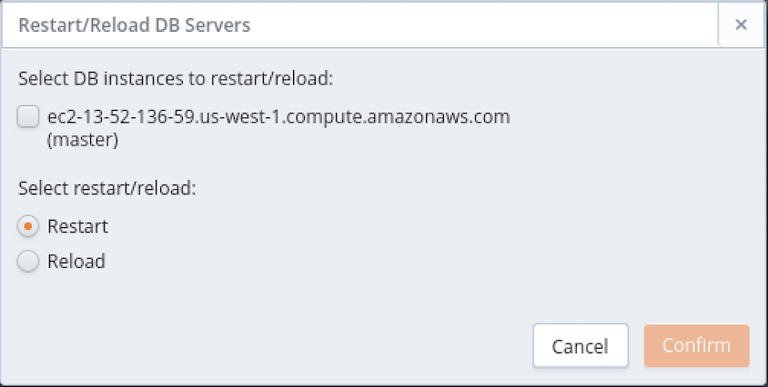
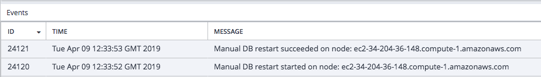

CDS offers easy to use management options for database clusters.

Change admin settings Modify rules

Fields on the `Administrative Settings` dialog display the current owner and the email address to which notification emails about the state of the cluster are sent. You can also use the dialog to modify the network security rules for the cluster.

To access the dialog, highlight the name of a cluster on the `Clusters` tab, and click the `Administrative Settings` icon.

Use the fields on the dialog to modify the Administrative settings for a cluster:

  - Use the drop-down listbox in the `Owner` field to select a new cluster owner; please note that only those users with permissions to access the tenant on which the cluster resides are included in the list.
  - Use the `Notification Email` field to specify the address to which you wish notices about the state of the cluster to be sent.
  - Use the `Add Rule` button to open a popup that allows you to define a new security rule for the cluster.
  - Highlight a security rule and click the `Delete Rule` button to delete a security rule for the cluster.

After modifying the administrative settings for the cluster, click the `Confirm` button to preserve your changes.

Restarting Server Reloading DB Server server restart

## Managing Database Server Operations

Highlight a cluster name and select the `Restart/Reload DB Servers` icon (located in the left column on the `Clusters` tab) to initiate a database restart or reload operation on one or more cluster nodes.

Use the options on the dialog to select servers and management actions:

  - Check the box next to a host address to restart or reload the selected server.
  - Select a radio button next to `Restart` or `Reload` to specify the action that will be performed.

After making your selections, click `Confirm` to start the restart or reload operation. A popup will confirm that the server(s) are restarting or reloading. You can confirm the status of the operation in the cluster's `Events` table.

Please note: you should perform these operations during maintenance windows. For more information about the reload and restart operations, please see the [Postgres core documentation](https://www.postgresql.org/docs/current/app-pg-ctl.html)
