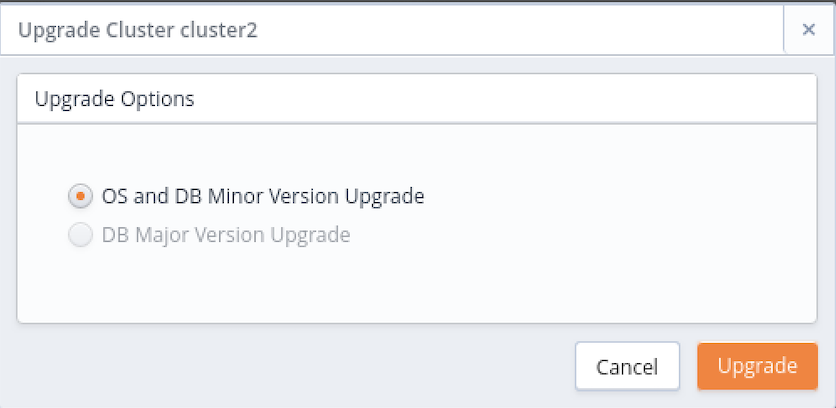
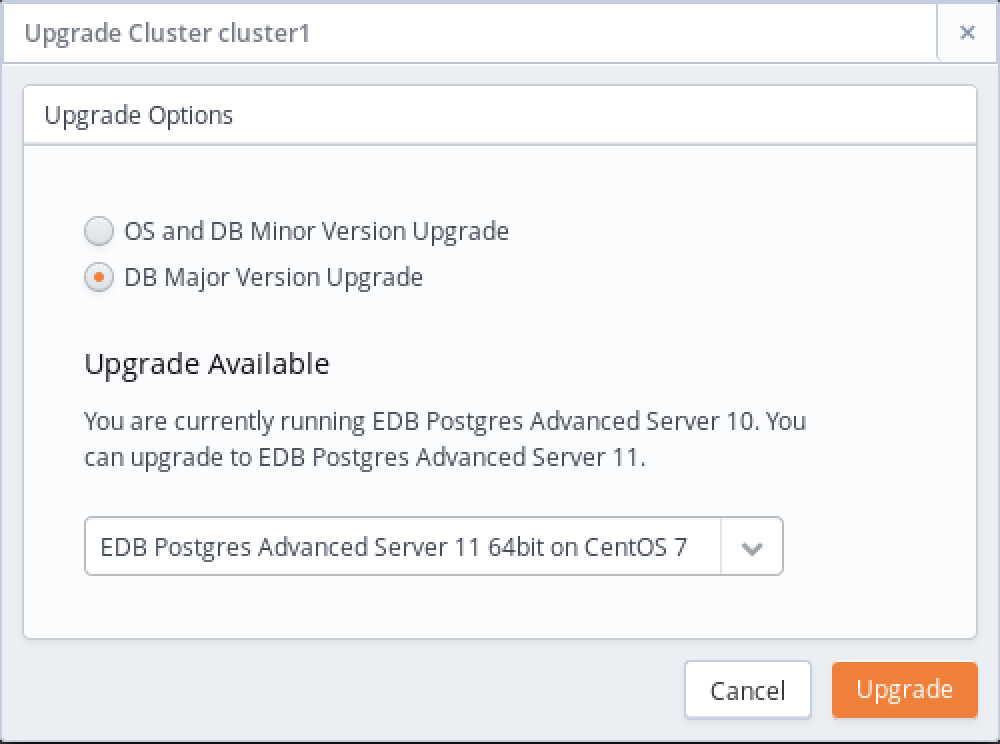

When an update becomes available for a package installed on your cluster, the console will display an alert symbol in the `UP` column of the `Details` panel for the cluster, and in the `UP` column of the `Address` table adjacent to the node that requires an update.

The columns display:

>   - A green checkmark indicates when an object is healthy.
>   - A yellow alert symbol calls attention to an object that requires attention.
>   - A red error symbol signifies that an object is not available.
>   - A busy-indicator signals that the cluster is processing a request.
>   - A question mark indicates that the state of the resource is unknown.

The overall cluster status (displayed in the top section of the Clusters tab) is based on the values of the nodes within the cluster.

  - If all of the nodes within the cluster are up-to-date, the UP column displays a green checkmark.
  - If one or more nodes require a non-critical update, the UP column displays a yellow alert symbol.
  - If one or more nodes require a critical update, the UP column for the cluster displays a red error symbol.
  - If one or more nodes have an unknown package status, the UP column for the cluster displays a grey checkmark.

Use the `Upgrade` icon (located on the `Clusters` tab) to access a dialog that allows you to update the server version on each node within the cluster.

When the `Upgrade Cluster` dialog opens, select the radio button next to an option to:

  - Select `OS and DB Minor Version Upgrade` to invoke a yum update command and update any outdated packages and perform a minor database version upgrade on each node of the cluster. For more information, see [Performing a Minor Version Upgrade](#performing-a-minor-version-upgrade).
  - Select `DB Major Version Upgrade` to select a version and perform a major version upgrade of the server. Please note that this functionality is restricted to users that are not required to use a template when deploying a cluster. For more information, see [Performing a Major Version Upgrade](#performing-a-major-version-upgrade).

After making a selection, click `Upgrade` to continue.

Database Upgrade upgrade database minor version upgrade

## Performing a Minor Version Upgrade

If you select the radio button next to `OS and DB Minor Version Upgrade` and click the `Upgrade` button, the console will invoke the yum update command on each node of the cluster. The yum update command will update all installed packages to the most recent version available of the same release (i.e., if you are running a 9.6 database server, yum will update your database server to the most recent version of 9.6).

Before performing the update, CDS will perform a backup. During the upgrade process, all clients will be disconnected from the server. The updated server will retain the IP address used by the original server. When the update has completed, clients may once again connect.

After performing a yum update, the node will be rebooted, initiating any kernel updates required. When the update completes, CDS will send an email notification that contains a list of the updated packages.

If one or more nodes in your cluster are currently displaying an unknown status, CDS will display an error message; you must correct the problem that is causing the unknown status before CDS can perform an update.

Please note that if the yum update command fails during the upgrade process, CDS will terminate the process and yum update will not be run on any remaining nodes, leaving the cluster partially upgraded.

## Performing a Major Version Upgrade

You can use the `Upgrade Cluster` dialog to upgrade your Postgres database server; the upgrade must be to a more recent version of the same server type and must use the same server image as the current database engine. For example, you may upgrade an Advanced Server version 9.6 database server that resides on a CentOS 6.x host to Advanced Server 11, but you cannot move the server onto a CentOS 7.x host. Similarly, you may not upgrade a PostgreSQL 9.6 database server that resides on a CentOS 7.x host to use an Advanced Server 11 server on a CentOS 7.x host. The server type and host operating system version must remain the same.

Please note: if over half of the data space allocated to a cluster is used, you must add storage to the cluster before performing the upgrade.

To upgrade a running cluster, select the radio button next to `DB Major Version Upgrade` and then use the drop-down listbox to select a server version. Click `Upgrade` to continue.

A popup will open, asking you to confirm that you wish to upgrade the server; click the `Upgrade` button to perform an upgrade. The server will be briefly unavailable during the upgrade process. The upgrade does not change the IP address and listening port of the server.
