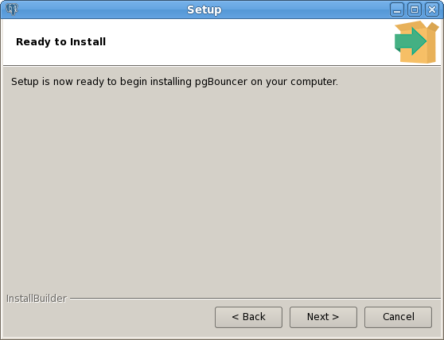
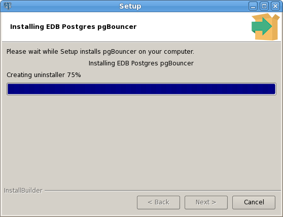

.. raw:: latex

    \newpage

.. _using_the_graphical_installer:

**************************************
`Using the Graphical Installer`:index:
**************************************

Graphical installers for PgBouncer are available via StackBuilder Plus
(for Advanced Server hosts) or Stack Builder (on PostgreSQL hosts). You
can access StackBuilder Plus through your Windows or Linux start menu;
after opening StackBuilder Plus and selecting the installation for which
you wish to install PgBouncer, expand the component selection screen
tree control to select and download the PgBouncer installer.

After downloading the PgBouncer installer, double-click the icon to
start the PgBouncer installer. Select an installation language, and
click ``OK`` to continue.

.. figure:: images/pgbouncer_welcome_wizard.png
   :alt: The PgBouncer Welcome window
   :align: center

   *The PgBouncer Welcome window*

The PgBouncer installer welcomes you to the setup wizard, as shown in
Figure above.

.. figure:: images/installation_directory_wizard.png
   :alt: The Installation Directory window
   :align: center

   *The Installation Directory window*

Use the ``Installation Directory`` field to specify the directory in which
you wish to install the PgBouncer software. Then, click
``Next`` to continue.

.. figure:: images/advanced_server_installation_details.png
   :alt: The Advanced Server Installation Details window
   :align: center

   *The Advanced Server Installation Details window*

Use fields on the ``EDB Postgres Advanced Server Installation Details``
window to provide connection information for the
Advanced Server host:

-  Use the ``Host`` field to identify the system on which Advanced Server
   resides.

-  Provide the name of the role that PgBouncer will use for connections
   to the server in the ``User Name`` field.

-  Provide the password associated with the role in the ``Password`` field.

-  Use the ``Port`` field to identify the listener port that Advanced Server
   monitors for client connections.

Then, click ``Next`` to continue.

.. figure:: images/pgbouncer_configuration_window.png
   :alt: The PgBouncer Configuration window
   :align: center

   *The PgBouncer Configuration window*

Use fields on the ``PgBouncer Configuration`` window  to
provide your preferences for the PgBouncer installation:

-  Use the ``Listening Port`` field to specify the port that PgBouncer
   monitors for connections.

-  Use the ``Operating System User`` field to specify the name of the Linux
   operating system user that PgBouncer will change to after startup.
   This option is not supported on Windows hosts.

  *The Ready to Install window*

The ``Ready to Install`` window notifies you when the
installer has all of the information needed to install PgBouncer on your
system. Click ``Next`` to install PgBouncer.

   *Installing EDB Postgres PgBouncer*

Progress bars inform you as the installation progresses.

.. figure:: images/installation_is_complete.png
   :alt: The installation is complete
   :align: center

   *The installation is complete*

The installer notifies you when the setup wizard has completed the
PgBouncer installation. Click ``Finish`` to exit the
installer.
